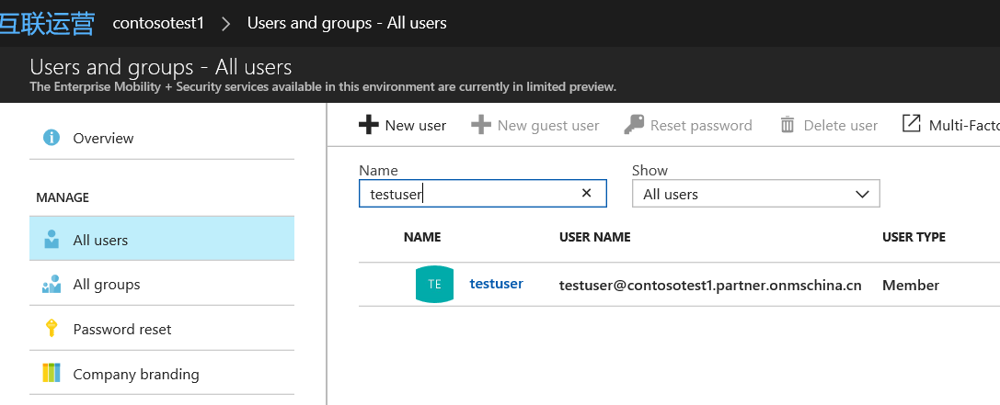
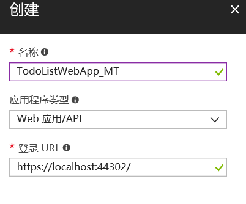
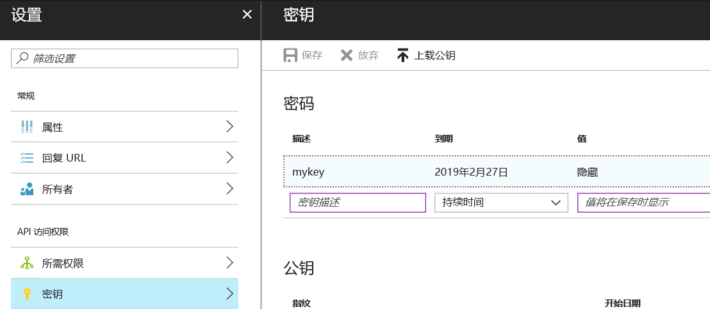
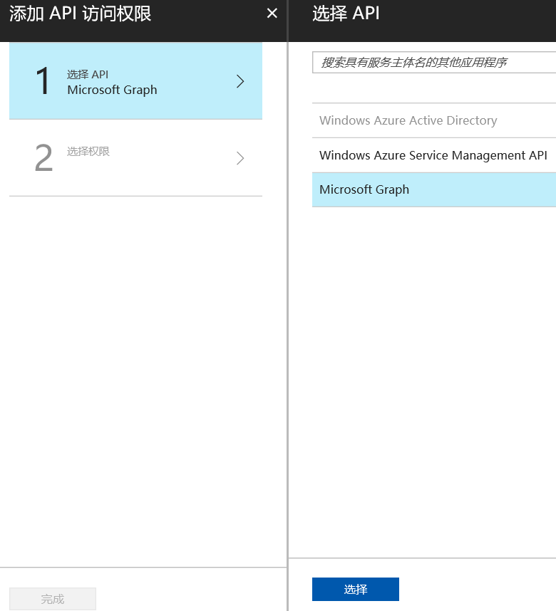
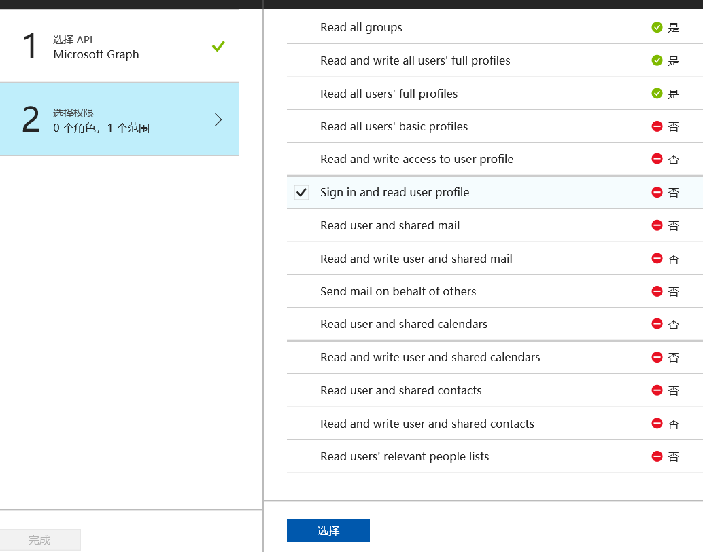
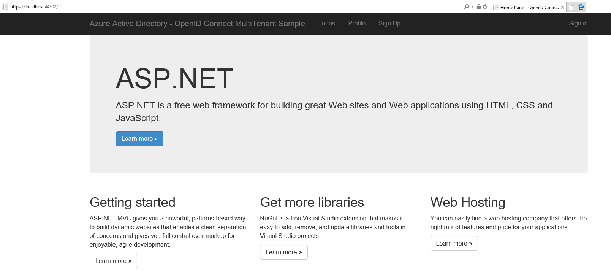
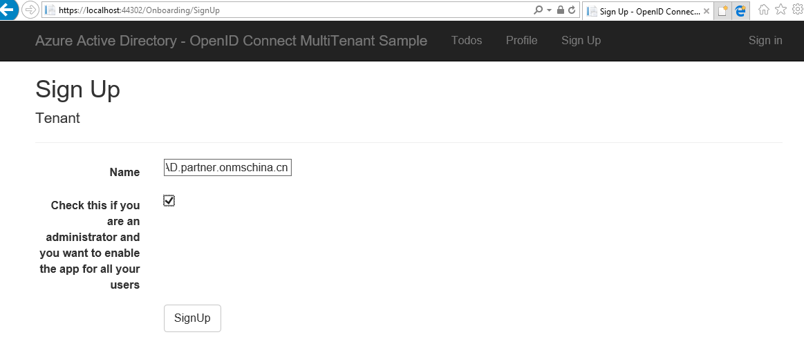
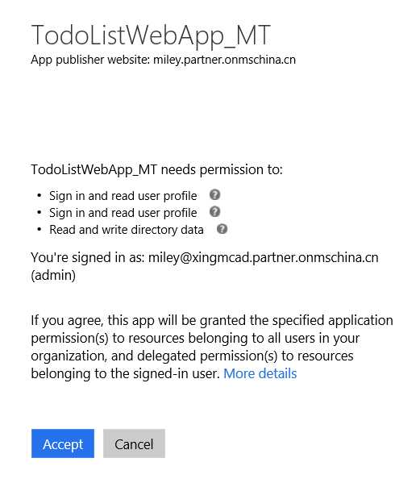

# 如何创建一个使用 Azure AD 调用 Web API 的多租户 SaaS Web 应用程序

这篇文章主要讲述如何创建一个可以通过 Azure AD 做用户 Sign up/Sign in 的多租户 Web 本地应用程序。

## 准备工作

- Visual Studio 2013/2015/2017
- Azure Active Directory 租户
- AD 租户中的**用户**账户

## 创建应用

### 管理门户部分

1. 登录 [在 Azure 门户中添加 Azure AD 目录](https://portal.azure.cn/#create/Microsoft.AzureActiveDirectory)，创建新的 Active Directory 并添加相关用户。

    

2. 使用 Azure AD 租户注册应用。

    1. 进入新注册的 Azure AD 租户，选择 “**应用注册**” 选项页，点击“**新应用程序注册**” 按钮。输入一个有效的名称如 'TodoListWebApp_MT'，同时在类型选项中选择 **Web 应用/API** 作为该应用程序的类型。输入 **登录 URL**，例如 `https://localhost:44302/`。最后点击 “**创建**” 按钮。

        

    2. 找到刚创建好的应用以及对应的 **应用程序 ID**，将其复制并保存在安全的位置，稍后将会在 Visual Studio 中配置该值。

        

3. 为您的 Azure AD 租户创建应用程序密钥。

    点击刚才第二步中创建好的应用程序，点击 “**设置**”，找到**密钥**选项，为该应用程序创建有效期为 1 年或者 2 年的密钥，点击下方的 “**保存**” 按钮来创建密钥。

    > [!NOTE]
    > 当你保存此页面时，将显示密钥值，将其复制并保存在安全的位置，稍后将会在 Visual Studio 中配置该值，另外此键值不会再次显示，所以创建完成后尽快保存。

    

4. 在应用程序的 “**属性**” 选项页下，将您的应用程序配置为多租户的并点击保存按钮。

    > [!IMPORTANT]
    > 在将某个应用程序设为多租户之前，Azure AD 要求该应用程序的应用 ID URI 全局唯一。应用 ID URI 是在协议消息中标识应用程序的方式之一，就单租户应用而言，应用 ID URI 在该租户中保持唯一便已足够。但是就多租户应用程序而言，该 URI 必须全局唯一，以便 Azure AD 能够在所有租户中找到该应用程序。

    

5. 为你的应用程序配置权限。

    1. 在 “**所需权限**” 选项卡中点击 “**添加**”，选择 **Microsoft graph** 权限，点击 “**选择**”。

    

    2. 找到刚才添加的 Microsoft Graph 权限，勾选 “**Sign in and read user profile**” 权限并点击 “**完成**” 保存设置。

        这将允许你的应用程序接收委托的权限，以便为给定的用户帐户验证和读取用户配置文件数据。

        

到目前为止，在 Azure 管理门户上做的配置工作已经全部完成，接下来，你需要通过在 Visual studio 中运行示例应用代码来体验多租户 Sign up 和 Sign in.

- 运行示例代码：

    1. 从[这里](https://github.com/wacn/AOG-CodeSample/tree/master/ActiveDirectory/CSharp/active-directory)下载示例代码。

    2. 在 Visual Studio 中打开示例应用项目。

    3. 打开 web.config 文件。

        1. 将 `ida:ClientID` 的值用刚才创建应用程序时生成的**客户端 ID** 替换。

        2. 将 `ida:Password` 的值用刚才创建应用程序时生成的**密钥**替换。

        

- 测试结果

    1. 运行该应用程序，会显示如下界面：
    
        

    2. Sign up:

        点击 Sign up，你可以选择是否要遵循**管理员同意**模式或**普通用户同意**模式。

        

        然后您将被跳转到 Azure AD 登录界面，用你想要登录的用户名和密码登录，如果你用其他 Azure AD 租户（同一订阅非该应用程序注册的租户）下的用户登录，将会有同意页面出现，点击 **AcceptA** 会有提示信息提示登录成功。

        

    3. Sign in
    
        一旦 Sign up 成功，就可以用刚才的用户名信息点击 Sign in 登录到应用中。

        

## 参考链接

[如何使用多租户应用程序模式将任何 Azure Active Directory (AD) 用户登录](/active-directory/develop/active-directory-devhowto-multi-tenant-overview)
