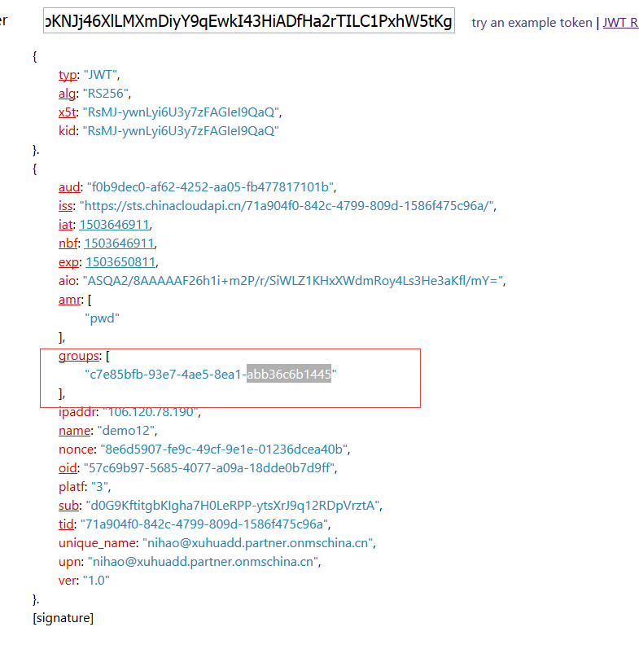

# 单点登录后获取当前用户所在组的 ID

## 现象描述

当前中国区 Azure 还无法通过门户来操作组，但是我们可以通过 Graph api 来创建用户，创建组，并把该 user 添加到组中。因此当用户单点登录以后发现只能获取到自己用户的基本信息，而无法获取到组的信息，可以通过 openid 进行请求获取组信息(可以在在返回中的 id_token 中获取到组信息)。
 
### Graph API 参考资料

- [Azure AD 图形 API 快速入门](https://docs.azure.cn/zh-cn/active-directory/develop/active-directory-graph-api-quickstart)
- [Graph api 各操作和 SDK 介绍](https://msdn.microsoft.com/Library/Azure/Ad/Graph/api/api-catalog)
- [groupMembershipClaims 资料介绍](http://www.dushyantgill.com/blog/2014/12/10/authorization-cloud-applications-using-ad-groups/)

## 操作步骤

1. 登陆 [Azure 门户](https://portal.azure.cn)，并添加 AAD 应用程序。
2. 点击 Manifest 选项，选择下载清单后缀为 json 文件。
3. 下载后打开 json 文件。
4. 找到 groupMembershipClaims 节点并添加值。

    `"groupMembershipClaims" : "SecurityGroup"`

5. 保存 json 文件并点击上载清单。
6. 编写程序用于通过 openID 获取 token。

    > [!NOTE]
    > 代码的编写只需要把[示例代码](https://github.com/Azure-Samples/active-directory-java-webapp-openidconnect)修改为自己的信息即可，节点修改为中国节点。

7. 登陆完成后获取 result 信息中的 id_token 字段中的值。
8. 该值为 JWT 数据，获取后需要进行转换，也可以通过 [JWT Decoder](http://jwt.calebb.net/) 页面中查看 JWT 值。

## 结果如下
 

