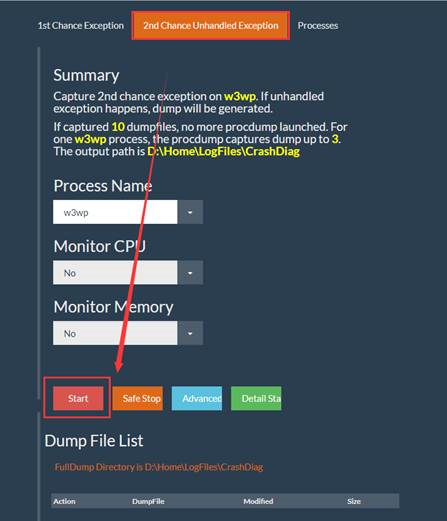

# 如何抓取 Web 应用 w3wp 进程的 Crash Dump

基于 Azure Web 应用的架构，用户的请求首先通过前端服务器(FrontEnd Server) 转发给后台实例，用户的网站运行在后台实例上。对于原生的 ASP.NET 程序，w3wp 进程负责运行用户的代码，当 w3wp 进程崩溃后，FrontEnd Server 可能会返回 502 错误给浏览器，另外用户通过查看网站的 event log 日志，也会发现 w3wp 进程崩溃的记录，此时如果在生产环境，用户可以考虑抓取 w3wp 进程的 Crash Dump 进行后续分析，本文详细介绍了如何通过 azure 内置工具抓取 dump 的步骤。

1. 在 Web 应用中安装 Crash Dumper 扩展
    
    打开 Web 应用，导航到【**扩展**】一栏，点击【**添加**】，选择【**Crash Diagnoser**】:

    
    

2. 安装以后，通过【**浏览**】按钮打开，进行配置 :

    
    
    选择默认的配置，点击【**start**】如下图(默认为 Second Chance Exception,如果需要抓取 First Change Exception，请切换选择):

    

3. 回到门户查看【**进程资源管理器**】，确保网站的 Crash Dump 进程已经在启动状态。如下图所示：

    

> [!NOTE]
> 1. 由于该工具只能运行在一个实例上，如果网站是多实例的情况，则抓取到日志的几率可能会随着实例数的变大而缩小。
> 2. 安装完 Crash Diag 扩展后，点击 **Browse** 按钮后，还需要点击 **Start** 按钮才会开始运行。

## 参考链接

[在 Azure Web 应用中使用 Crash Diagnoser Site Extension 来捕获 Crash Dump 以解决间歇性异常或性能问题](https://blogs.msdn.microsoft.com/asiatech/2015/12/28/use-crash-diagnoser-site-extension-to-capture-dump-for-intermittent-exception-issues-or-performance-issues-on-azure-web-app/ )