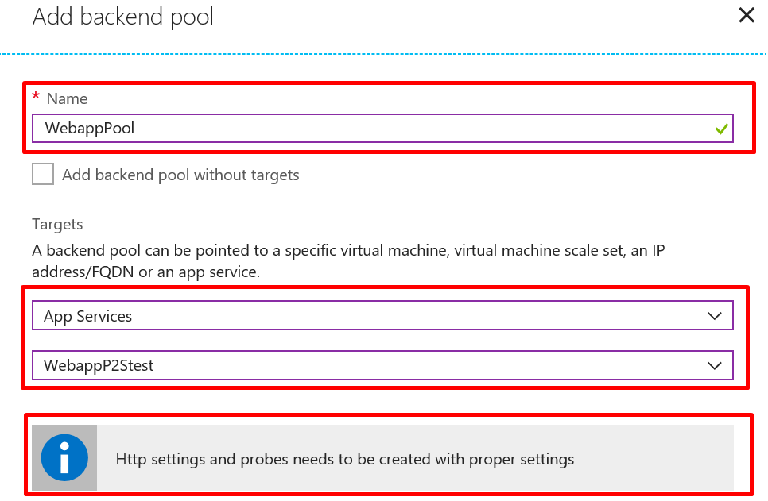
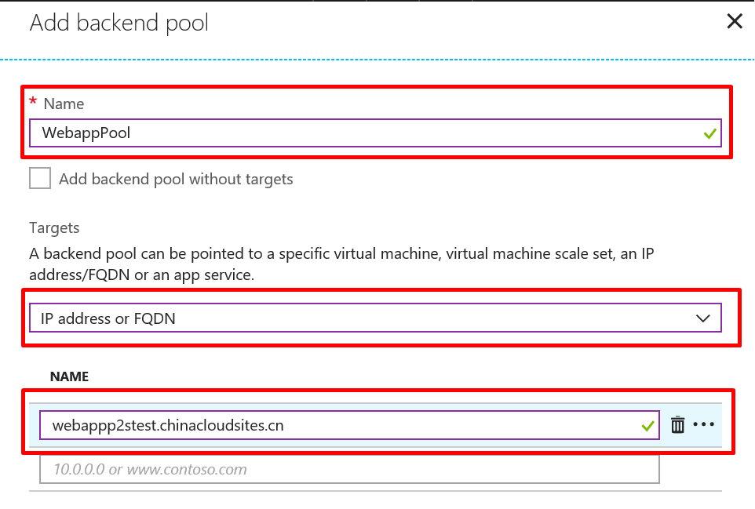
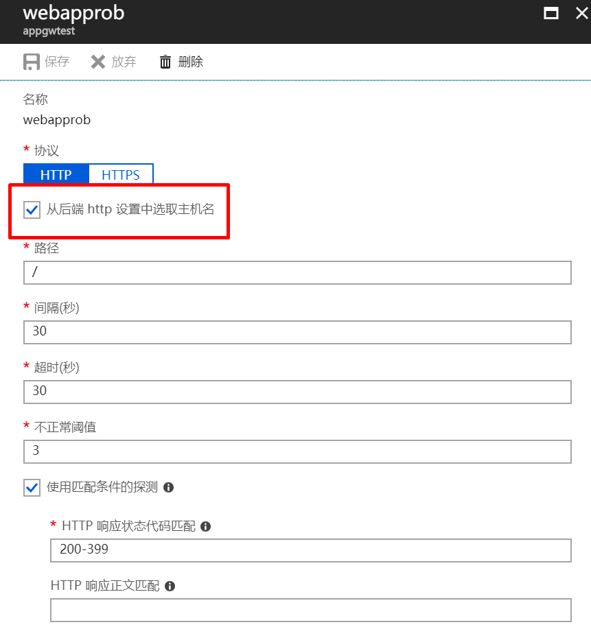
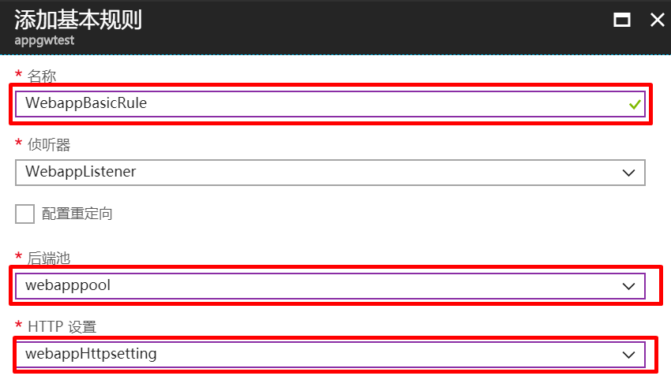

# 使用门户将 Azure Web 应用配置为应用程序网关后端池成员

本文介绍如何通过 Azure 门户将 Azure Web 应用或其他多租户服务配置为应用程序网关后端池成员。

## 创建 Azure Web 后端池

1. 单击 “所有资源”，选择之前创建好的应用程序网关。

2. 单击 “应用程序网关”，选择 “后端池” => “添加”。

3. 创建名称为 `<WebappPool>` 的后端池，并使用添加目标类型为 “App Services”，选择 Azure Web 应用 “WebappP2Stest”。针对 App Services 类型后端池，Http 设置和运行状况探测注意需要进行相应的设置。

    

    如果 Azure Web 应用和应用程序网关在不同的订阅中，则选择目标类型 “IP address or FQDN”。

    

## 创建探测

单击 “探测”，并单击 “添加” 按钮添加探测，对应 Azure Web 后端池探测中需要选中 “从后端 Http 设置选取主机名”。

## 创建 Http 设置

单击应用程序网关的 “HTTP 设置”，并单击窗口中列出的当前后端 Http 设置，并单击“添加”按钮添加 Http 设置，选中 “从后端地址中选取主机名”。

> [!NOTE]
> 只有选中“从后端地址中选取主机名”才可以选择之前设置的探测 Webapprob（选中了“从后端 Http 设置选取主机名”）。

## 创建路由规则

1. 依次单击 “规则” => “基本”。
2. 输入 `<WebappBasicRule>` 作为名称。
3. 对于侦听器，选择 “WebappListener”。
4. 对于后端池，选择 “webapppool”。
5. 对应 HTTP 设置，选择 “webappHttpsetting”。

    

    > [!NOTE]
    > 对于 Web 应用后端池，只有选中了 “从后端地址中选取主机名” 的 Http 设置才可以在创建规则时被选择。

## 测试应用程序网关

查看应用程序网关的 DNS 域名, 复制该 DNS 域名，并将其粘贴到浏览器的地址栏，测试可以正常访问

