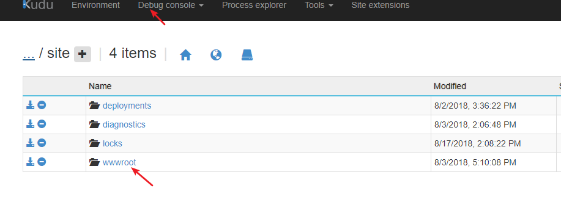

# Azure Web 应用的 js/css 文件过大导致访问慢的解决办法

## 问题描述

.net 的 Azure Web 应用当 js/css 文件过大时，会导致网站访问变慢。

## 问题分析

在 IIS 中开启对经常访问的文件压缩的配置。

```xml
<serverRuntime enabled="true"  frequentHitThreshold="1"  frequentHitTimePeriod="00:00:20" />
```

其中 `frequentHitThreshold` 为访问次数，需要与 `frequentHitTimePeriod` 配合查看 url 是否属于常访问资源。设定值仅是参考，可以根据具体环境配置。

其中 `frequentHitTimePeriod` 为时间段，需要与 `frequentHitThreshold` 配合查看 url 是否属于常访问资源。设定值仅是参考，可以根据具体环境配置。

参考链接：[IHttpUrlInfo::IsFrequentlyHit](https://msdn.microsoft.com/zh-cn/library/ms692441.aspx?f=255&MSPPError=-2147217396)。

## 解决方法

在 [Azure 门户](https://portal.azure.cn)中修改：

1. 登录 kudu，登录方式如下图

    

2. 进入 kudu 选择 Debug Console，选择 wwwroot 文件夹，在里面寻找 Web.config 文件。点击左面的笔头图标进行编辑。

    

3. 修改 Web.config 文件，将代码插入到 `<system.webServer>` 中,完成后点击保存按钮，重启您的网站。

    

您也可以直接在项目中修改 web.config 文件，之后重新部署一下。