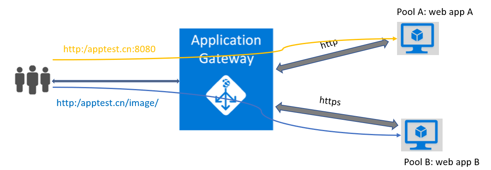
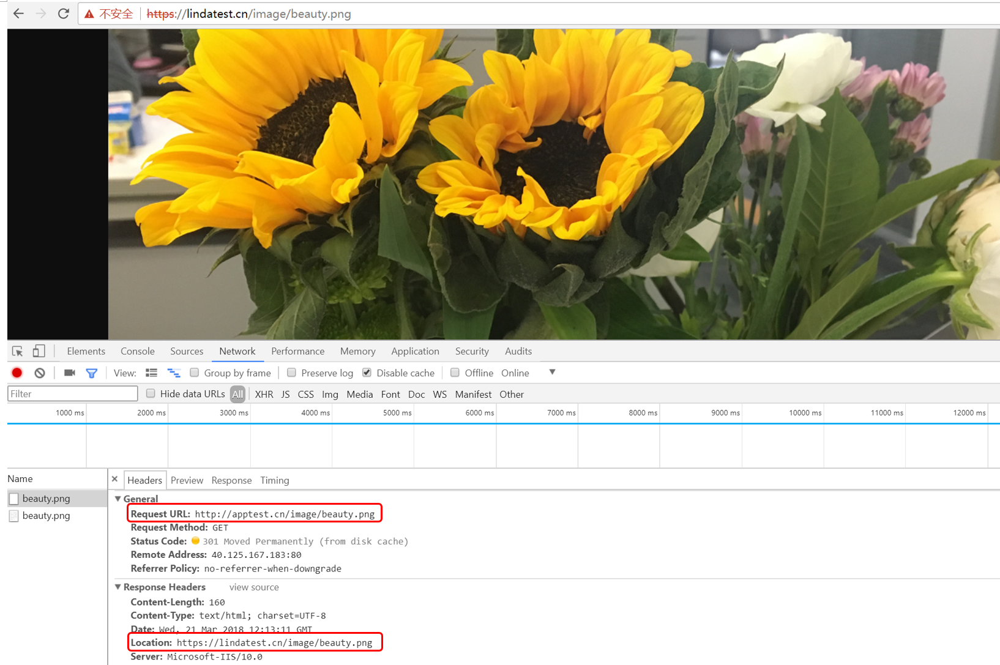

# 应用程序网关如何基于路径重定向到后端 Web 应用

## 介绍

应用程序网关重定向支持具有以下功能:

1. 在网关上从一个侦听器全局重定向到另一个侦听器。这样可实现站点上的 HTTP 到 HTTPS 重定向。
2. 基于路径的重定向。这种类型的重定向只能在特定站点区域中进行 HTTP 到 HTTPS 重定向，例如 /cart/* 表示的购物车区域。
3. 重定向到外部站点。

本文主要介绍通过域名解析把域名解析到应用程序网关的前端 IP，在多站点应用程序网关上实现 HTTP 到 HTTPS，基于路径的重定向到后端 Web 应用池。

## 开始之前

本文示例中，应用程序网关后端为两个现有的 PaaS 服务，位于两个不同的后端池，Web 应用 A 处理文本信息， Web 应用 B 处理图像信息，应用程序网关前端监听的域名都为 `apptest.cn`。当访问 `http://apptest.cn:8080` 时， 应用程序网关把请求转发给后端池 A 里的 Web 应用 A， 当访问 `http://apptest.cn/image` 目录下的图像文件时，应用程序网关会根据路径进行重定向，把请求转发到后端池 B 里的 Web 应用 B。



访问 `http://apptest.cn:8080` 时的页面为：


下文将介绍如何基于路径重定向到后端不同的 Web 应用, 使当访问 `apptest.cn` 域名 image 路径下的请求， 转发到后端 Web 应用 B。

请参考[为应用程序网关创建 Web 应用后端池](/application-gateway/application-gateway-web-app-powershell)，创建 Web 应用后端池。

## 重定向配置步骤

```powershell
# 获得现有的应用程序网关
$gw = Get-AzureRmApplicationGateway -Name appgateway -ResourceGroupName APPGWRG
# 获得现有的 https 的 listener
$httpslistener = Get-AzureRmApplicationGatewayHttpListener -Name httpslistener -ApplicationGateway $gw
# 获得 应用程序网关前端 IP 配置
$fipconfig = Get-AzureRmApplicationGatewayFrontendIPConfig -Name IPconfig -ApplicationGateway $gw
# 添加监听端口，如果已经存在监听端口，请使用 Get-AzureRmApplicationGatewayFrontendPort
Add-AzureRmApplicationGatewayFrontendPort -Name FrontendPort2 -Port 8080 -ApplicationGateway $gw
$fp = Get-AzureRmApplicationGatewayFrontendPort -Name FrontendPort2 -ApplicationGateway $gw
# 创建重定向 listener 监听重定向请求
Add-AzureRmApplicationGatewayHttpListener -Name imagelistener -Protocol Http -FrontendPort $fp -FrontendIPConfiguration $fipconfig -ApplicationGateway $gw -hostname apptest.cn
# 获得新创建的 listener
$newlistener = Get-AzureRmApplicationGatewayHttpListener -Name imagelistener -ApplicationGateway $gw
# 配置重定向，重定向到现有的 https 的 listener
Add-AzureRmApplicationGatewayRedirectConfiguration -Name redirectpath -RedirectType Permanent -TargetListener $httpslistener -IncludePath $true -IncludeQueryString $true -ApplicationGateway $gw
# 获得已经创建的重定向配置
$redirectconfig = Get-AzureRmApplicationGatewayRedirectConfiguration -Name redirectpath -ApplicationGateway $gw
# 获得现有的 https 后端配置
$poolSetting = Get-AzureRmApplicationGatewayBackendHttpSettings -Name backendhttps -ApplicationGateway $gw
# 获得现有的 https 后端池
$pool = Get-AzureRmApplicationGatewayBackendAddressPool -Name httpspool -ApplicationGateway $gw
# 创建基于路径的重定向规则
$pathRule = New-AzureRmApplicationGatewayPathRuleConfig -Name pathrule -Paths "/image/*" -RedirectConfiguration $redirectconfig
# 为重定向规则创建 url path map，同时 与目的后端池关联起来
Add-AzureRmApplicationGatewayUrlPathMapConfig -Name urlpathmap1 -PathRules $pathRule -DefaultBackendAddressPool $pool -DefaultBackendHttpSettings $poolSetting -ApplicationGateway $gw
# 获得已经创建的 url path map
$urlPathMap = Get-AzureRmApplicationGatewayUrlPathMapConfig -Name urlpathmap1 -ApplicationGateway $gw
# 创建基于路径的 routing rule：
Add-AzureRmApplicationGatewayRequestRoutingRule -Name redirectrule -RuleType PathBasedRouting -HttpListener $newlistener -UrlPathMap $urlPathMap -ApplicationGateway $gw
# 更新应用程序网关，使配置生效
Set-AzureRmApplicationGateway -ApplicationGateway $gw
```

## 验证步骤

当配置完成并生效之后， 可以通过集中方法验证配置是否成功以及是否可以成功完成重定向：

1. 从 Azure 门户 或者 PowerShell 中观察

    例如从 PowerShell 中观察， 使用 `Get-AzureRmAplicationgatewayRequestRoutingRule` 获得基于路径的重定向规则如下，检查配置已经正确写入：

    

    下一步使用 `Get-AzureRmApplicationGatewayUrlPathMapConfig` 获得 URL Path Map，观察到已经与目的后端池关联了，以此保证图像请求可以重定向到 Web 应用 B 上。

    

2. 本地浏览器打开 URL

    通过本地浏览器访问 `http://apptest.cn/image/beauty.png`, 经过应用程序网关跳转至 Web 应用 B 下的 `/image/` 目录，得到以下内容，表明基于路径的重定向成功：

    

    观察重定向的具体过程，请求的域名和 url 以及 HTTP 状态码等。可以观察到，客户端访问域名 `apptest.cn` 的 `/image/` 路径下的 `beauty.png` 文件时，首先返回重定向状态码 `301`，通知客户端将对此请求做永久重定向，重定向到后端 Web 应用 `lindatest.chinaclousites.cn` 去处理，并返回 `200OK`。

> [!IMPORTANT] 
> 在本文中 Web 应用 A 与 Web 应用 B 均为同一应用程序网关的后端池，对于 Web 应用 A 正常的访问，应用程序网关对应一个监听，对于 Web 应用 A 图像的访问， 应用程序网关对应另一个监听，这两个监听由于监听在同一个 Host, 同一个前端 IP， 这时不能使用同样的监听端口， 如示例中 `8080` 端口监听来自 Web 应用 A 的文本信息， 具体如何设置，需要考虑用户实际需求。

