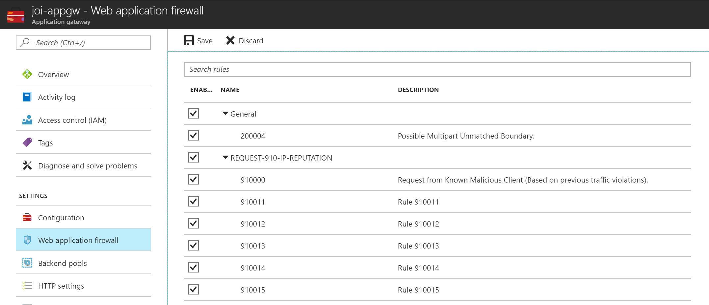
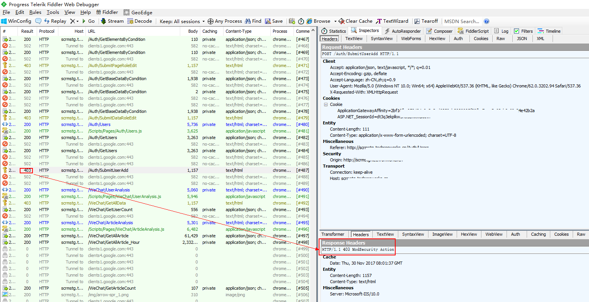
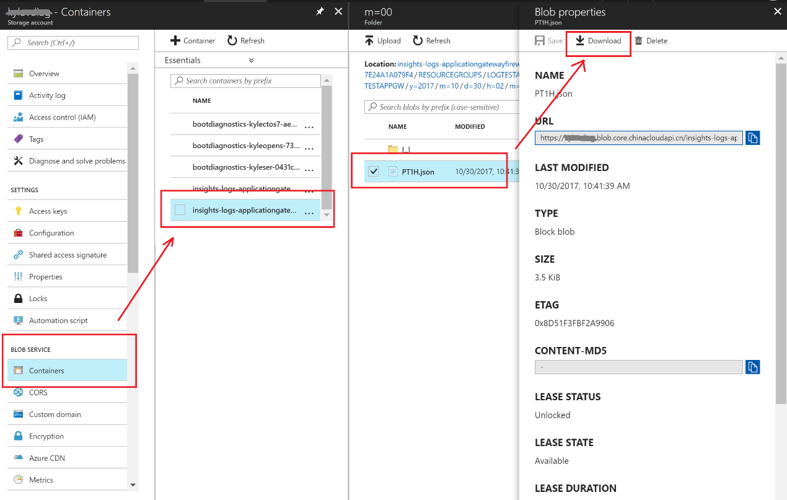
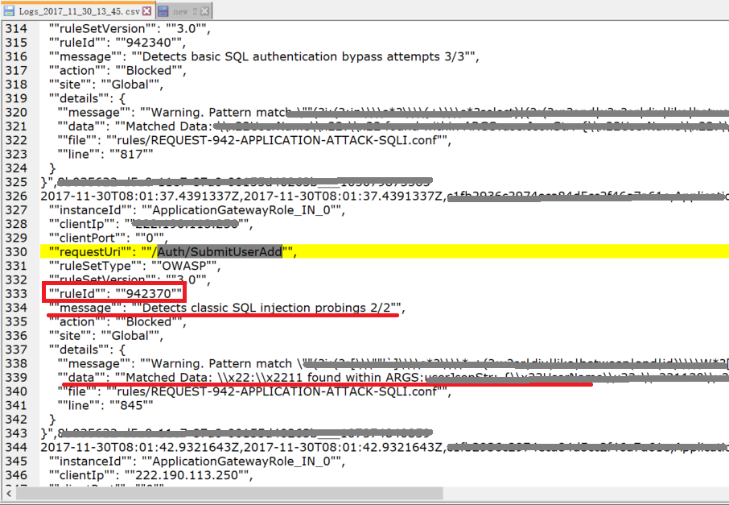
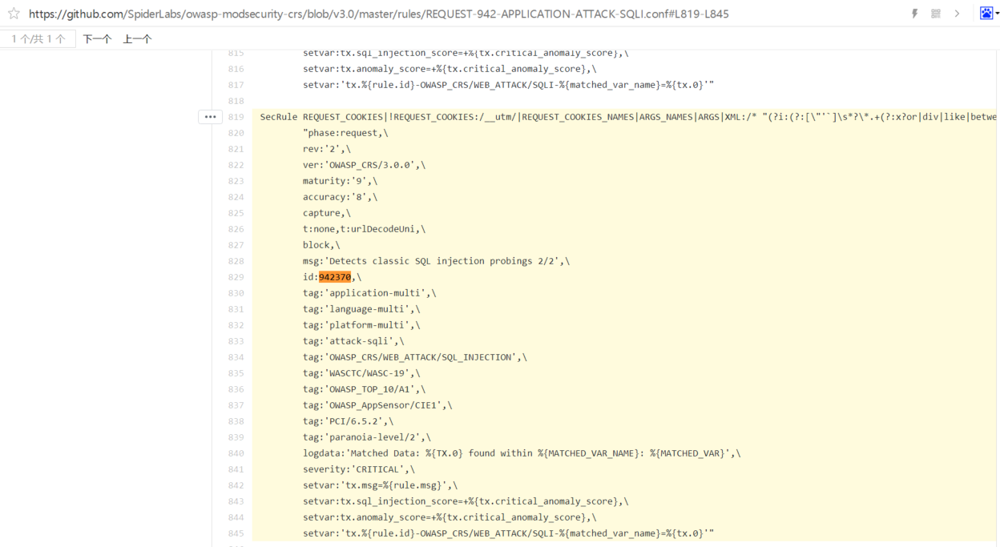
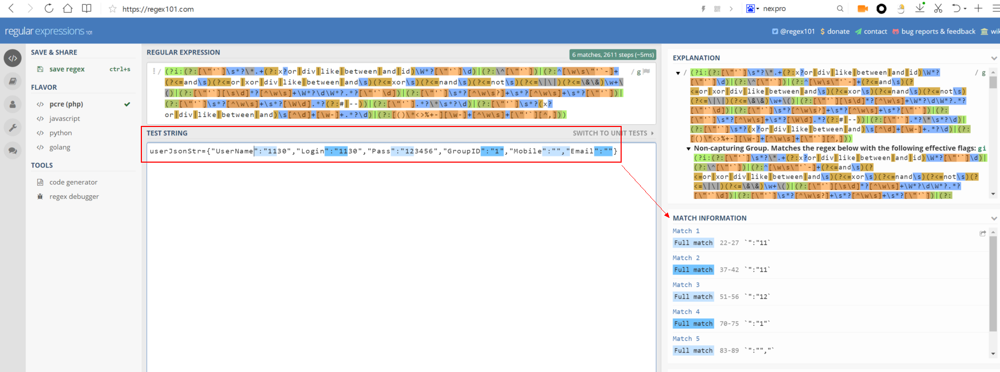

# 如何快速定位应用程序网关 WAF 功能拦截问题

WAF（Web 应用程序防火墙）是应用程序网关的功能，基于 OWASP 核心规则集 3.0 或 2.2.9 中的规则对 Web 应用程序进行集中保护，避免其受到常见的攻击和漏洞伤害。 

本文介绍了当我们发现请求被 WAF 阻挡时，如何快速确认 WAF 拦截行为是否误挡，并根据生效的 WAF 规则排查应用安全性的方法。

## 如何使用 WAF

1. 在现有的应用程序网关中启用 WAF，详情请参考[如何将 WAF 添加到现有的应用程序网关](/application-gateway/application-gateway-web-application-firewall-portal#add-web-application-firewall-to-an-existing-application-gateway)。

2. 创建具有 WAF 功能的应用程序网关，详情请参考[如何创建具有 WAF 的应用程序网关](/application-gateway/application-gateway-web-application-firewall-portal#create-an-application-gateway-with-web-application-firewall)。

3. 使用 Azure 市场（中国区）中的[第三方 WAF](https://market.azure.cn/zh-cn/marketplace/apps?search=waf)，
您可以按照需求选取第三方厂商的 WAF，厂商一般会在镜像下载的页面提供如何将其 WAF 加入进 Azure 中的说明。

    > [!IMPORTANT]
    > 以下范例不代表任何微软的厂商倾向性，仅为帮助您大致了解第三方 WAF 的配置过程。
    > 范例：[如何配置 Barracuda WAF 云服务](https://docs.microsoft.com/zh-cn/azure/app-service/environment/app-service-app-service-environment-web-application-firewall#configuring-your-barracuda-waf-cloud-service)。

## 如何快速排查 WAF 阻挡问题

Azure 使用国际通用的 OWASP ModSecurity Core Rule Set, 是一套第三方、开源的行业标准，业界大部分企业在启用 WAF 时都使用了这套规则。

使用 WAF 本身是一个不断调优的过程，业务实际需求不同，必定会造成部分规则不适用，但这并不一定代表业务有风险。<br>
我们建议尽量使用 WAF，如有冲突建议根据实际情况按以下 2 点进行优化：

1. 修改应用
2. 屏蔽规则

具体使用哪种方法进行调优需要您自己决定，比如可以通过第三方安全渗透测试报告，针对对应规则的漏洞的安全等级，来决定是**修改应用**还是**屏蔽规则**。

### 场景范例及建议的解决方案

- 请求触发了可禁用的规则

    此情景可在 [Azure 门户](https://portal.azure.cn/)上启用或禁用对应的规则：

    

    Azure 平台允许客户启用或禁用的规则列表请参见[核心规则集](/application-gateway/application-gateway-web-application-firewall-overview#core-rule-sets)。

- 请求触发了 WAF 的核心参数限制或其他默认规则

    此情景无法在 Azure 门户上修改，建议您联系应用开发的团队确认：

    1. 冲突的逻辑是否为实际业务需要，如果不是建议从应用层着手修改。
    2. 如果的确是业务需要，请将 WAF 调整为 “**检测**” 或不使用 WAF。

    出于安全考虑，我们建议客户自行部署安全策略以保障 Web 应用程序等的安全。
    
    开发人员可以参考以下排查步骤，以及 [ModSecurity CRS](/application-gateway/application-gateway-crs-rulegroups-rules) 中针对每条规则的说明，快速排查应用请求被阻挡的具体原因。

## 具体排查步骤

> [!NOTE]
> 此方法适用于大多数 OWASP 规则，使用了第三方开源工具，不排除部分规则无法适用，仅供参考。

### 启用及下载诊断日志

1. 通过以下 [PowerShell 命令](https://docs.microsoft.com/en-us/powershell/module/azurerm.insights/set-azurermdiagnosticsetting?view=azurermps-5.2.0)，对 WAF [启用诊断日志](/application-gateway/application-gateway-diagnostics#diagnostic-logs)。

    ```PowerShell
    Set-AzureRmDiagnosticSetting  -ResourceId /subscriptions/<subscriptionId>/resourceGroups/<resource group name>/providers/Microsoft.Network/applicationGateways/<application gateway name> -StorageAccountId /subscriptions/<subscriptionId>/resourceGroups/<resource group name>/providers/Microsoft.Storage/storageAccounts/<storage account name> -Enabled $true
    ```
    > [!IMPORTANT]
    > WAF 诊断日志功能目前在 Azure 中国区尚未正式发布，如果在防火墙日志采集以及分析中遇到问题，请联系[世纪互联技术支持](https://www.azure.cn/support/contact/)寻求帮助。

2. 对 WAF 进行访问测试，并在测试机上使用[Fiddler](https://www.telerik.com/download/fiddler)抓包。

    如果请求返回的 `HTTP Code` 是 `403`，并且 `Response Header` 是 `HTTP/1.1 403 ModSecurity Action`，则代表这个请求被 WAF 阻挡。

    

3. 在 Azure 门户存储服务界面，通过下图所示步骤下载存储账户中的防火墙日志（存储在名为 “**insights-logs-applicationgatewayfirewalllog**” 的容器 Container 中）。

    

### 分析防火墙日志

> [!NOTE]
> 以下步骤中涉及的示例规则采用的是 OWASP_3.0 核心规则集。

1. 从 Fiddler 中选取需要分析的被拦截的请求（下图红框中的 403），记录请求的**URI**和**请求时间**。

    

2. 在防火墙日志中找到对应时间点，对应请求触发的规则 6 位数编号（下图中**942370**）：

    

    > [!NOTE]
    > 1. 一个请求可能同时触发了多条规则，需要将所有规则都记录下来。
    > 2. Log 中显示的时间为 UTC 时间。

3. 在 GitHub 资源库中查看对应的[规则定义](https://github.com/SpiderLabs/owasp-modsecurity-crs/tree/v3.0/master/rules )和[核心参数](https://github.com/SpiderLabs/ModSecurity/blob/master/modsecurity.conf-recommended)。

    如上一步截图中的的规则 “**942370**” 对应的[规则定义](https://github.com/SpiderLabs/owasp-modsecurity-crs/blob/17d4317dcd86a20854100b877476d47ecb854d53/rules/REQUEST-942-APPLICATION-ATTACK-SQLI.conf#L819-L845)为：

    

4. 在规则定义中找到其使用的正则表达式。
 
    正则表达式可能较长，GitHub 页面不能完整显示。可以将此规则定义的所有行拷贝到文本编辑器，以便完整查看其正则表达式。<br>
    如下图第一行灰色选中的部分（第一个引号中的部分）。

    

5. 使用第三方工具 [Regular Expressions](https://regex101.com/) 校验正则表达式

    使用 Regular Expressions 工具验证 Fiddler 抓取到的请求（`Header`和`Body`，`encode`和`decode`都需要）与正则表达式的匹配情况。<br>
    匹配时，页面上会显示是哪个字符(串)匹配了这个正则表达式，从而可以指导开发人员快速定位并修复。<br>
    大多数规则是通过正则表达式匹配来判断是否触发阻挡，大家可以通过以上排查方法，快速判断应用请求是误挡还是确实触发了规则。<br>
    根据经验，大多数符号、英文字母被阻挡的规则都是真实发生了正则匹配。

    
    

### 建议的解决方案

至此基本可以判断请求触发的 WAF 规则和相关的参数，接下来如文章开始部分建议的，您可以：
- 如果请求触发了可禁用的规则

    此情景可在 [Azure 门户](https://portal.azure.cn/)上启用或禁用对应的规则

- 如果请求触发了 WAF 的核心参数限制或其他默认规则

    此情景无法在 Azure 门户上修改，建议您联系应用开发的团队确认：

    1. 冲突的逻辑是否为实际业务需要，如果不是建议从应用层着手修改。
    2. 如果的确是业务需要，请将 WAF 调整为 “**检测**” 或不使用 WAF。这种情况下出于安全考虑，我们建议客户自行部署安全策略以保障 Web 应用程序等的安全。
    
