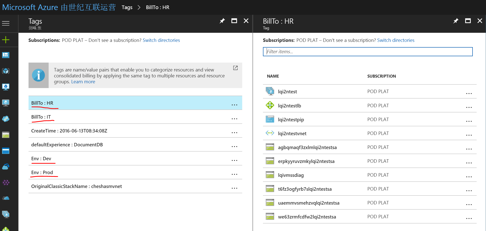

# 使用 Azure 资源策略为资源组中的资源强制添加标记

使用资源策略可在组织中建立资源标记。通过资源标记，可以控制成本并更轻松地管理资源。

本文以具体示例讲述如何为不同的资源组分别添加标记。示例中所使用的标记为：Env 和 Bill，分别代表资源所属的环境和部门。

- 资源组 1 Env : Dev; Bill : IT
- 资源组 2 Env : Prod; Bill ：HR

## 定义资源策略

对于已经有标记的资源，判断是否有 Bill 和 Env 这两个标记的键；若存在，无论值是否匹配，跳过添加标记；若没有，则添加标记并赋值。共有四组标记键值对，因此定义四个策略:

1. [tags-env-prod.json](https://github.com/wacn/AOG-CodeSample/blob/master/AzureResocrceManager/json/tags-env-prod.json)
2. [tags-env-dev.json](https://github.com/wacn/AOG-CodeSample/blob/master/AzureResocrceManager/json/tags-env-dev.json)
3. [tags-bill-it.json](https://github.com/wacn/AOG-CodeSample/blob/master/AzureResocrceManager/json/tags-bill-it.json)
4. [tags-bill-hr.json](https://github.com/wacn/AOG-CodeSample/blob/master/AzureResocrceManager/json/tags-bill-hr.json)

对于没有标记的资源，则添加两个标记的键值对。

1. [notags-prod-hr.json](https://github.com/wacn/AOG-CodeSample/blob/master/AzureResocrceManager/json/notags-prod-hr.json)
2. [notags-dev-it.json](https://github.com/wacn/AOG-CodeSample/blob/master/AzureResocrceManager/json/notags-dev-it.json)

## 指定订阅和资源组

指定要配置资源策略的订阅和资源组:

```PowerShell
$mysubscription = "9ef8a15c-15a2-4ef1-a19b-e31876ab177c"
$myresourcegroup1 = "lqi2ntoolrg"
$myresourcegroup2 = "lqi2ntestvmssrg"
```

## 登录订阅

Azure PowerShell 登录订阅，选择订阅:

```PowerShell
login-azurermaccount
Get-AzureRmSubscription
Select-AzureRmSubscription -SubscriptionId $mysubscription
```

## 定义资源策略

定义资源策略并分配给资源组。

这两个策略表示若资源已有标记，则判断是否有 Env 和 Bill 标记；若没有，则添加标记并赋值。

> [!TIP]
> 请根据实际情况定义 Name, Description, Policy 文件所在的路径和文件名。

```PowerShell
$policy = New-AzureRmPolicyDefinition -Name lqitags-env-dev -Description "Policy to set environment" -Policy "C:\Users\lqi.FAREAST\Desktop\tags-env-dev.json"
New-AzureRmPolicyAssignment -Name lqitags-env-dev -PolicyDefinition $policy -Scope /subscriptions/$mysubscription/resourceGroups/$myresourcegroup1
$policy = New-AzureRmPolicyDefinition -Name lqitags-env-prod -Description "Policy to set environment" -Policy "C:\Users\lqi.FAREAST\Desktop\tags-env-prod.json"
New-AzureRmPolicyAssignment -Name lqitags-env-prod -PolicyDefinition $policy -Scope /subscriptions/$mysubscription/resourceGroups/$myresourcegroup2

$policy = New-AzureRmPolicyDefinition -Name lqitags-bill-it -Description "Policy to set bill owner" -Policy "C:\Users\lqi.FAREAST\Desktop\tags-bill-it.json"
New-AzureRmPolicyAssignment -Name lqitags-bill-it -PolicyDefinition $policy -Scope /subscriptions/$mysubscription/resourceGroups/$myresourcegroup1
$policy = New-AzureRmPolicyDefinition -Name lqitags-bill-hr -Description "Policy to set bill owner" -Policy "C:\Users\lqi.FAREAST\Desktop\tags-bill-hr.json"
New-AzureRmPolicyAssignment -Name lqitags-bill-hr -PolicyDefinition $policy -Scope /subscriptions/$mysubscription/resourceGroups/$myresourcegroup2
```

该策略表示若资源没有标记，则添加 Dev 和 Bill 标记，并赋指定的值。

```PowerShell
$policy = New-AzureRmPolicyDefinition -Name lqinotags-dev-it -Description "Policy to set env and bill" -Policy "C:\Users\lqi.FAREAST\Desktop\notags-dev-it.json"
New-AzureRmPolicyAssignment -Name lqinotags-dev-it -PolicyDefinition $policy -Scope /subscriptions/$mysubscription/resourceGroups/$myresourcegroup1
$policy = New-AzureRmPolicyDefinition -Name lqinotags-prod-hr -Description "Policy to set env and bill" -Policy "C:\Users\lqi.FAREAST\Desktop\notags-prod-hr.json"
New-AzureRmPolicyAssignment -Name lqinotags-prod-hr -PolicyDefinition $policy -Scope /subscriptions/$mysubscription/resourceGroups/$myresourcegroup2
```
## 更新标记

为资源组分配策略后，资源组中任何新建的资源（只要支持标记属性）将会被赋予标记。上面三条策略共同保证了标记不会被误删（删除后根据策略会自动加回），标记内容不能被修改。

但对于已存在的资源，策略不会回溯分配标记。因此，可以使用下面命令更新资源，为其添加标记。

下面命令在保留资源已有标记的前提下，为其添加缺少的标记。若资源已经有 Env/Bill 标记，但值不同，不会更新标记值。

```PowerShell
$group = Get-AzureRmResourceGroup -Name $myresourcegroup1

$resources = Find-AzureRmResource -ResourceGroupName $group.ResourceGroupName 

foreach($r in $resources)
{
    try{
        $r | Set-AzureRmResource -Tags ($a=if($r.Tags -eq $NULL) { @{}} else {$r.Tags}) -Force -UsePatchSemantics
    }
    catch{
        Write-Host  $r.ResourceId + "can't be updated"
    }
}
```

下面命令将强制清空所有已有标记，为其添加策略定义的标记。

```PowerShell
$group = Get-AzureRmResourceGroup -Name $myresourcegroup1

$resources = Find-AzureRmResource -ResourceGroupName $group.ResourceGroupName 

foreach($r in $resources)
{
    try{
        $r | Set-AzureRmResource -Tags @{} -Force -UsePatchSemantics
    }
    catch{
        Write-Host  $r.ResourceId + "can't be updated"
    }
}
```

## 示例结果

在门户中查看标记:



关于资源策略的详细介绍请参考：[资源策略概述](https://docs.azure.cn/zh-cn/azure-resource-manager/resource-manager-policy)。