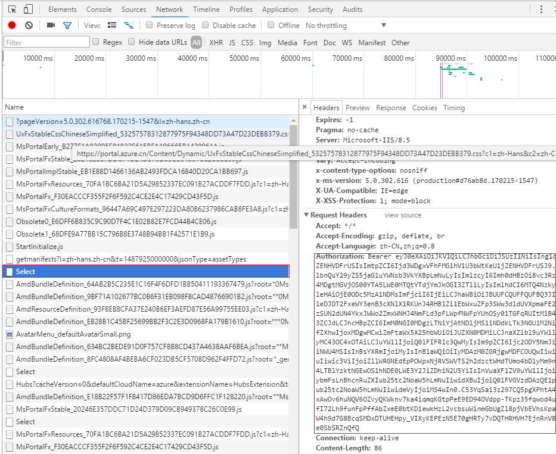

<properties
    pageTitle="如何通过 PowerShell调用 RateCard API"
    description="如何通过 PowerShell调用 RateCard API"
    service=""
    resource="billing"
    authors="Chen Rui"
    displayOrder=""
    selfHelpType=""
    supportTopicIds=""
    productPesIds=""
    resourceTags="Billing, RateCard API, PowerShell"
    cloudEnvironments="MoonCake" />
<tags
    ms.service="na-aog"
    ms.date=""
    wacn.date="03/16/2017" />
# 如何通过 PowerShell调用 RateCard API

客户和合作伙伴如果需要能够准确地预测和管理其 Azure 费用，则可以通过使用 RateCard API 来预测账单，通过以下步骤实现使用 PowerShell 调用 RateCard API：

1. 获取 Authorization Header：

    1. 使用 Google Chorme 浏览器（其它浏览器请参考网上资料）登录 [https://portal.azure.cn](https://portal.azure.cn)。

    2. 登录成功后，按下 `Ctrl+Shift+I` 键，调出审查元素控制台，单击 `Network` 后，刷新门户，可以看到监测很多请求。选择 Select，单击右边 `Headers`，我们可以快速的查看到 Authorization，将此部分复制作为后续 HTTP 认证使用。

        

2. Powershell调用（[下载](https://github.com/hello-azure/ratecardapi)）：

        clear

        # 说明：参考官方 RATE CARE API定义：https://msdn.microsoft.com/en-us/library/azure/mt219004.aspx

        # 订阅 ID
        $subscriptionId ="e0fbea86-6cf2-4b2d-81e2-9c59f4f96bcb"

        # API版本：支持 2015-06-01-preview、2016-08-31-preview两个值，参考：https://msdn.microsoft.com/en-us/library/azure/mt219005.aspx         
        $apiVersion = "2016-08-31-preview";

        # 我们请求的方 RATE CARE API 中有一个参数包含了一个$特殊字符，而这个特殊字符是 powershell 内置字符定义变量使用，因此我们要做转义，使用`进行转义
        $filterPara ="`$filter"

        # 这个参数值参考官方的示例设定，如需要请求其它类型数据，参考：https://msdn.microsoft.com/en-us/library/azure/mt219004.aspx中的其它示例，如'MS-AZR-0003p'
        $filter = "MS-MC-AZR-0033P";

        # 这个参数同上参考其它示例
        $currency = "CNY";

        # 这个参数同上参考其它示例
        $locale = "en-US";

        # 这个参数同上参考其它示例
        $regionInfo = "CN";

        # 格式化请求的 URL：第一点从官网拷贝的 URL 请求终结点是 https://management.azure.com，我们需要修改为 China 的地址为：https://management.chinacloudapi.cn。
        # 格式化请求的 URL：第二点从官网拷贝的 URL 中 $filter 与 Powershell存在字符冲突，参考$filterPara ="`$filter"进行转义。
        # 格式化请求的 URL：第三点从官网拷贝的 URL 中包含空格符，我们需要使用 %20 替换 URL 中所有的空格符
        # 格式化请求的 URL：第四点从官网拷贝的 URL 中包含非法字符’，将其替换为'
        $httpUri =  [string]::Format("https://management.chinacloudapi.cn/subscriptions/{0}/providers/Microsoft.Commerce/RateCard?api-version={1}&{2}=OfferDurableId eq ’{3}’ and Currency eq ’{4}’ and Locale eq ’{5}’ and RegionInfo eq ’{6}’",$subscriptionId,$apiVersion,$filterPara,$filter,$currency,$locale,$regionInfo)
        $httpUri = $httpUri.Replace(" ","%20").Replace("’","'")

        # 关于基于 AD 认证头信息可以在登录 https://portal.azure.cn 网站后，通过 Chorme 等浏览器查看 HTTP 请求-Network-Select 的 Authorization来获取，具体参考之前的说明
        $basicAuthValue = "Bearer eyJ0eXAiOiJKV1QiLCJhbGciOiJSUzI1NiIsIng1dCI6Ijd3WDgxVFhFMG1hV1U3bWtKeU1jZENHVDFrUSIsImtpZCI6Ijd3WDgxVFhFMG1hV1U3bWtKeU1jZENHVDFrUSJ9.eyJhdWQiOiJodHRwczovL21hbmFnZW1lbnQuY29yZS5jaGluYWNsb3VkYXBpLmNuLyIsImlzcyI6Imh0dHBzOi8vc3RzLmNoaW5hY2xvdWRhcGkuY24vYjM4OGI4MDgtMGVjOS00YTA5LWE0MTQtYTdjYmJkOGI3ZTliLyIsImlhdCI6MTQ4NzkyMzU4NywibmJmIjoxNDg3OTIzNTg3LCJleHAiOjE0ODc5Mjc0ODcsImFjciI6IjEiLCJhaW8iOiJBUUFCQUFFQUFBQ3JIS3ZyeDdHMlNhWmJaaC10RG5wNzhWcTlINWZ5NXNVV0N6T0UyLXlXbl8xQnpibUxUc190M0FUbGdzQmNuUjVTdm5sNUhaY3k5NUN1QXZrQXpqTWRjZUlIQzgya3paX3VtYmlGTURCZmRQZTBmcDY5dXg5SUMyVzU2RmR1TnpXZjMyRHYyODNCT2Y4aFg0OTc3VGMySUFBIiwiYW1yIjpbInB3ZCJdLCJhcHBpZCI6ImM0NGI0MDgzLTNiYjAtNDljMS1iNDdkLTk3NGU1M2NiZGYzYyIsImFwcGlkYWNyIjoiMiIsImVfZXhwIjoxMDgwMCwiZmFtaWx5X25hbWUiOiJUZXN0MDMiLCJnaXZlbl9uYW1lIjoiQ0lFIiwiaXBhZGRyIjoiMTA2LjEyMC43OC4xOTAiLCJuYW1lIjoiQ0lFIFRlc3QwMyIsIm9pZCI6Ijc2ODY5NmJiLWFiNWUtNDRjNi04ZTFiLTcxMjJiNjFiNWU4MSIsInBsYXRmIjoiMyIsInB1aWQiOiIyMDAzM0ZGRjgwMDFCOUQwIiwic2NwIjoidXNlcl9pbXBlcnNvbmF0aW9uIiwic3ViIjoiZllWRGNEdEpPOWpxNjRVSWVTS2h2dzctWHdTUmo4bDlyMm9nelJFWTBSWSIsInRpZCI6ImIzODhiODA4LTBlYzktNGEwOS1hNDE0LWE3Y2JiZDhiN2U5YiIsInVuaXF1ZV9uYW1lIjoiQ0lFVGVzdDAzQE1pY3Jvc29mdEludGVybmFsLnBhcnRuZXIub25tc2NoaW5hLmNuIiwidXBuIjoiQ0lFVGVzdDAzQE1pY3Jvc29mdEludGVybmFsLnBhcnRuZXIub25tc2NoaW5hLmNuIiwidmVyIjoiMS4wIn0.Vm1dTkpxFyIeEKZrhkjkGKJMZSMaz6uzc0rMHFEloUJThoTzjPPaRSuQHx5nzQVZOmrHo5vrTxmr0hRvLONnKferEtIlQuSJCpJgenLvFhNA5GjYJBhrebMGhePXi3thE4q3dVe50CuCuCg4sh5kg1I-vjESBrupIW7X1t712oZxc_l81u-tSbw08aG72uSw2s6Bp4zQ473_47dqCCgfKNol_qMW66cI8QrJW2pUL9OQPqbwPTKvFz-v3KeSIn_Y4L0044PZbaZLrvi3P4oOIB_3unO_FLw3XXP62KrxJTBKPgFe4BtOFwl8g9mPIfrmRT5Hok6Q13M8EomcV0OzAg"
        $headers = @{ Authorization = $basicAuthValue }

        # 执行请求，获取账单信息，存储到本地文件。这个数据是 JSON 格式的，如果希望更好的展现还需要应用化处理
        $res = Invoke-WebRequest -Uri $httpUri -Headers $headers -Method Get -ContentType "application/json" -OutFile E:\response.txt