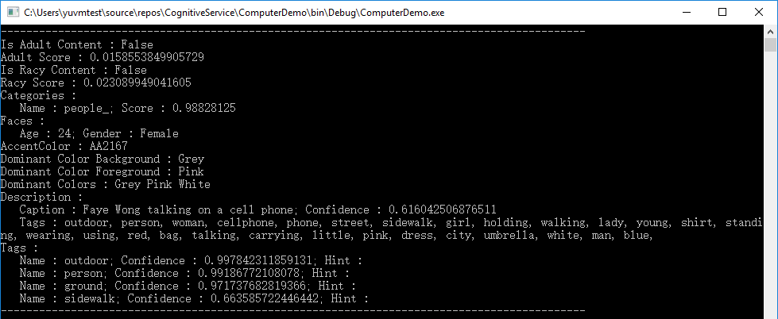

# 计算机视觉 API C# SDK 使用示例

认知服务为开发者提供了一组 API 和 SDK，从而将微软公司不断演进的人工智能技术扩展到广大开发者手中。<br>
开发人员可以使用基于云的计算机视觉 API 来访问高级算法，以便处理图像并返回信息。上传图像或指定图像 URL 后，Microsoft 计算机视觉算法可以根据输入和用户选择以不同的方式分析视觉内容。<br>
本文演示使用 C# SDK 并结合中国版认知服务 key 的控制台示例。

## 示例程序

```C#
using Microsoft.ProjectOxford.Vision;
using Microsoft.ProjectOxford.Vision.Contract;
using System;
using System.Threading.Tasks;

namespace ComputerDemo
{
    class Program
    {
        //初始化对象
        static string subscriptionKey = "<computer vision API key>";
        static VisionServiceClient visionServiceClient = new VisionServiceClient(subscriptionKey, "https://api.cognitive.azure.cn/vision/v1.0");
        static void Main(string[] args)
        {
            Console.WriteLine("--------------------------------------------------------------------------------------------");
            AnalysisResult visisonResult = MyMethod().GetAwaiter().GetResult();
            //打印输出结果
            printResult(visisonResult);
            Console.WriteLine("--------------------------------------------------------------------------------------------");

            Console.ReadKey(true);
        }

        static async Task<AnalysisResult> MyMethod()
        {
            //设置需要输出的参数
            VisualFeature[] visualFeatures = new VisualFeature[] { VisualFeature.Adult, VisualFeature.Categories, VisualFeature.Color, VisualFeature.Description, VisualFeature.Faces, VisualFeature.ImageType, VisualFeature.Tags };
            //图片的 URL，此处既可以使用公网可以访问的图片，也可以直接读取本地图片的 URL
            AnalysisResult analysisResult = await visionServiceClient.AnalyzeImageAsync("http://h.hiphotos.baidu.com/baike/pic/item/7a899e510fb30f2445d60e4dc195d143ad4b032b.jpg", visualFeatures);

            return analysisResult;
        }

        /// <summary>
        /// 打印输出结果函数
        /// </summary>
        /// <param name="result"></param>
        static void printResult(AnalysisResult result)
        {
            if (result.Adult != null)
            {
                Console.WriteLine("Is Adult Content : " + result.Adult.IsAdultContent);
                Console.WriteLine("Adult Score : " + result.Adult.AdultScore);
                Console.WriteLine("Is Racy Content : " + result.Adult.IsRacyContent);
                Console.WriteLine("Racy Score : " + result.Adult.RacyScore);
            }

            if (result.Categories != null && result.Categories.Length > 0)
            {
                Console.WriteLine("Categories : ");
                foreach (var category in result.Categories)
                {
                    Console.WriteLine("   Name : " + category.Name + "; Score : " + category.Score);
                }
            }

            if (result.Faces != null && result.Faces.Length > 0)
            {
                Console.WriteLine("Faces : ");
                foreach (var face in result.Faces)
                {
                    Console.WriteLine("   Age : " + face.Age + "; Gender : " + face.Gender);
                }
            }

            if (result.Color != null)
            {
                Console.WriteLine("AccentColor : " + result.Color.AccentColor);
                Console.WriteLine("Dominant Color Background : " + result.Color.DominantColorBackground);
                Console.WriteLine("Dominant Color Foreground : " + result.Color.DominantColorForeground);

                if (result.Color.DominantColors != null && result.Color.DominantColors.Length > 0)
                {
                    string colors = "Dominant Colors : ";
                    foreach (var color in result.Color.DominantColors)
                    {
                        colors += color + " ";
                    }
                    Console.WriteLine(colors);
                }
            }

            if (result.Description != null)
            {
                Console.WriteLine("Description : ");
                foreach (var caption in result.Description.Captions)
                {
                    Console.WriteLine("   Caption : " + caption.Text + "; Confidence : " + caption.Confidence);
                }
                string tags = "   Tags : ";
                foreach (var tag in result.Description.Tags)
                {
                    tags += tag + ", ";
                }
                Console.WriteLine(tags);

            }

            if (result.Tags != null)
            {
                Console.WriteLine("Tags : ");
                foreach (var tag in result.Tags)
                {
                    Console.WriteLine("   Name : " + tag.Name + "; Confidence : " + tag.Confidence + "; Hint : " + tag.Hint);
                }
            }
        }
    }
}
```

## 测试结果



## 更多参考

[计算机视觉 API 1.0 版](https://docs.azure.cn/zh-cn/cognitive-services/computer-vision/home)<br>
[Computer Vision API](https://dev.cognitive.azure.cn/docs/services/56f91f2d778daf23d8ec6739/operations/56f91f2e778daf14a499e1fa)<br>
[认知服务计算机视觉 API - Windows](https://github.com/Microsoft/Cognitive-Vision-Windows)<br>
[中国版认知服务使用指导](https://docs.azure.cn/zh-cn/articles/azure-operations-guide/cognitive-services/aog-cognitive-services-guidance)