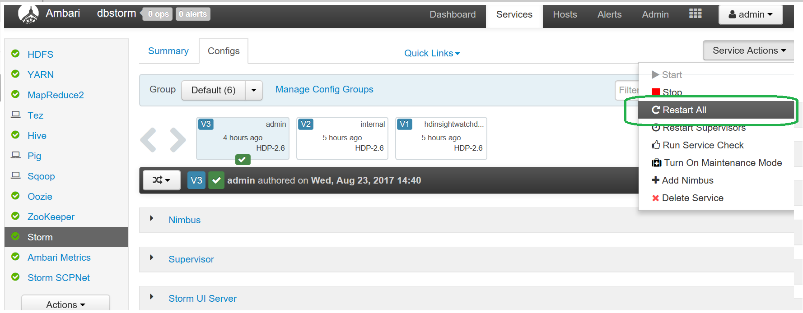
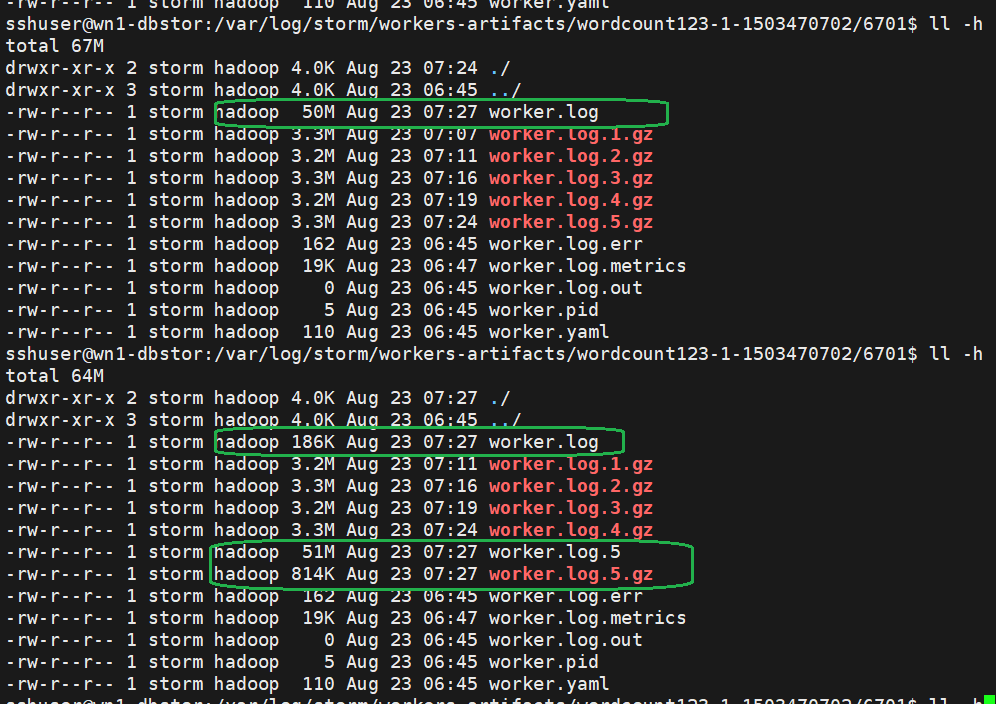

# 如何自定义 HDInsight Storm 日志文件大小

HDInsight Storm 集群采用 Log4j 对 topology 日志进行收集并存储在 Azure Blob Storage 中，默认情况下，只会保存一定时间内的日志，history 的日志会被冲刷。但是用户可以通过修改相关参数对日志文件大小和保存时间进行自定义修改。以下为相关步骤：

## 先决条件

- HDInsight Storm 集群
- 登录集群的 ssh 工具，例如：Putty 或者 Xshell.

## 操作步骤

1. 创建完集群后，登录 ambari 界面，可以查看到集群 Log4j 保存日志的默认参数。

    

    参数 `SizeBasedTriggeringPolicy size = "100 MB"`作用是如果日志文件大小达到 100MB，那么此日志文件会被进行压缩，生成后缀为 .gz 文件。

    参数 `DefaultRolloverStrategy max= "9"` 作用是默认情况下，此类 gz 文件保留 9 份。

    > [!NOTE]
    > 最老版本的 gz 文件会被冲刷。

2. 向 storm 集群提交 topology，在 worker 节点路径 /var/log/storm/workers-artifacts 下查看日志文件。

    

    从此图中我们可以看到 worker.log 文件 size 达到 100M 时，马上被重命名为 worker.log.7，并且随即进行了压缩。

    > [!NOTE]
    > gz 文件会保留 9 份。

3.	如果客户想要对此日志文件保留策略进行自定义的话，可以通过修改第一步中说明的两个参数。

    

    点击右上方 "**Save**"按钮，然后选择一个合适的时间点 restart storm 相关服务。操作如下：

    

    通过以上步骤，将此修改 deploy 到了集群的每个节点，包括 headnode 和 worknode。可以在 /usr/hdp/XXXX/storm/log4j2/worker.xml 查看到更新。

4.	观察新 topology 的日志文件变化。文件增长到 50M 的时候，随即被压缩。并且，以 gz 结尾的文件值保存了 5 个。

    

## 总结

通过以上步骤可以对 HDInsight Storm 日志文件进行自定义，以上演示是将单个日志文件保存大小从 100M 改为 50M，且总数从 10 个减少为 5 个。当然，完全可以增大单个日志文件大小和文件总数，只要增大第一步中提到了 2 个参数值的大小即可。