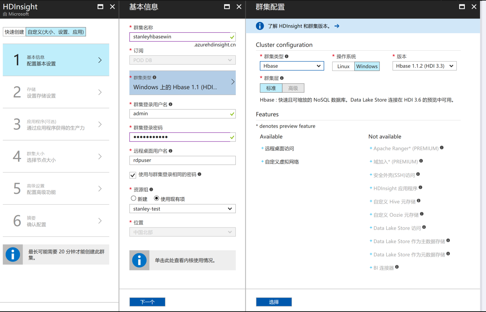
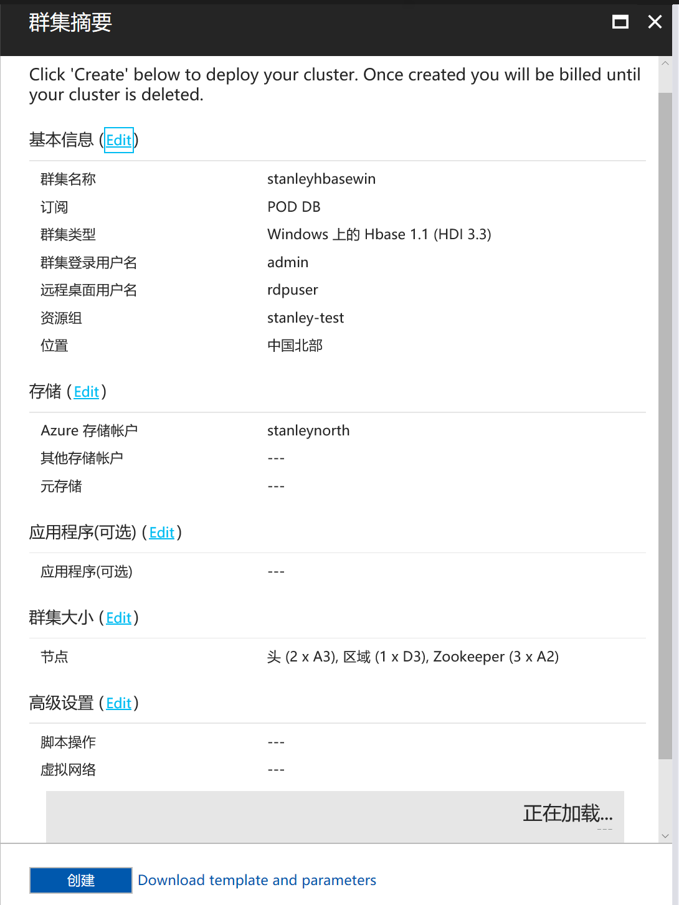
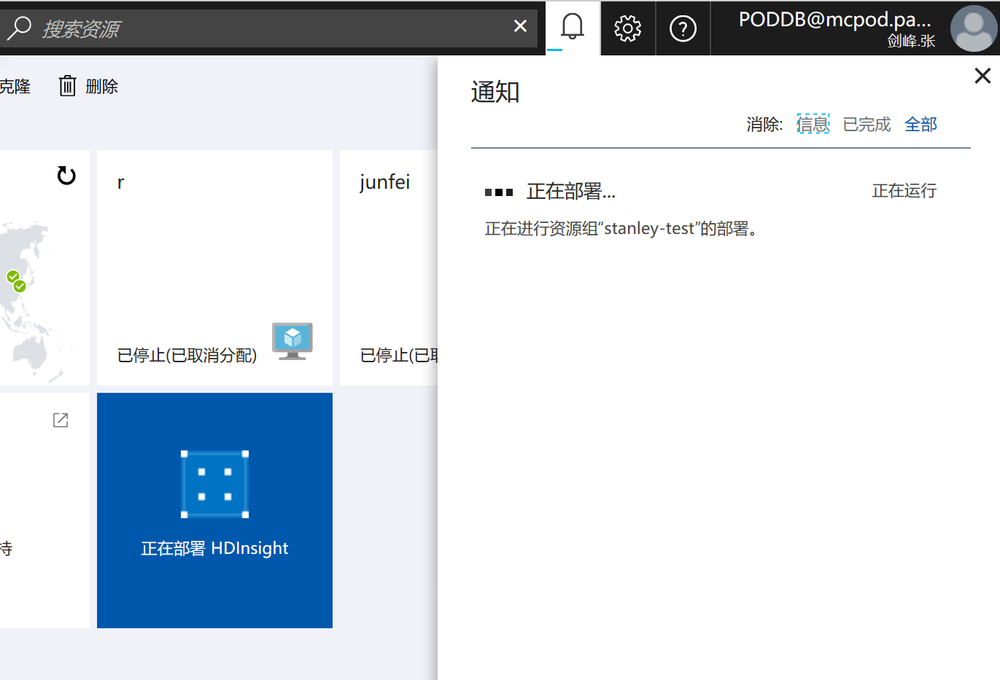
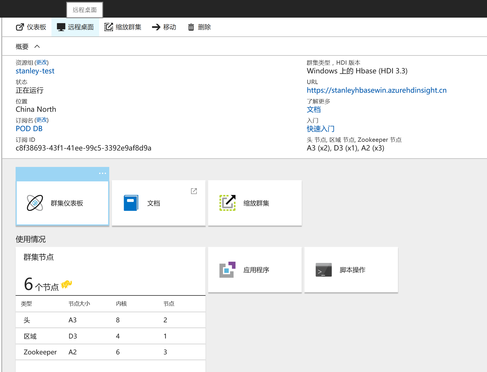
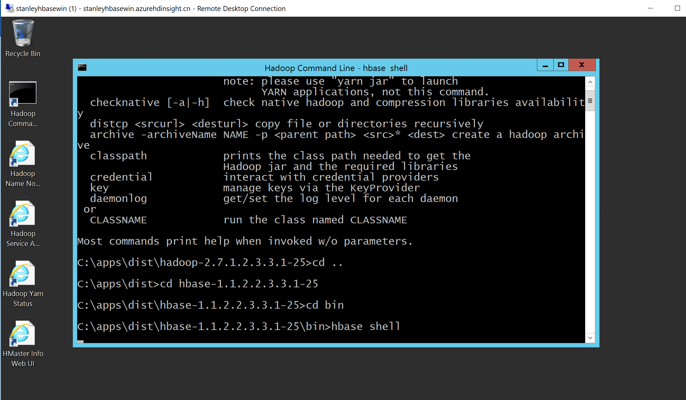
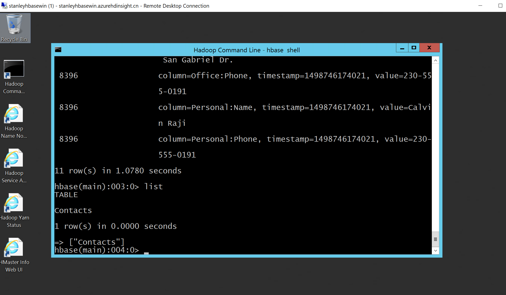
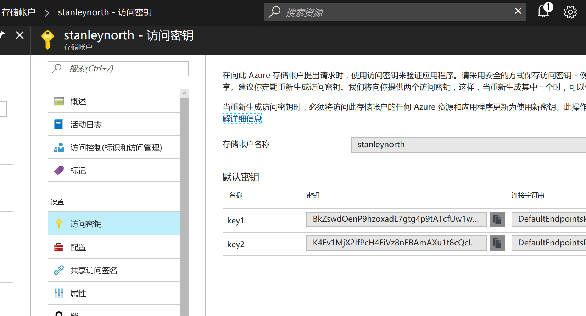
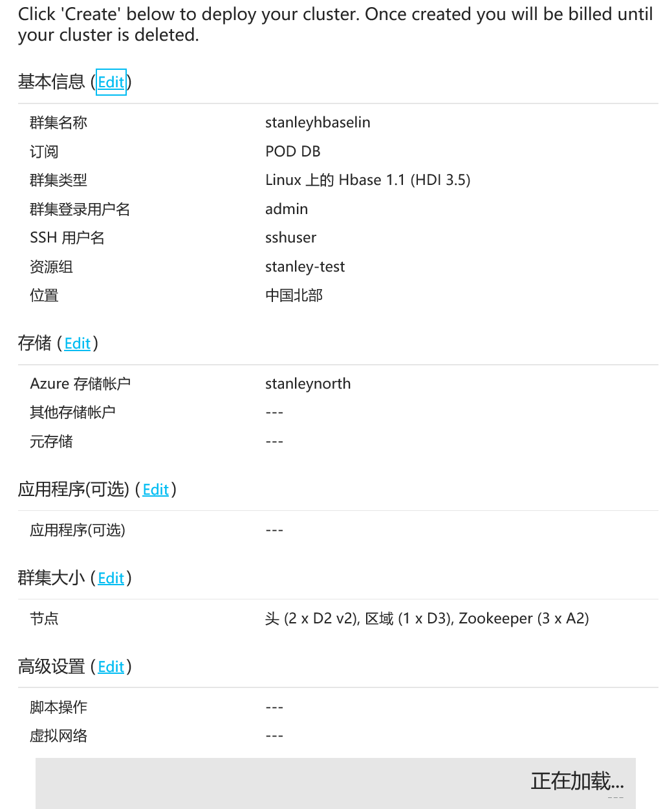

# Windows HDInsight 群集向 Linux 环境迁移示例之 HBase 篇

Azure HDInsight 作为 Azure 上的大数据分布式处理平台，目前支持基于 Windows 和 Linux 的群集。目前 Windows 环境中的 HDInsight 最高版本 HDI 3.3 即将在 2017 年 7 月 31 日停止支持，因此需要将其上的 Windows 群集迁移到 Linux 环境中更高 HDI 版本的群集。 [Azure 官网文章](https://docs.azure.cn/zh-cn/hdinsight/hdinsight-hbase-tutorial-get-started-linux/) 介绍了此项迁移任务的大致操作步骤，但并未给出具体示例。本文旨在介绍 HDInsight 迁移的一个简单示例，以供读者参考。

截至 2017 年 6 月 30 日，Windows 平台上支持的 HDInsight 群集类型及最高版本为 Hadoop 2.7.0(HDI 3.3)，HBase 1.1.2(HDI 3.3) 和Storm 0.9.3(HDI 3.3)。本次迁移示例是将 Windows HDInsight 上的HBase 1.1.2 (HDI 3.3) 迁移到 Linux HDInsight 上的 HBase 1.1.2 (HDI 3.5) 。

以下为本次 HBase 迁移示例的具体步骤：

1. [在 Azure 门户预览上创建 Windows HDInsight 的 HBase 群集](#portal)
2. [用 HBase Shell 创建示例表格](#shell)
3. [用 Microsoft Azure Storage Tool 复制 HBase 群集所用的容器](#storge-tool)
4. [基于所复制的容器创建 Linux HDInsight 的 HBase 群集](#create)

下面将就这几步进行具体介绍，其中将 Windows HDInsight 上的 HBase 群集简称为 Windows HBase 群集，将 Linux HDInsight 上的 HBase 群集简称为 Linux HBase 群集。

## 在 Azure 门户预览上创建 Windows HDInsight 的 HBase 群集

登陆 Azure 门户预览后，点击 “ **新建** ” → **HDInsight**，开启 HDInsight 创建页面，选择自定义创建方式：

之后可参考官网文章进行参数设置。本示例所用的容器是位于中国北部的存储账户 stanleynorth 下的 stanleyhbasewin (容器名可自行设定)，区域节点为 D3，头结点为 A3，Zookeeper 节点为 A2。在创建群集前显示的摘要如图所示：

所有参数设定完后，点击 “**创建**” 按钮，便开启了 HDInsight 群集部署，此过程可能耗时二十多分钟甚至更长时间。

待 HDInsight 群集创建完毕，便可通过 RDP 进行远程桌面登陆：

## 用 HBase Shell 创建示例表格

远程登陆机器之后，双击 Hadoop Command Line 图标打开命令行界面，输入以下命令打开 hbase shell 界面：

    cd ..

    cd hbase-1.1.2.2.3.3.1-25

    cd bin

    hbase shell

> [!NOTE]
> 第二步跳转到 HBase 目录，所用的目录名视具体 HBase 版本而定。

之后创建测试表 '**Contacts**'，该表有 '**Personal**' 和 '**Office**' 两个 Column Family，共包含 11 行数据。以下为操作命令，具体内容可参考 : [HBase 教程：开始使用 HDInsight 中的 Apache HBase](https://docs.azure.cn/zh-cn/hdinsight/hdinsight-hbase-tutorial-get-started-linux/) 中的 "**创建表和插入数据**" 部分：

    create 'Contacts', 'Personal', 'Office'
    list

    put 'Contacts', '1000', 'Personal:Name', 'John Dole'
    put 'Contacts', '1000', 'Personal:Phone', '1-425-000-0001'
    put 'Contacts', '1000', 'Office:Phone', '1-425-000-0002'
    put 'Contacts', '1000', 'Office:Address', '1111 San Gabriel Dr.'
    scan 'Contacts'

    get 'Contacts', '1000'

    exit

    hbase org.apache.hadoop.hbase.mapreduce.ImportTsv -Dimporttsv.columns="HBASE_ROW_KEY,Personal:Name,Personal:Phone,Office:Phone,Office:Address" -Dimporttsv.bulk.output="/example/data/storeDataFileOutput" Contacts wasbs://hbasecontacts@hditutorialdata.blob.core.windows.net/contacts.txt

    hbase org.apache.hadoop.hbase.mapreduce.LoadIncrementalHFiles /example/data/storeDataFileOutput Contacts

表格创建完毕，如下所示：

> [!NOTE]
> 实例表格创建完毕后，需要将表 'Contacts' 给 disable，这样做的目的是为了将 HBase 内存中的数据完整地写到存储中，确保数据的完整性。

## 用 Microsoft Azure Storage Tool 复制 HBase 群集所用的容器

上述操作完成后，便可将 Windows HBase 群集的数据迁移到 Linux HBase 群集中。官网文章介绍的方法是在部署好 Linux HBase 群集后，用 SSH 工具登陆并输入以下命令进行数据迁移：

    hdfs dfs -cp wasbs://CONTAINER@ACCOUNT.blob.core.windows.net/path/to/old/data /path/to/new/location

但经本地测试发现，也可通过 Microsoft Azure 存储工具命令行(参考:使[用 AzCopy 命令行实用程序传输数据](https://docs.azure.cn/zh-cn/storage/storage-use-azcopy/))直接将 Windows HBase 群集所用容器的内容复制到一个新容器中，并在后者的基础上新建 Linux HDInsight 的 HBase 群集。以下是具体步骤：

首先，在 Azure 门户预览上创建新容器。为方便起见，本示例选择在 Windows HBase 群集所用的存储账户 stanleynorth 下新建名为 stanleyhbasewin-backup 的容器。当然，也可根据需要而在其他存储账户下创建新容器。

待容器创建完成后，点击“**访问密钥**”，查看存储账户 stanleynorth 所用的密钥，key1 或 key2 互为备份，均可使用。

然后打开 Microsoft Azure Storage 命令行窗口，输入以下命令将 Windows HBase 群集所用容器 stanleyhbasewin 中的数据全部复制到新建容器 stanleyhbasewin-backup 中：

    AzCopy /Source:https://stanleynorth.blob.core.chinacloudapi.cn/stanleyhbasewin /Dest:https://stanleynorth.blob.core.chinacloudapi.cn/stanleyhbasewin-backup /SourceKey:<key_source> /DestKey:<key_dest> /S

其中 <key_source> 表示源存储账户的密钥，<key_dest> 表示目的存储账户的密钥，在本示例中，二者均为存储账户 stanleynorth 的密钥。

容器复制完成后，会显示复制文件数，所花时间等信息。

从 Azure 门户预览上看，容器 stanleyhbasewin 中的内容已复制到 stanleybasewin-backup 中。

## 基于所复制的容器创建 Linux HDInsight 的 HBase 群集

最后创建 Linux HBase 群集，群集名为 stanleyhbaselin，存储账户和默认容器分别选择 stanleynorth 和 stanleyhbasewin-backup，区域节点为 D3，头结点为 D2 v2，Zookeeper 节点为 A2。

同之前情况类似，此次创建也需耗时二十多分钟以上。待群集创建完毕后，点击存储账户，可确认所使用的容器为 stanleyhbasewin-backup。

然后用 PuTTY 登陆 stanleyhbaselin 群集，直接输入 hbase shell 进入 hbase 环境。

执行 list 和 scan ‘Contacts’，可看到之前在 Windows HBase 上创建的有 11 行数据的 Contacts 表，这表明从 Windows HDInsight 到 Linux HDInsight 的数据迁移是成功的。

## 结语

本文介绍了一个从 Windows HBase 群集向 Linux HBase 群集迁移的示例，所用的方法是在 Microsoft Azure Storage 命令行界面中用 AzCopy 命令将 Windows HBase 群集所用存储账户容器 stanleyhbasewin 中的内容复制到一个新的容器 stanleyhbasewin-backup 中，并基于 stanleyhbasewin-backup 创建 Linux HBase 群集，之后登陆 Linux HBase 群集便可看见之前在 Windows HBase 群集中创建的表 Contacts。

如前文所言，目前 Windows HDInsight 平台支持 Hadoop，HBase 和 Storm 三个群集类型，本文所介绍的 HBase 群集的迁移只涉及到表格，相对比较简单。之后我会继续研究 Hadoop 和 Storm 群集所涉及的数据和作业方面的迁移，并另外撰文进行总结。
