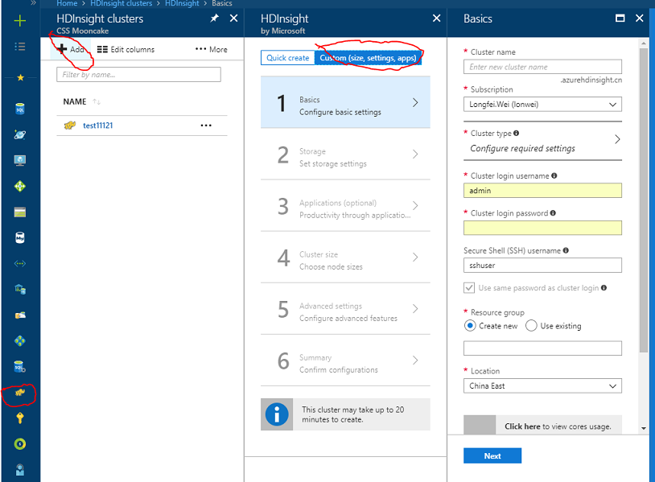
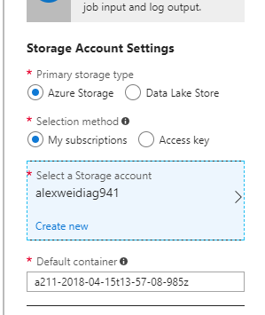
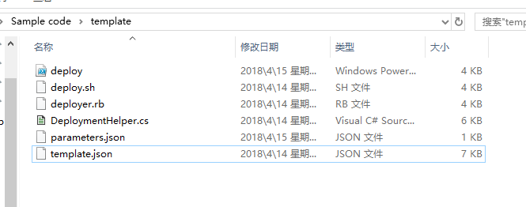
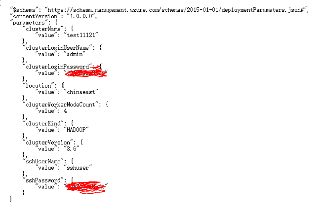
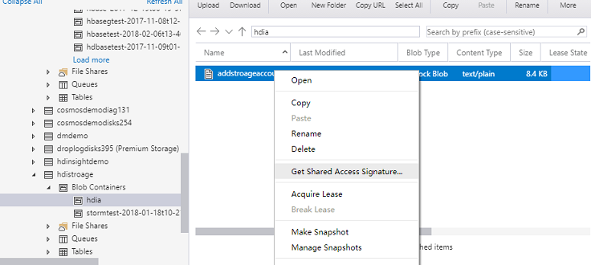
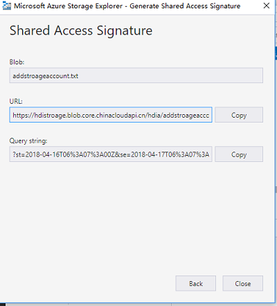

# 如何合理的利用 HDInsight 并节省费用

HDInsight 集群是当前 Azure 中最流行的大数据分析平台，因为其一键配置，便于管理与监控深受用户的欢迎。

不过其昂贵的价格也让不少用户对于 HDInsight 的使用踌躇不定甚至望而却步。

> [!NOTE]
> 下面是集群中使用节点最少的 spark 集群 ，3 工作节点的官方价格。


本文旨在介绍一种关于如何合理减少 HDInsight 集群费用的入门方法，读者可以结合自己的应用场景来选择使用。

HDInsight 属于一种 PaaS 服务，与其他 PaaS 服务如 SQL DB 或 MySQL 相比较之下，它的计费是按分钟计算的。所以，每少用一分钟，就可以节省一分钟的使用费用。而对于部分用户的大数据计算业务来说，可能我只需要 4 个小时就可以跑完我一天的计算任务，并将计算结果导入到 SQL DB 中供用户查询。这样一来，我就可以删除掉 HDInsight 集群来节省需要的费用。

以下介绍如何自动创建和删除 HDInsight 集群。

按照下图所示，找到 HDInsight, ADD，自定义配置。



输入用户所需要的配置内容即可。
此处请务必配置好需要的存储，因为 HDInsight 在删除时不会删除存储上的内容，也是本文的根基所在。

Container 的名字是 HDInsight 存放数据的根目录，最好是手动命名。



创建完成之后，点击下文红圈处，download template and paramters.


虽然也可以从已经创建好的集群导出模板，但是为了方便用户，还是建议在一开始的时候就这样做。

在导出模板并解压缩后，目录结构如下：


此时用户需要修改，deploy,parameters.jason,template.jason 3 个文件。

> [!TIP]
> Deploy 文件中用户需要修改相应参数。<br>
> Mandatory 需要改为 false。手动填写需要 deploy 的 subid,resource group name,deployment name。

```json
param(
 [Parameter(Mandatory=$False)]
 [string]
 $subscriptionId="a9dc7515-7692-4316-9ad4-xxxxxxx0",

 [Parameter(Mandatory=$False)]
 [string]
 $resourceGroupName="storm",

 [string]
 $resourceGroupLocation,

 [Parameter(Mandatory=$False)]
 [string]
 $deploymentName="hditest",
```

接下来，在替换 deploy 文件中的 Azure 登录配置之前，我们需要进行免交互登录配置。

首先为登录 Azure 门户的密码生成一个加密的字符串。

> [!TIP]
> 替换 deploy 文件中的密码文件路径和 password。

```powershell
#从加密文件载入密码登录
$pwd = Get-Content C:\secretfile.txt | ConvertTo-SecureString
$cred = New-Object System.Management.Automation.PSCredential("xxxx@xxx.partner.onmschina.cn",”password”)
Login-AzureRmAccount -EnvironmentName AzureChinaCloud -Credential $cred
```

生成加密后的密码之后，我们需要对 deploy 文件的 sign in 部分进行如下替换：

默认为：

```powershell
# sign in
Write-Host "Logging in...";
Login-AzureRmAccount
```

替换后的内容为

```powershell
# sign in
Write-Host "Logging in...";
$pwd = Get-Content C:\secretfile.txt | ConvertTo-SecureString
$cred = New-Object System.Management.Automation.PSCredential("xxxx@mcpod.partner.onmschina.cn",$pwd)
Login-AzureRmAccount -EnvironmentName AzureChinaCloud -Credential $cred
```

至此 deploy 文件的替换内容已经结束。

接下来进行 parameter.json 的替换。

这部分内容相对比较简单，只需要对登陆的密码和用户名进行替换。



最后是需要替换 template.json 文件中的 script action，也就是用户需要执行定时任务的脚本路径。<br>
只需要替换 `ComputeProfile` 中的 `scriptactions` 属性即可。


在本例中，url 我们使用 Azure 存储中的文件，步骤如下：

1. 打开 Azure Storage Explorer，选中文件，右键点击 **Get Shared Access Signature...**。

    

2. 生成一个存活时间足够长的共享访问签名：

    

3. 生成访问 url，并替换掉 deploy template 中的 url：

    > [!TIP]
    > 建议在替换之前先尝试该 URL 是否可以在浏览器中打开，确认自己生成正确。

    

至此一个完整的 HDInsight 创建模板已经完成了。

用户需要做的只是通过定时任务（如 Windows scheduler）调用该 PowerShell 对 HDInsight 进行创建即可。

> [!TIP]
> 本文只是一个初步的使用方法，用户可以根据自己的实际需要情况去调整更多内容。
