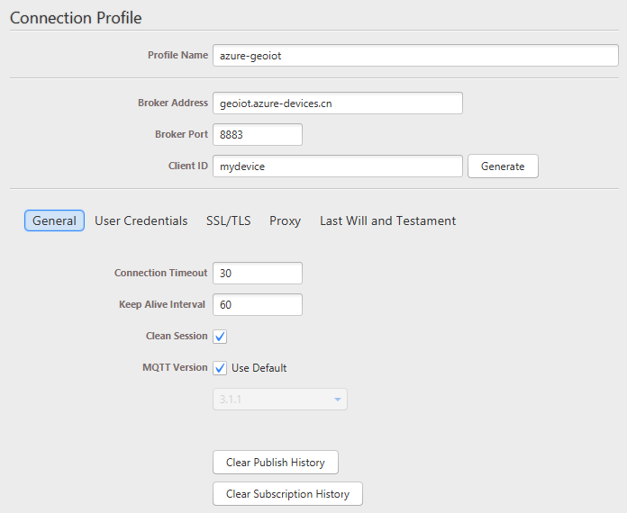
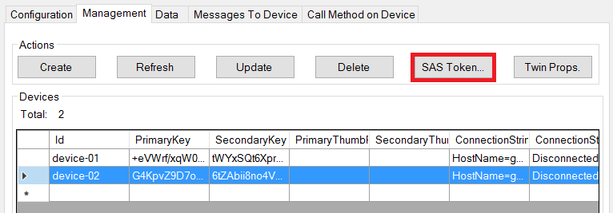
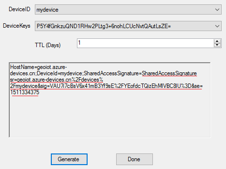
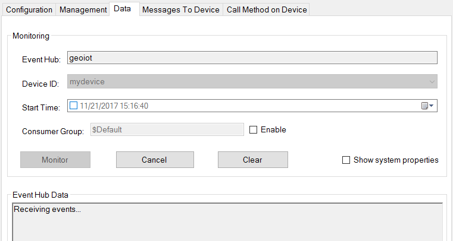
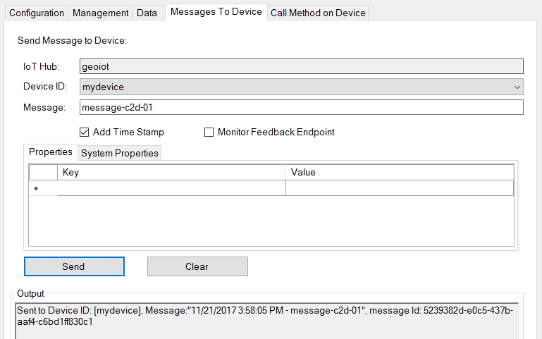
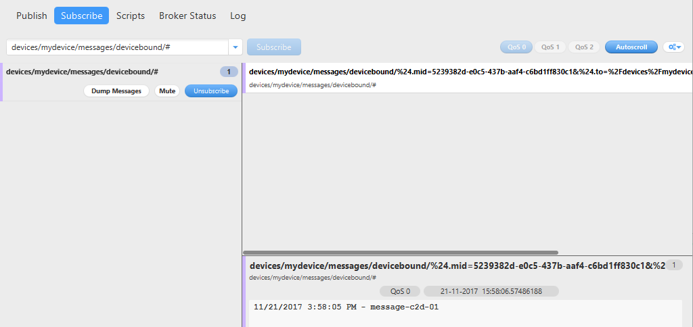

# 使用 MQTT.fx 工具连接 IoT Hub

## 场景描述

MQTT.fx 是目前主流的 MQTT 客户端，可以快速验证是否可以与 IoT Hub 服务交互发布或订阅消息。

MQTT.fx 下载地址：[http://mqttfx.bceapp.com/](http://mqttfx.bceapp.com/) 

## 实现原理

1. 连接协议

    IoT 中心让设备能够在端口 8883 上使用 MQTT v3.1.1 协议，或在端口 443 上使用基于 WebSocket 的 MQTT v3.1.1 协议来与 IoT 中心设备终结点通信。IoT 中心要求使用 TLS/SSL 保护所有设备通信（因此，IoT 中心不支持端口 8883 上的非安全连接）。

2. 发布消息

    使用 MQTT.FX 工具时，设备可以使用 `devices/{device_id}/messages/events/` 或 `devices/{device_id}/messages/events/{property_bag}` 作为主题名称将消息发送到 IoT 中心。`{property_bag}` 元素可让设备使用 URL 编码格式发送包含其他属性的消息。

    IoT 中心不支持 QoS 2 消息。如果设备使用 QoS 2 发布消息，IoT 中心将断开网络连接。

3. 订阅消息

    使用 MQTT.FX 工具时，设备应使用 `devices/{device_id}/messages/devicebound/#` 作为主题筛选器来进行订阅。主题筛选器中的多级通配符 # 仅用于允许设备接收主题名称中的其他属性。IoT 中心不允许使用 # 或 ? 通配符筛选子主题。由于 IoT 中心不是一般用途的发布-订阅消息传送中转站，它仅支持存档的主题名称和主题筛选器。

更多信息请参考：[IoT 中心 MQTT 支持](https://docs.azure.cn/zh-cn/iot-hub/iot-hub-mqtt-support)

## 使用测试

1. 客户端连接

    1. 基本新配置如下：

        

    2. 使用 [Device Explorer](https://github.com/Azure/azure-iot-sdk-csharp/tree/master/tools/DeviceExplorer) 准备认证凭据：

        * “**用户名**”字段使用 `{iothubhostname}/{device_id}`，其中 `{iothubhostname}` 是 IoT 中心的完整 CName。例如，如果 IoT 中心的名称为 `contoso.azure-devices.cn`，设备的名称为 `MyDevice01`，则完整用户名字段应包含 `contoso.azure-devices.cn/MyDevice01`。
        
        * “**密码**”字段使用设备的 SAS 令牌。SAS 令牌的格式如下：`SharedAccessSignature sig={signature-string}&se={expiry}&sr={URL-encoded-resourceURI}`。可以通过快速获取，如下：

            
        
            TTL 设置 > 0，点击 “**Generate**”,注意 SAS 拷贝的部分（红线标记即为密码）：

            

    3. 切换到 “**User Credentials**”，输入用户名、密码：

        

    4. 切换到 SSL/TLS：

        

    5. 配置好后连接即可：

        

2. 发布消息

    1. 使用 Device Explorer 接收 Device(mydevice) 的消息：

        

    2. 建立连接后，设备可以使用 `devices/{device_id}/messages/events/` 或 `devices/{device_id}/messages/events/{property_bag}` 作为主题名称将消息发送到 IoT 中心。

        

    3. 通过 Device Explorer 查看接收的消息：

        

3. 订阅消息

    1. 若要从 IoT 中心接收消息，设备应使用 `devices/{device_id}/messages/devicebound/#` 作为主题筛选器来进行订阅。

        

    2. 使用 Device Explorer 发送 C2D 消息：

        

    3. 查看订阅消息：

        