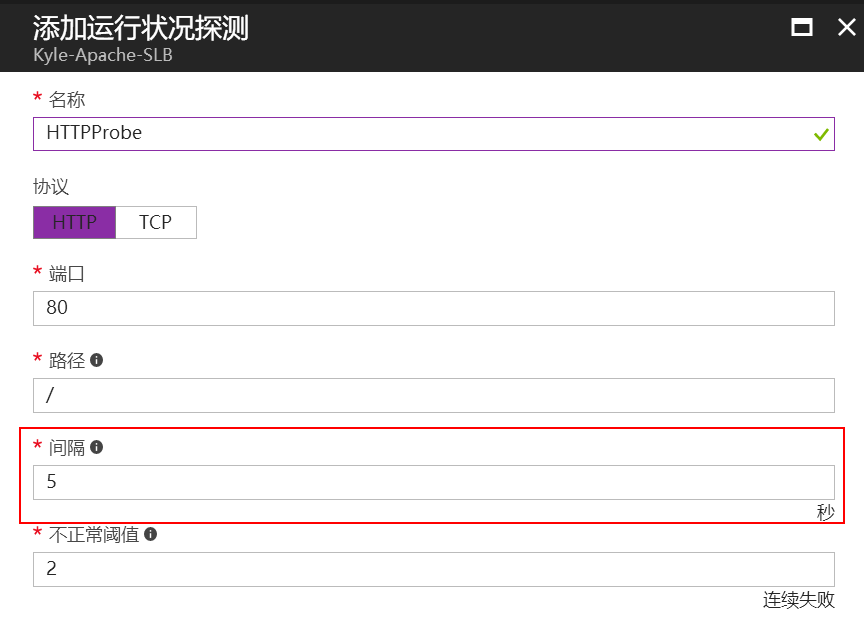
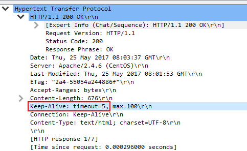
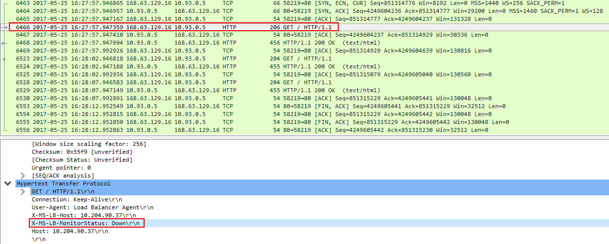
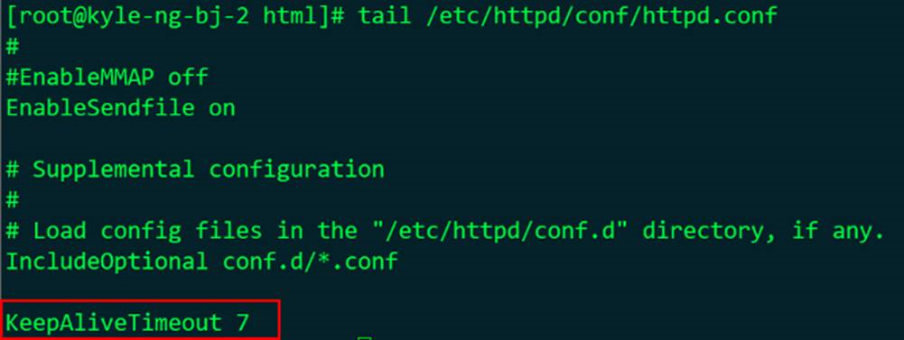

# Apache KeepAlive 引发的 HTTP 探测问题及解决办法

Azure 负载均衡器的运行状况探测支持 TCP 和 HTTP 两种探测方式。TCP 探测是对被检测的 TCP 端口进行连接（TCP 三次握手），通过 TCP 会话能否成功建立来判断服务是否正常。而 HTTP 探测则是向被检测的 HTTP 服务发送 Get 请求，对方返回“ **HTTP 200 OK** ”的响应后，Azure 则认为服务正常。

## 问题描述

在实际使用过程中，我们发现当负载均衡器的后端为 Apache Web Server，启用了 KeepAlive 并且使用默认设置时（不同版本的 Apache，KeepAlive 可能默认开启或者关闭），偶尔会引发 HTTP 探测失败，进而导致后端这台虚拟机的 Web 服务被标记为宕机。负载均衡器会中断之前连接在这台虚拟机中的 TCP 会话，转而向它认为健康的虚拟机建立新的 TCP 连接。如果这些被中断的 TCP 会话包含用户的登录信息，而这些信息没有同步到其它后端虚拟机时，会话重置后这些信息会丢失，最终导致用户被登出。

## 问题分析

经研究发现，这个问题与 Azure 负载平衡器运行状态探测和 Apache KeepAlive 配置有关。

HTTP 探测配置中时，默认间隔是 5 秒，如下图。这样，Azure 会每隔 5 秒向后端池中的所有 HTTP 服务发送一个 HTTP 的 Get 请求。

Apache KeepAlive Timeout 默认值也是 5 秒，这个值表示 Apache 连接保持的时间。也就是说，在上一个 HTTP 请求后，如果 5 秒钟内都没有接收到新的 HTTP 请求，Apache 就中断这个连接。我们可以通过抓包来确认这个配置，如下图。

这两个时间间隔都配置为 5 秒时，由于网络延迟客观存在，导致 Apache 收到的连续两个探测包间隔比 5 秒多了零点几毫秒。而在第二个探测包到达之前，Apache 就判定了会话超时，从而开始结束会话，并且不响应后续的请求。

如下图抓包所示，Apache 在发出终止 TCP 会话的数据包（下图中第 6458 包）后，又收到了 Azure 发来的 HTTP 探测包（下图中第 6459 包）。此时 Apache 不会响应此探测包，Azure 认为探测失败，并将该虚拟机标记为 Down。

在 Azure 新发出的 HTTP 探测中，也能看到前一次被标记为 Down 的信息（下图中第 6466 包）。

后续的探测 Apache 返回了“ **HTTP 200 OK** ”，所以 Azure 认为探测成功，并重新将虚拟机标记为 UP。而在以上 Down、UP 的切换过程中，TCP 会话会被重置。进而引发了已登录的用户会话信息丢失，账号被登出，需要重新登录的问题。

## 解决方法

此问题是由于 HTTP 探测配置默认间隔和 Apache KeepAlive Timeout 默认值相同导致。在网络延迟的影响下，Azure 探测包在 Apache 发出的会话终止数据包之后到达，Apache 不回应此探测，进而 Azure 将虚拟机标记为 Down。

所以，将这两个时间间隔配置为不同值，即可解决此问题。

为了保证负载平衡器的探测更灵敏，建议保留其 5 秒间隔的默认值（最小配置为 5 秒）。这里以修改 Apache 中的 KeepAliveTimeout 设置为例。将 KeepAliveTimeout 7（7 秒发送一个 KeepAlive 数据包）加入/etc/httpd/conf/httpd.conf 末尾，然后重启 Apache 服务使之生效（httpd.conf 路径需要根据实际情况调整），如下图：

