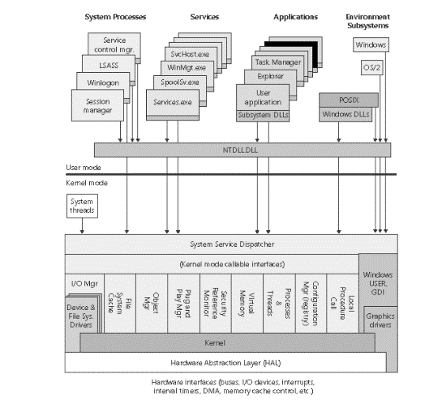

# 理解 Azure 存储的监控

前文：[理解 Azure 虚拟机的负载监控](aog-monitoring-and-diagnostics-virtual-machines-load-monitoring-understanding.md)，我们介绍了运行在 Azure 平台上的 Windows 虚拟机和 Linux 虚拟机可以收集的性能指标，以及 Azure 如何存储这些数据用于用户界面的显示和资源的缩放，本文我们脱离虚拟机，来了解一下 Azure 平台上其他服务的监控。

在了解监控功能之前，我们重新回顾一下 Azure 上的服务列表。很多用户在使用了 Azure 一段时间之后，仍然对 Azure 的各个服务之间的关系不是很清楚。在此，我们先讲述下 Azure 的架构：

上图囊括了大部分 Azure 平台的服务。此处我们不是想详细解释每个服务的具体功能。从宏观的角度看，我们可以把 Azure 这个公有云的平台看成一个巨大的操作系统。

大家可能对于 Windows 操作系统比较熟悉，那我们可以把 Windows 系统和 Azure 平台做一个简单的类比。

- **Hardware Abstraction Layer (HAL)**：在 Windows 平台上，系统可以运行在各种不同的硬件设备上。为了让操作系统的设计摆脱硬件设备的不一致性，系统使用 HAL 来隐藏了具体硬件信息而向操作系统提供了一致的接口。在 Azure 平台上，我们使用 Hyper-V，软件定义网络以及软件定义存储等技术隐藏了具体数据中心的硬件细节，而向上层的用户提供一致的计算，网络以及存储接口。

- **Windows Kernel**: 在 Windows 平台上，系统内核涵盖了内存管理，IO 系统，文件系统，对象管理，安全系统等等来实现对于资源的调度，访问控制等等。在 Azure 平台，我们使用 Fabric Controller 等来管理数据中心的资源分配，监控以及调度，实现资源的最优分配。

- **Thread**：在 Windows 平台上，线程是执行代码的最小单元。它会占用 CPU 资源进行计算，处理内存请求，访问存储等等来实现代码设计好的功能。在 Azure 平台上，我们暂且认为虚拟机是一个最小的可排程的计算单元（不考虑 Container 的状况），虚拟机也通过对于 CPU，内存，网络，存储的使用达到预期实现的功能。

- **Process**：在 Windows 平台上，进程实际上是运行在同一个地址空间的线程的集合。按照功能，我们可以把进程分为系统服务（比如打印服务 spoolsv.exe）和用户进程(比如 notepad.exe)。从本质上，这两种进程没有区别。都是通过对于线程的逻辑调度完成作业。只不过一个是操作系统提供的进程，另一个可能是用户自己开发的应用程序。在 Azure 平台上，实际上也存在两种计算单元(虚拟机)的集合。如果虚拟机是由微软管理并支配来实现特定的功能，比如 Azure SQL 服务，App 服务，那他就构成了 Azure 平台上的某个 PaaS 服务。如果虚拟机是由用户创建管理的，它也就构成了客户部署的业务环境。

现在，再回到我们的监控主题。在 Windows 平台中，我们会关心 Thread 的代码逻辑，内存使用是否合理，文件存取性能等等。因为这些数据会聚合成 Process 的性能。而对于 Process 层面，我们需要了解业务负载是否可以正常处理，是否需要更多的工作线程等等。这些数据，往往是通过 Process 级别的性能数据或是日志来提供。

对于 Azure 的用户而言，类似的，我们需要一方面需要了解用户管理的虚拟机个体的运行数据。这部分数据如何获取和保存在我之前的文章中已经做过解释。

另一方面，我们需要了解 Azure 平台针对用户提供的服务的性能数据。对于这类服务，用户是不可能去了解其背后运行的虚拟机的工作状态。这些是由 Azure 平台负责监控和维护。用户所能获取的，更多的是 Azure 平台所提供的服务内容和监控日志，来理解当前服务是否正常以及进行错误排查。

此处，我们以存储服务为例来进一步说明。首先，Azure 提供的存储服务并不是简单的 JBOD 或是磁盘阵列，他是微软针对于云计算平台设计的具有高可用性，高扩展性，高数据完整性的存储系统。如果有兴趣，可以参考详细的技术细节：[SOSP 论文 – Windows Azure 存储：高度一致的高可用云存储服务](https://blogs.msdn.microsoft.com/windowsazurestorage/2011/11/20/sosp-paper-windows-azure-storage-a-highly-available-cloud-storage-service-with-strong-consistency/)

当用户使用存储服务时，通常会遇到这样两方面的需求：

- 从平台层面，监控存储账号的读写性能和吞吐能力。尽管微软提供了存储系统 SLA 的保障，但对于个体用户，需要确认存储账号个体的运行状态。
- 从用户数据层面，需要了解用户数据的访问模式。

针对这两种需求，Azure 平台提供了不同的监控数据供用户进行分析。请注意同 Windows 操作系统一样，任何的监控方案都会带来一定的资源开销。缺省情况下，存储系统的监控功能并未启用，用户需要针对特定存储账号启用该功能。具体方法请参照: [启用 Azure 存储指标并查看指标数据](https://docs.azure.cn/zh-cn/storage/storage-enable-and-view-metrics)

在 Diagnostic 配置的页面中，很明显，诊断数据可以分为两类。

其一是存储服务的性能数据，这也就相当于 Windows 系统中的进程级别的性能日志，这也就满足了用户对于平台所提供的服务本身的监控需求。对于如何使用这些性能数据，请参照:[关联日志数据](https://docs.azure.cn/zh-cn/storage/storage-monitoring-diagnosing-troubleshooting#correlating-log-data)。

另一类则是各个存储子服务的运行日志，这些日志提供该服务内部的一些业务逻辑。通过以下问题示例，我们简单解释下日志的应用：

问题的现象很简单，当创建了一个 SAS 来访问存储账号且该 SAS 链接只允许写操作。其目的是使用这个 SAS 链接开放存储账号的上传功能。在具体操作中，发现使用 Azure Storage Explore 时可以正常向 Blob 存储中上传文件，但是使用 AzCopy，上传就会失败。

如果是在 Windows 操作系统中，这个问题就类似于两个程序访问同一个可写文件夹但是只有一个可以正常写入。这种问题，我们很容易通过 Process Monitor 工具来追踪文件的访问。在 Azure 平台，存储服务的日志提供了类似于 Process Monitor 的功能来记录对于存储账号中数据的访问细节。
通过对于 AzCopy 上传文件的跟踪，我们很容易理解存储服务的内部访问细节。虽然是一个上传文件动作，AzCopy 需要去查询存储账号下 Container 的信息，由于读访问被拒绝，导致上传文件失败。

在此，我们仅仅是以存储服务为例做一个说明。对于 Azure 上大多数的服务来讲，都提供了类似于存储服务的性能数据和服务日志。但是根据服务本身的不同，提供的数据也存在很大的区别，而没有一个统一的方法来进行分析。用户可以根据自己的实际需求来实现不同的监控方案。

## 相关链接 

- [理解 Azure Linux 虚拟机的诊断工作原理](aog-monitoring-and-diagnostics-virtual-machines-linux-operating-principle-understanding.md)
- [理解 Azure 虚拟机的负载监控](aog-monitoring-and-diagnostics-virtual-machines-load-monitoring-understanding.md)