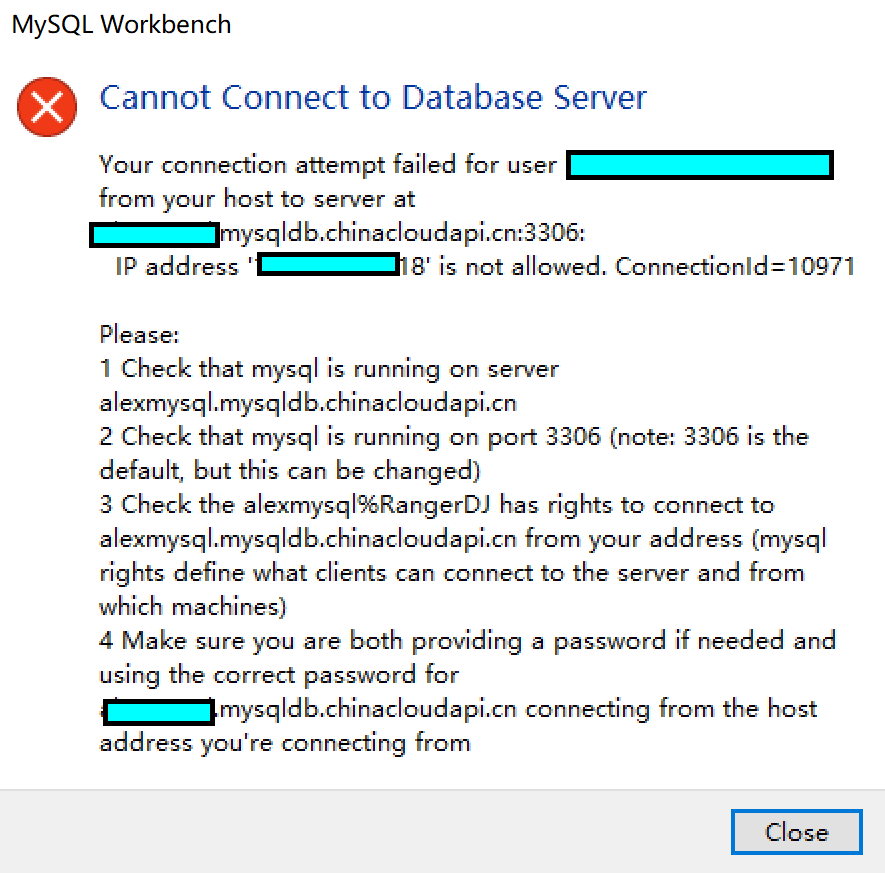
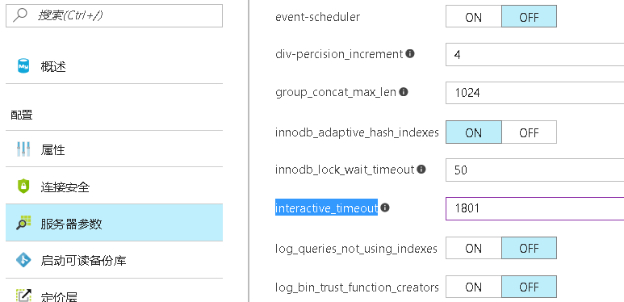
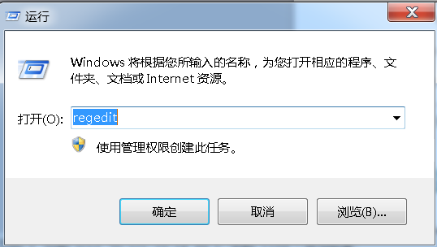
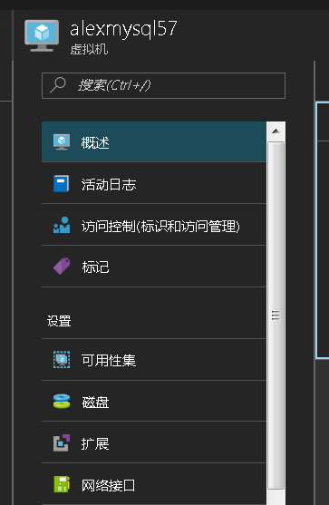
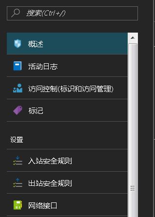

# 如何对 Azure MySQL 连接进行故障排查

本文旨在帮助 Azure 用户对 MySQL database on Azure 上比较常见的连接问题进行故障排查。

内容主要包括防火墙问题，TCP keep alive 问题，以及 MySQL 自身的参数问题三部分。

## 防火墙问题

大多数用户在第一次创建 MySQL database on Azure 实例之后便开始尝试连接。但是往往遇到的结果不是连接成功而是如下图所示的错误信息：



该错误信息表明您的 IP 地址并不在 MySQL on Azure 防火墙的准入范围之内，这种设定可以在某种程度上避免设置了简单密码的生产用户遭到恶意的字典攻击，当然 Azure 还有其他的手段可以防范遭到恶意入侵之后的解救办法，不过这并不在这篇文章的讨论范畴。

既然知道了是防火墙禁止了您的访问请求那么第一步就应该把客户端的 IP 地址添加到防火墙中的允许列表中去。

首先打开 Azure 门户上的 MySQL 数据库，点击 "**连接安全**",右侧面板中就出现了"**添加客户端 IP**" 的按钮。


点击 **添加客户端 IP** ，在此处输入你防火墙的准入 IP 列表名称（自定义），IP 起始地址，IP 结束地址。


将当前 IP 填入，点击保存。 稍等片刻，即可开启您的 MySQL Azure 之旅。

> [!NOTE]
> 避免将 IP 范围设置为如下所示的 0.0.0.0-255.255.255.255，该设置意味着 Azure 防火墙的失效。


## TCP Keep Alive 问题

在使用 MySQL 客户端时遇到以下报错：

```
ERROR 2013 (HY000): Lost connection to MySQL server during query
ERROR 2006 (HY000): MySQL server has gone away
```


发生了这样的错误，通常有两种可能性:

1. 您的 MySQL 客户端闲置过久,被 Azure 流量管理器认为已经 timeout 并终结掉了,这个默认的时间通常为 4 分钟。

2. 可能是达到了您的 **interactive_timeout** 的时间限制，这个时间在 Azure 上的默认最大限制为 1800 秒。也就是 30 分钟，如果您的查询超过了 30 分钟的话，很有可能是因为这个参数而导致被 MySQL 终结。

可以通过打开 Azure 门户上的 MySQL 实例检查该参数的设置。



经过初步分析之后：

如果对于类型 1 所引起的连接中断，可以使用以下方式来调整 heart beat 参数，通过缩短网络“心跳”间隔的方式来通知 Azure 流量控制器，你的客户端还在工作，进而避免被 Azure 的流量控制器终结。

- Windows

    打开 “**运行**”, 输入 “**regedit**”, 修改(如果没有则添加)注册表：

    **HKEY_LOCAL_MACHINE\SYSTEM\CurrentControlSet\Services\Tcpip\Parameters\KeepAliveTime**

    

    打开 Parameters 后,在右侧界面空白处鼠标单击右键创建 DWORD(32 位)值。

    

    把名字修改为 KeepAliveTime, 值选十进制，输入 60000。

- Linux

    对于 linux 的用户来说，需要修改 4 个操作系统的 **keepalive** 参数。

    1. **tcp_keepalive_probes** : 在认定连接失效之前，已发送的 TCP  keepalive 探测包的个数。使用该值乘以 **tcp_keepalive_intvl** 表明连接在发送了 keepalive 之后可以保持多长时间无需做出回应。

    2. **tcp_keepalive_time** : 最后一次数据交换到 TCP 发送第一个保活探测包的间隔，即允许的持续空闲时长，也就是每次正常发送心跳的周期。

    3. **tcp_keepalive_intvl** : 发送探测包的间隔周期。

    4. **tcp_retries2** : 在通讯过程中（已激活的 sock），数据包发送失败，在决定终止该连接之前，内核要重试发送的次数。

    ```
    sudo echo "60" > /proc/sys/net/ipv4/tcp_keepalive_time
    sudo echo "1" > /proc/sys/net/ipv4/tcp_keepalive_intvl
    sudo echo "10" > /proc/sys/net/ipv4/tcp_keepalive_probes
    sudo echo "3" > /proc/sys/net/ipv4/tcp_retries2
    ```

    > [!NOTE]
    > **tcp_keepalive_time** 和 **tcp_keepalive_intvl** 是以秒为单位的，以上的方法只是为了临时改变当前系统中的参数，如果要永久保留的话，则需要将这些参数加入到 **/etc/sysctl.conf** 系统文件中去。

如果是对于类型 2 所引起的连接中断，可以考虑选择以下方法：

1. 减少一次的数据访问量，提升语句响应速度。
2. 从语句或者架构的角度来进行优化，缩短语句响应时间，尽量使其在 1800 秒内完成。
3. 考虑升级服务器级别，使用更高的定价层可以得到更快的响应时间，或向 Azure 专家团队咨询。

## EOFException

详细错误信息如下：

```
Caused by: java.io.EOFException: Can not read response from server Expected to read 4 bytes, read 0 bytes before connection was unexpectedly lost.
```

该问题往往发生在由应用程序使用驱动(如 JDBC)来访问 MySQL Azure 的连接上。无论您是使用的连接池技术或者是每次都请求一个新的连接，都有可能遇上这种类型的错误。

如果您使用了连接池技术的话，可以考虑先通过文档：[如何在客户端配置验证机制确认长连接有效性](https://docs.azure.cn/zh-cn/mysql/mysql-database-validationquery) 排除未设置验证连接有效性的问题。

排查了连接池本身的设置之后，该问题发生的可能原因还有以下两种：

1.没有设置 keepalive，导致链接空闲时间过长，而被 Azure 流量控制器终结链接。解决该问题的方法可以参考之前文章中提到的 keepalive 的设置方法。

2.查询时长超过了 4 分钟，或者连接空闲时间超过了 4 分钟。该时间的长度受 **MySQL wait_timeout** 的影响。当前这个值的最大限制为 240 秒，也就是 4 分钟如下图所示。


## 连接数限制

详细错误信息如下：

```
com.mysql.jdbc.exceptions.jdbc4.MySQLNonTransientConnectionException: Data source rejected establishment of connection,  message from server: "Too many connections"
```

该类型的错误往往是因为应用程序访问数据库创建的连接太多，并且没有及时回收已经结束的连接，或者是没有使用连接池技术。

如果经过上述的排查还没有解决该问题的话，可以考虑使用更高级的“**定价层**”，不同层级的可支持的并发可以参考该文档：[了解服务层和版本](https://docs.azure.cn/zh-cn/mysql/mysql-database-performance-guidance-asdb-test-result)。

## Azure MySQL 问题总结

在 Azure MySQL PaaS 的访问过程中以上 4 种情况导致 MySQL 的访问出现错误的情况占了大多数，最常见的应该是 **keepalivetime** 由于使用了缺省值或 SQL 运行时间过长而导致的 timeout 连接中断。针对于后一种情况，可以从减少数据访问量，在 DBA 的协助下优化语句，使用更高性能的服务器等方向上进行故障排查，如果上述方法都无法解决该问题的话，建议拨打 AZURE China 的技术支持热线，由 Azure 专家组来进行诊断。

以上总结了多条 MySQL on Azure PaaS 服务里可能出现的问题,最后再讲述一种在 MySQL on VM 上很常见的问题。

## MySQL on VM 连接超时

这种问题可能发生的原因很多，但主要原因是应用程序发现了目标 MySQL 主机但是无法成功连接或 MySQL 监听没有任何响应，需要排查虚拟机本身是否有防火墙，或者 MySQL 是安装在 Azure 的虚拟机上的需要同时开启 Azure 的第一层防火墙。

以安装在 Azure 虚拟机上的 MySQL 为例，下面是在 Azure 门户上开启防火墙的简要步骤。

在 Azure 门户上打开虚拟机，点击 “**网络接口**”，单击右侧菜单中的 **网络接口**。



点击 **网络安全组** ：


点击 **入站安全规则** ：



添加需要开放的入站端口：


配置完成后即可使用您的 MySQL on Azure VM 了。