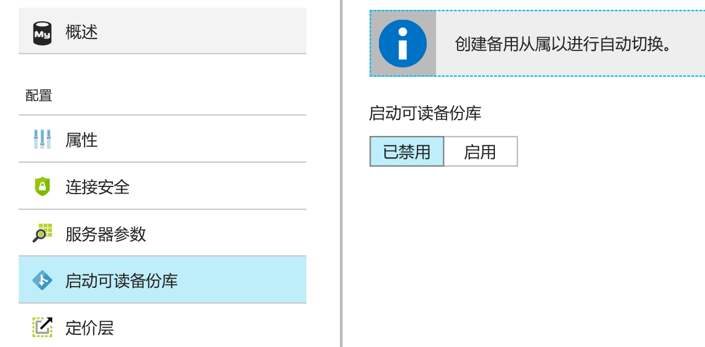
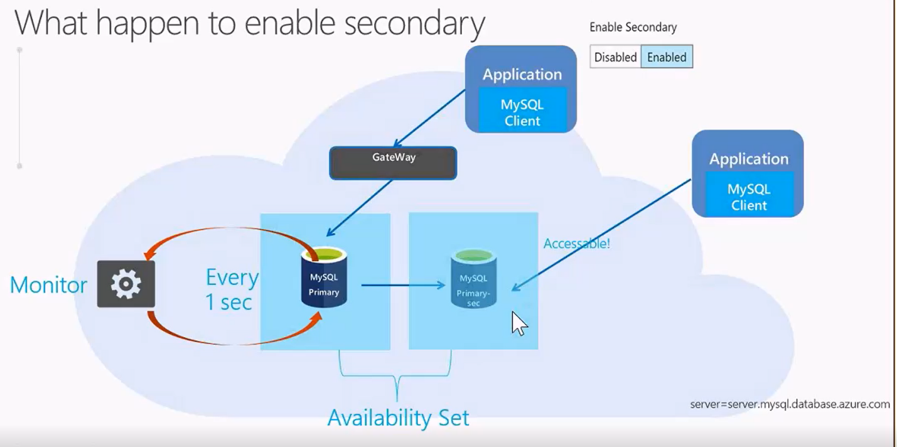

# 使用可读备份库提升 MySQL Database on Azure 的高可用性

本文主要讲解可读备份库的工作原理及相关限制。

## 简介

启用可读备份库功能可以帮助用户进一步增强 MySQL Database on Azure 实例的可用性。当用户为 MySQL Database on Azure 实例启用可读备份库功能后，Azure 会自动创建一个备份实例。主备实例之间通过复制技术同步数据。用户可以将备份实例作为只读实例使用，以满足应用程序的大量读需求。当主实例发生故障，Azure 会自动提升备份实例为新的主实例，并且创建新的备份实例。启用可读备份库功能后，故障恢复时间通常在分钟级（60 秒内）。故障转移后无数据丢失。

## 工作原理

可读备份库的原理是基于 Create Slave 功能。简单来说，Azure 在用户启动可读备份库的同时，会增加一台名字是 yourdb-sec 的数据库，并且与用户的数据库处于同步状态。 
Yourdb-sec 数据库同样是可读的数据库，访问时需要注意修改链接字符串，以及用户名，都要改成 yourdb-sec。 
Yourdb-sec 所依赖的虚拟机与 yourdb 所依赖的虚拟机处于同一个可用性集中。这意味着两台数据库的虚拟机不共享同一个机架和电源，同时不会因为打补丁等行为造成两台虚拟机同时重启。 
当故障发生时，yourdb-sec 的数据库会主动提升为 yourdb_name 的数据库，从而降低了数据库切换的时间。 
对于用户来说，当故障发生时，切换的动作几乎感知不到，无需修改链接字符串，通常切换时间可以在 60 秒内完成。 

## 相关限制

由于可读备份库同样使用了 Replication 技术，所以在您使用时请注意以下几点：

    1. 确认是否数据库中所有的表都有主键。以免因为没有主键的修改造成 Replication 的延迟。
    2. 先创建一台 Slave，在高峰期观察 Slave 的延迟，如果延迟秒数高于能接受的停机时间，那么也不建议使用可读备份库。因为为了保障用户数据的一致性，yourdb-sec 会在完全同步了用户的 yourdb 之后才会允许新链接访问。
    3. 预算。在启用了可读备份库之后，相当于用户使用了 2 台相同配置的 MySQL Database on Azure 数据库。所以会按照用户当前数据库的配置额外的收取一份费用。