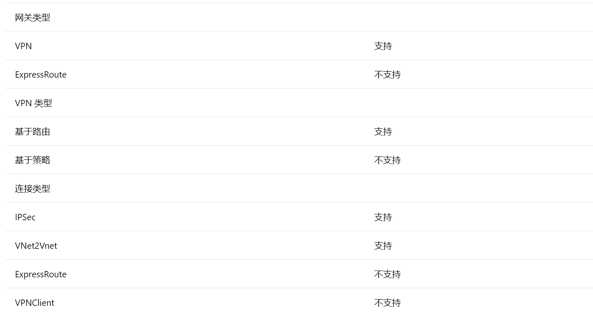
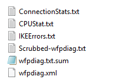

# 使用网络观察程序诊断 Azure VPN 网关和本地连接

VPN 故障排查过程通常比较复杂，联系 Azure 技术支持再做抓包通常需要较长的时间做准备，问题可能在开始抓包之前消失。使用 Azure 网络观察程序故障排除功能，可以诊断任何网关和连接问题，在几分钟内获得足够的信息，就如何解决问题做出明智的决策。

## 准备阶段

此方案假定已按照[创建网络观察程序](https://docs.azure.cn/zh-cn/network-watcher/network-watcher-create)中的步骤创建网络观察程序。

支持的网关类型和连接：



## 概述

“资源故障排除”提供对使用虚拟网络网关和连接时发生的问题进行故障排除的功能。 发出资源故障排除请求时，系统将查询并检查日志。检查完成后，将返回结果。资源故障排除请求是长时间运行的请求，可能需要好几分钟才能返回结果。 故障排除日志存储在指定的存储帐户上的容器中。

## 检索网络观察程序

```powershell
$nw = Get-AzurermResource | Where {$_.ResourceType -eq "Microsoft.Network/networkWatchers" -and $_.Location -eq "chinanorth" }
$networkWatcher = Get-AzureRmNetworkWatcher -Name $nw.Name -ResourceGroupName $nw.ResourceGroupName
```

## 检索虚拟网络网关连接

```powershell
$connection = Get-AzureRmVirtualNetworkGatewayConnection -Name "toLocalSite" -ResourceGroupName "testrg"
```

## 获取存储帐户

资源故障排除返回有关资源运行状况的数据，还将日志保存到要查看的存储帐户中。

```powershell
$connection = Get-AzureRmVirtualNetworkGatewayConnection -Name "toLocalSite" -ResourceGroupName "testrg"
$sa = Get-AzureRmStorageAccount -Name "nrprgdiag822" -ResourceGroupName "testrg"
```

## 运行网络观察程序资源故障排除

将使用 Start-AzureRmNetworkWatcherResourceTroubleshooting cmdlet 对资源进行故障排除。 我们将向该 cmdlet 传递网络观察程序对象、连接或虚拟网络网关的 Id、存储帐户 Id 以及用来存储结果的路径。

```powershell
Start-AzureRmNetworkWatcherResourceTroubleshooting -NetworkWatcher $networkWatcher -TargetResourceId $connection.Id -StorageId $sa.Id -StoragePath 'https://nrprgdiag822.blob.core.chinacloudapi.cn/logs'
```

完成该 cmdlet 后，可以导航到该 cmdlet 中指定的存储位置，获取有关问题和日志的详细信息。 Azure 网络观察程序创建包含以下日志文件的 zip 文件夹：



**ConnectionStats.txt** 文件包含连接的综合性统计信息，包括入口和出口字节数、连接状态、建立连接的时间。

```ConnectionStats.txt
Connectivity State : Connecting
Remote Tunnel Endpoint : 42.159.81.255
Ingress Bytes (since last connected) : 0 B
Egress Bytes (since last connected) : 0 B
Ingress Packets (since last connected) : 0 Packets
Egress Packets (since last connected) : 0 Packets
Ingress Packets Dropped due to Traffic Selector Mismatch (since last connected) : 0 Packets
Egress Packets Dropped due to Traffic Selector Mismatch (since last connected) : 0 Packets
Bandwidth : 0 b/s
```

**IKEErrors.txt** 文件包含在监视过程中发现的任何 IKE 错误。

以下示例显示一个 IKEErrors.txt 文件的内容。 用户的错误可能因问题的不同而不同。

```IKEErrors.txt
Error: Authenticated failed. Check keys and auth type offers.
    based on log : Peer sent AUTHENTICATION_FAILED notify
Error: Authentication failed. Check shared key. Check crypto. Check lifetimes.
     based on log : Peer failed with Windows error 13801(ERROR_IPSEC_IKE_AUTH_FAIL)
```

更多报错介绍您可以参考这里：使用 Azure 网络观察程序进行故障排除（https://docs.azure.cn/zh-cn/network-watcher/network-watcher-diagnose-on-premises-connectivity#troubleshooting-using-azure-network-watcher）

**Scrubbed-wfpdiag.txt** 日志文件包含 wfp 日志。该日志包含对数据包丢弃操作和 IKE/AuthIP 故障的日志记录。

以下示例显示 Scrubbed-wfpdiag.txt 文件的内容，可以通过 Scrubbed-wfpdiag.txt 获取有关错误的详细信息，在本例中，该文件指出 ERROR_IPSEC_IKE_AUTH_FAIL 导致连接无法正常工作。以下示例只是完整日志的一个片段，因为日志可能很长（具体取决于问题）。日志中隐去了部分个人信息，以xxx代替。

```Scrubbed-wfpdiag.txt
[0]0380.1968::09/25/2018-07:25:26.512 [ikeext] 31567|42.159.81.255|Deleted ICookie from the high priority thread pool list
[0]0380.1968::09/25/2018-07:25:26.512 [ikeext] 31567|42.159.81.255|IKE diagnostic event:
[0]0380.1968::09/25/2018-07:25:26.512 [ikeext] 31567|42.159.81.255|Event Header:
[0]0380.1968::09/25/2018-07:25:26.512 [ikeext] 31567|42.159.81.255|  Timestamp: 1601-01-01T00:00:00.000Z
[0]0380.1968::09/25/2018-07:25:26.512 [ikeext] 31567|42.159.81.255|  Flags: 0x00000xxx
[0]0380.1968::09/25/2018-07:25:26.512 [ikeext] 31567|42.159.81.255|    Local address field set
[0]0380.1968::09/25/2018-07:25:26.512 [ikeext] 31567|42.159.81.255|    Remote address field set
[0]0380.1968::09/25/2018-07:25:26.512 [ikeext] 31567|42.159.81.255|    IP version field set
[0]0380.1968::09/25/2018-07:25:26.512 [ikeext] 31567|42.159.81.255|  IP version: IPv4
[0]0380.1968::09/25/2018-07:25:26.512 [ikeext] 31567|42.159.81.255|  IP protocol: 0
[0]0380.1968::09/25/2018-07:25:26.512 [ikeext] 31567|42.159.81.255|  Local address: 139.xxx.xxx.xxx
[0]0380.1968::09/25/2018-07:25:26.512 [ikeext] 31567|42.159.81.255|  Remote address: 42.xxx.xxx.xxx
[0]0380.1968::09/25/2018-07:25:26.512 [ikeext] 31567|42.159.81.255|  Local Port: 0
[0]0380.1968::09/25/2018-07:25:26.512 [ikeext] 31567|42.159.81.255|  Remote Port: 0
[0]0380.1968::09/25/2018-07:25:26.512 [ikeext] 31567|42.159.81.255|  Application ID:
[0]0380.1968::09/25/2018-07:25:26.512 [ikeext] 31567|42.159.81.255|  User SID: <invalid>
[0]0380.1968::09/25/2018-07:25:26.512 [ikeext] 31567|42.159.81.255|Failure type: IKE/Authip Main Mode Failure
[0]0380.1968::09/25/2018-07:25:26.512 [ikeext] 31567|42.159.81.255|Type specific info:
[0]0380.1968::09/25/2018-07:25:26.512 [ikeext] 31567|42.159.81.255|  Failure error code:0x0000xxxx
[0]0380.1968::09/25/2018-07:25:26.512 [ikeext] 31567|42.159.81.255|    IKE authentication credentials are unacceptable
[0]0380.1968::09/25/2018-07:25:26.512 [ikeext] 31567|42.159.81.255|
[0]0380.1968::09/25/2018-07:25:26.512 [ikeext] 31567|42.159.81.255|  Failure point: Remote
[0]0380.1968::09/25/2018-07:25:26.512 [ikeext] 31567|42.159.81.255|  Flags: 0x00000000
[0]0380.1968::09/25/2018-07:25:26.512 [ikeext] 31567|42.159.81.255|  Keying module type: IKEv2
[0]0380.1968::09/25/2018-07:25:26.512 [ikeext] 31567|42.159.81.255|  MM State: Initial state, no packets sent
[0]0380.1968::09/25/2018-07:25:26.512 [ikeext] 31567|42.159.81.255|  MM SA role: Initiator
[0]0380.1968::09/25/2018-07:25:26.512 [ikeext] 31567|42.159.81.255|  MM auth method: Certificate
[0]0380.1968::09/25/2018-07:25:26.512 [ikeext] 31567|42.159.81.255|  Cert hash:
[0]0380.1968::09/25/2018-07:25:26.512 [ikeext] 31567|42.159.81.255|0000000000000000000000000000000000000000
[0]0380.1968::09/25/2018-07:25:26.512 [ikeext] 31567|42.159.81.255|  MM ID: 0x00000000000xxxx
[0]0380.1968::09/25/2018-07:25:26.512 [ikeext] 31567|42.159.81.255|  MM Filter ID: 0x00000000000xxxx
[0]0380.1968::09/25/2018-07:25:26.512 [ikeext] 31567|42.159.81.255|  Local Principal Name: 
[0]0380.1968::09/25/2018-07:25:26.512 [ikeext] 31567|42.159.81.255|  Remote Principal Name: 
[0]0380.1968::09/25/2018-07:25:26.512 [ikeext] 31567|42.159.81.255|  Local Principal Group SIDs:
[0]0380.1968::09/25/2018-07:25:26.512 [ikeext] 31567|42.159.81.255|  Remote Principal Group SIDs:
[0]0380.1968::09/25/2018-07:25:26.512 [ikeext] 31567|42.159.81.255|
[0]0380.1968::09/25/2018-07:25:26.512 [ikeext] 31567|42.159.81.255|Cleaning up mmSa: xxxx. Error 13801(ERROR_IPSEC_IKE_AUTH_FAIL)
[0]0380.1968::09/25/2018-07:25:26.512 [ikeext] 31567|42.159.81.255|QM done. Cleaning up qmSa xxx.  Error 13801(ERROR_IPSEC_IKE_AUTH_FAIL)
[0]0380.1968::09/25/2018-07:25:26.512 [ikeext] 31567|42.159.81.255|Completing Acquire for ipsec context 20665
```
