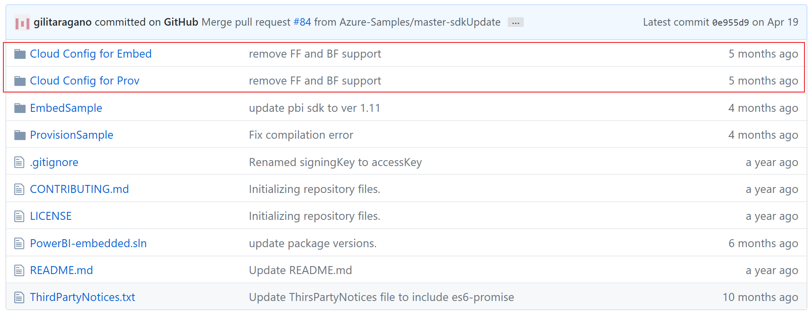
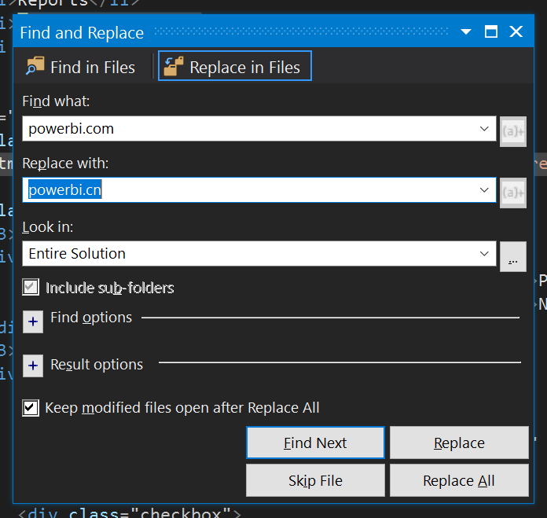

# Power BI Embedded 官方新版示例(2017 年 4 月版)配置步骤

根据官网 [Power BI Embedded 示例入门](https://docs.azure.cn/zh-cn/power-bi-embedded/power-bi-embedded-get-started-sample)所介绍，由于官方给的 Power BI Embedded 示例（参见 [Power BI Embedded - 将报表集成到 Web 应用中](https://github.com/Azure-Samples/power-bi-embedded-integrate-report-into-web-app/)）仅适用于国际版 Azure 的环境，若需要在中国区环境中使用，则需要在示例代码中完成以下修改：

> [!IMPORTANT]
> 本示例中的某些 URL 只能在全球环境中使用。 若要在 Azure 中国区环境中使用它，必须执行一些替换。 例如：在文件 \ProvisionSample\App.config 中将 https://api.powerbi.com 替换为 https://api.powerbi.cn ，将 https://management.azure.com 替换为 https://management.chinacloudapi.cn ，在文件 \ProvisionSample\Program.cs 中将 https://management.core.windows.net 替换为 https://management.core.chinacloudapi.cn ，在文件 \ProvisionSample\ProgramExtensions.cs 中将 https://login.windows.net 替换为 https://login.chinacloudapi.cn 。 有关全球环境与中国区环境中 URL 的差别的详细信息，请参阅 [此文](https://docs.azure.cn/zh-cn/articles/developerdifferences)。

然而 2017 年 4 月份之后，官方给出了新版 Power BI Embedded 示例(以下简称“新版示例”，以区别于之前的“旧版示例”)，新版示例考虑到 Power BI 中国版的情况，因此添加了名为 "Cloud Config for Embed" 和 "Cloud Config for Prov" 的两个文件夹，如下所示：

进入 Cloud Config for Embed 文件夹后，可发现名为 “**Power BI operated by 21Vianet in China**” 的文件夹，里面的 “**Cloud.config**” 文件即为针对 Power BI 中国版配置好的 Cloud.config 文件。

同理，Cloud Config for Prov 文件夹中也有已配置好的 Cloud.config 文件。

因此相对旧版示例而言，新版示例的配置操作有所调整，如下所示：

1. 将 "**\Cloud Config for Embed\Power BI operated by 21Vianet in China**" 中的 "**Cloud.config**" 拷贝覆盖到 "**\EmbedSample**" 下;

    将 "**\Cloud Config for Prov\Power BI operated by 21Vianet in China**" 中的 "**Cloud.config**" 拷贝覆盖到 "**\ProvisionSample**" 下。

2. 双击 "**PowerBI-embedded.sln**"，用 Visual Studio 打开；

3. 选择 "**Tools**"=>"**NuGet Package Manager**"=>"**Package Manager Console**"，在命令行界面里输入 `Update-Package`，更新依赖包；

    

    更新完成后可能会出现以下报错，这个错误不影响 Sample 使用，只需要重启 Visual Studio 即可。

4. Visual Studio 重启后，用 Ctrl+h 将 powerbi.com 全局替换为 powerbi.cn，即在 entire solution 范围内进行替换；

    

5. 之后选择 "**Build**" => "**Rebuild Solution**" 以重新 Build Solution；

    

6. 最后将 Embed Sample 下 Web.config 中的 `powerbi:AccessKey`，`powerbi:WorkspaceCollection` 和 `powerbi:WorkspaceId` 的值填好，之后示例便可正常使用了。

    