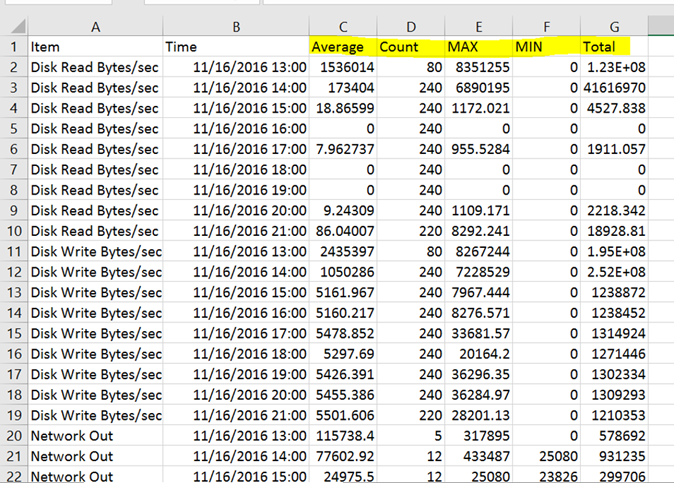

<properties 
	pageTitle="C# 获取虚拟机监控数据" 
	description="如何通过 C# 获取虚拟机监控数据" 
	service=""
	resource="virtualmachines"
	authors=""
	displayOrder=""
	selfHelpType=""
    supportTopicIds=""
    productPesIds=""
    resourceTags="Azure Virtual Machines, C#"​
    cloudEnvironments="MoonCake" 
/>
<tags 
	ms.service="na-aog"
	ms.date="" 
	wacn.date="1/12/2016"
/>
# C# 获取虚拟机监控数据

## **问题描述**

需要通过本地程序获取 Azure 虚拟机的监控数据并保存成文件时，可以通过接口获取该种数据，然而我们最多只能获取 30 天内的监控数据。

## **前提条件**

- 下载[订阅文件](https://manage.windowsazure.cn/publishsettings/)

- 安装 VS2015

## **解决方法**

引用如下命名空间

	using System;
	using System.Linq;
	using System.Threading.Tasks;
	using System.Configuration;
	using Microsoft.WindowsAzure.Storage;
	using Microsoft.WindowsAzure.Storage.Blob;
	using System.Net;
	using System.Collections.Generic;
	using System.Text;
	using System.Xml.Linq;
	using System.Security.Cryptography.X509Certificates;
	using Microsoft.WindowsAzure.Management;
	using Microsoft.WindowsAzure.Management.Compute;
	using Microsoft.WindowsAzure.Management.Compute.Models;
	using Microsoft.WindowsAzure.Management.Monitoring.Metrics;
	using Microsoft.WindowsAzure.Management.Monitoring.Utilities;
	using Microsoft.WindowsAzure.Management.Scheduler;
	using Microsoft.Azure;
	using Microsoft.WindowsAzure;
	using Microsoft.WindowsAzure.Management.Monitoring.Metrics.Models;
	using System.IO;
	
	//需要将如下代码改为自己的真实信息
	string subscriptionId = "";
	string cloudServiceName = "";
	string deploymentName = "";
	string vmName = "";
	
	//加载下载的订阅文件
	XElement xElement = XElement.Load(System.AppDomain.CurrentDomain.BaseDirectory + "订阅文件");
	var subscriptionElements = xElement.Descendants("Subscription");
	var base64cer = subscriptionElements.Where(e => e.Attribute("Id").Value.ToString() == subscriptionId).FirstOrDefault().Attribute("ManagementCertificate").Value.ToString();
	
	X509Certificate2 certificateStore = new X509Certificate2(Convert.FromBase64String(base64cer));
    Microsoft.WindowsAzure.SubscriptionCloudCredentials credential = new Microsoft.WindowsAzure.CertificateCloudCredentials(subscriptionId, certificateStore);
    Uri baseUri = new Uri("https://management.core.chinacloudapi.cn/");

    MetricsClient metricsClient = new MetricsClient(credential, baseUri);

    string cloudServiceResourceId = ResourceIdBuilder.BuildVirtualMachineResourceId(cloudServiceName, deploymentName, vmName);
    // Metric names
    List<string> metricNames = new List<string>() { "Network Out", "Disk Read Bytes/sec", "Disk Write Bytes/sec", "Percentage CPU", "Network In" };
    TimeSpan timeGrain = TimeSpan.FromHours(1);
    DateTime timeBegin = DateTime.Now.AddDays(-30);
    DateTime time2Start = DateTime.Parse(timeBegin.ToString("yyyy-MM-dd") + " 00:00:00");
    DateTime time2Stop = DateTime.Parse(timeBegin.ToString("yyyy-MM-dd") + " 23:59:59");
    int rate = (DateTime.Now - time2Start).Days / 13 + 1;
    int addition = (DateTime.Now - time2Start).Days % 13;
    int num1, num2;
    string json = null;
    for (int i = 0; i < rate; i++)
    {
        num1 = i * 13;

        if (i == rate - 1)
        {
            num2 = i * 13 + addition;
        }
        else
        {
            num2 = (i + 1) * 13;
        }
        DateTime startTime = time2Start.AddDays(num1);
        DateTime endTime = time2Stop.AddDays(num2);

        MetricValueListResponse response = metricsClient.MetricValues.List(cloudServiceResourceId, metricNames, String.Empty, timeGrain, startTime, endTime);

        foreach (MetricValueSet value in response.MetricValueSetCollection.Value)
        {
            String valueName = value.Name;
            Console.WriteLine("------------------------Metric: {0}------------------------", valueName);
            foreach (MetricValue metricValue in value.MetricValues)
            {
                json += value.Name + "," + metricValue.Timestamp.AddHours(8) + "," + metricValue.Average + "," + metricValue.Count + "," + metricValue.Maximum + "," + metricValue.Minimum + "," + metricValue.Total + "\r\n";
            }
        }
    }
    FileStream aFile = new FileStream(AppDomain.CurrentDomain.BaseDirectory + ConfigurationManager.AppSettings["VmTracePath"] + cloudServiceName + "_" + deploymentName + "_" + vmName + "_" + timeBegin.ToString("yyyy-MM-dd") + "~" + DateTime.Now.ToString("yyyy-MM-dd") + ".CSV", FileMode.OpenOrCreate);
    StreamWriter sw = new StreamWriter(aFile, Encoding.GetEncoding("GB2312"));
    sw.Write(json);
    sw.Close();

## **测试结果**

执行程序，在 Debug 文件夹下会看到获取监控信息所写入的文件，名称如下：
 

 
