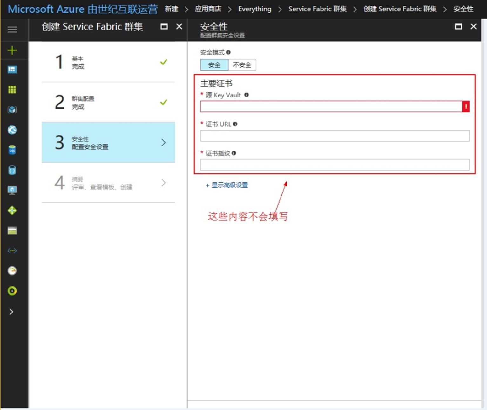
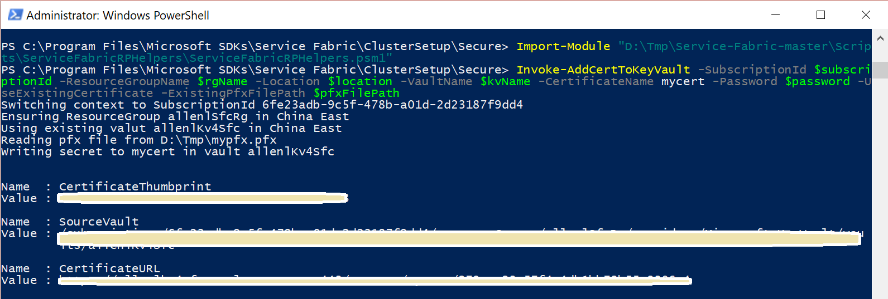

<properties
    pageTitle="如何设置安全 Service Fabric 集群的证书信息"
    description="如何设置安全 Service Fabric 集群的证书信息"
    service=""
    resource="servicefabric"
    authors="Allan Li"
    displayOrder=""
    selfHelpType=""
    supportTopicIds=""
    productPesIds=""
    resourceTags="Service Fabric, PowerShell, Certification"
    cloudEnvironments="MoonCake" />
<tags
    ms.service="service-fabric-aog"
    ms.date=""
    wacn.date="05/22/2017" />

# 如何设置安全 Service Fabric 集群的证书信息

当创建 Service Fabric 集群时，出于安全考虑，建议采用安全模式，但从 Azure 门户上操作时，却发现不知道该如何填写相应的证书信息（如下图）。其实 Azure 中国官网上有详细的步骤说明，可点击[链接](https://docs.microsoft.com/zh-cn/azure/service-fabric/service-fabric-cluster-creation-via-portal)查看，但因为详细所以比较长，这篇文章将把内容精简，并以 PowerShell 脚本呈现以便快速部署。

完整脚本如下，注意：

1. 这不是一个可以直接运行的脚本，需要按照注释中的提示一步步执行。

2. 这里创建的是一个自签名的证书，只建议测试用，生产环境请使用 CA 颁发的正规证书。

        # 新开管理员权限的powershell窗口
        # 步骤一：创建Key Vault
        # ---注意将以下参数替换成你自己的值
        # ---运行以下命令创建Key Vault
        $rgName = 'new resource group name'
        $kvName = 'new key vault name'
        $subscriptionId = 'your subscription id'
        $location = 'China East' # or ‘China North’

        Login-AzureRmAccount -EnvironmentName AzureChinaCloud
        New-AzureRmResourceGroup -Name $rgName -Location $location
        New-AzureRmKeyVault -VaultName $kvName -Location $location -ResourceGroupName $rgName -EnabledForDeployment

        # 步骤二：创建自签名证书
        # ---确保本地已经安装service fabric SDK
        # ---注意将脚本“C:\Program Files\Microsoft SDKs\Service Fabric\ClusterSetup\Secure\CertSetup.ps1”里面的CN=ServiceFabricDevClusterCert全部替换成CN=<你的sf集群全称>，比如CN=mysfc.chinaeast.cloudapp.chinacloudapi.cn
        # ---运行以下命令创建证书
        cd "C:\Program Files\Microsoft SDKs\Service Fabric\ClusterSetup\Secure\"
        .\CertSetup.ps1 -Install
        # ---通过证书管理->本地电脑->个人找到刚创建的证书获取指纹，并替换到myThumbprint的值
        # ---运行以下命令导出证书pfx文件到指定的pfxFilePath
        $myThumbprint = 'your value' # eg. 9ac6ebb2e5817db611e5fd49db606e567c92867e
        $pfxFilePath = 'your path' # eg. D:\Tmp\mypfx.pfx
        $password = 'your password' # eg. 123456

        $securedPwd = ConvertTo-SecureString -String $password -Force -AsPlainText
        Get-ChildItem -Path Cert:\LocalMachine\my\$myThumbprint | Export-PfxCertificate -FilePath $pfxFilePath -Password $securedPwd

        # 步骤三：导入证书到Key Vault中并获取相应安全参数
        # ---下载https://github.com/ChackDan/Service-Fabric的所有内容到本地，比如D:\Tmp
        # ---运行以下命令把证书导入Key Vault中
        Import-Module "D:\Tmp\Service-Fabric-master\Scripts\ServiceFabricRPHelpers\ServiceFabricRPHelpers.psm1"
        Invoke-AddCertToKeyVault -SubscriptionId $subscriptionId -ResourceGroupName $rgName -Location $location -VaultName $kvName -CertificateName mycert -Password $password -UseExistingCertificate -ExistingPfxFilePath $pfxFilePath

        # 运行成功后，会输出portal上需要的三个参数：源Key Vault（SourceVault），证书URL（CertificateURL），证书指纹（CertificateThumbprint），比如：

    