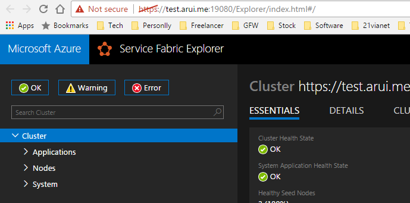

# 如何为开启安全认证的 Service Fabric 设置自定义域名

一般情况下，如果我们没有为 Azure Service Fabric 开启群集安全证书功能，我们只需要将域名的 DNS 解析绑定到 Service Fabric 群集使用的负载均衡器对应的公网 IP 上即可。但对于开启了安全证书功能的群集，我们需要将证书和域名进行绑定，相对要复杂一些。

## 生成证书

我们可以在 CA 申请自定义域名的可信证书，也可以使用自签名证书，无论哪种证书，我们都需要将证书使用者的名称和自定义域名保持一致。以下是使用 Github 上提供的 [PowerShell 模块](https://github.com/wacn/AOG-CodeSample/tree/master/ServiceFabric/Script/ServiceFabricRPHelpers)，可以借此快速生成证书，并上传至 Key Vault。下载 Github 代码后，将其解压，并执行以下命令导入 PowerShell 模块 :

```PowerShell
Import-Module "C:\..\ServiceFabricRPHelpers\ServiceFabricRPHelpers.psm1"
```

此模块中提供 `Invoke-AddCertTokeyVault` 命令自动将证书的私钥格式设置为 JSON 字符串，并将它上传到密钥保管库，参考以下脚本 :

```PowerShell
$ResouceGroup = "kevin-group"
$VName = "kevinsfvault"
$SubID = "e0fbea86-6cf2-4b2d-81e2-9c59********"
$locationRegion = "chinanorth"
$newCertName = "aruicert"
$dnsName = "test.arui.me"
$localCertPath = "C:\"
 
Invoke-AddCertToKeyVault -SubscriptionId $SubID -ResourceGroupName $ResouceGroup -Location $locationRegion -VaultName $VName -CertificateName $newCertName -CreateSelfSignedCertificate -DnsName $dnsName -OutputPath $localCertPath
```
> [!NOTE]
> dnsName 必须和我们的自定义域名一致。

## 设置域名解析

我们需要创建一个静态公网 IP，并将我们的自定义域名 DNS 解析到该 IP 之上，如下图，绑定 DNS 域名并解析至之前创建的静态公网 IP 地址，以下DNS解析以 Aliyun 为例，每个域名提供商的设置可能不一样，请参考各域名提供商的设置进行配置。


### 设置 DNS 域名解析 ：


## 使用 ARM 资源模板创建 Service Fabric

使用 Azure Service Fabric 资源模板创建 Service Fabric，在创建时，我们需要修改模板的一些地方，以确保整个群集都能够正常的使用自定义域名进行访问。

### 设置负载均衡器的前端 IP

```
"frontendIPConfigurations": [
    {
        "name": "LoadBalancerIPConfig",
        "properties": {
        "publicIPAddress": {
            "id": "[concat('/subscriptions/', subscription().subscriptionId, '/resourceGroups/', parameters('staticIpResourceGroups'), '/providers/Microsoft.Network/publicIPAddresses/', parameters('staticIpName'))]"
            }
        }
    }
]
```

为群集配置安全证书，可参考[此文档](https://docs.azure.cn/zh-cn/service-fabric/service-fabric-cluster-creation-via-arm)进行设置，之后修改群集的 Manager Endpoint 设置，使其使用自定义域名访问群集。此示例中的 `staticIpDnsFQDN` 指的是 `test.arui.me` :

`"managementEndpoint": "[concat('https://',parameters('staticIpDnsFQDN'),':',parameters('nt0fabricHttpGatewayPort'))]"`

配置好之后，就可以使用该模板创建 Service Fabric。当创建完成时，就可以使用 https://test.arui.me:19080，如下图：



> [!NOTE]
> 如果创建时，虚拟机规模集创建完成，但 Service Fabric 群集还是处于等待节点状态。很有可能是因为 Service Fabric 客户端无法与虚拟机规模集中的群集系统服务进行通信。造成这样情况的原因大部分是因为证书的使用者名称和设置 managementEndpoint 地址不匹配。

## 相关链接

- [示例模板代码](https://github.com/wacn/AOG-CodeSample/tree/master/ServiceFabric/Template)
- [使用 Azure Resource Manager 创建 Service Fabric 群集](service-fabric-cluster-creation-via-arm)
