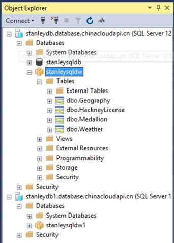
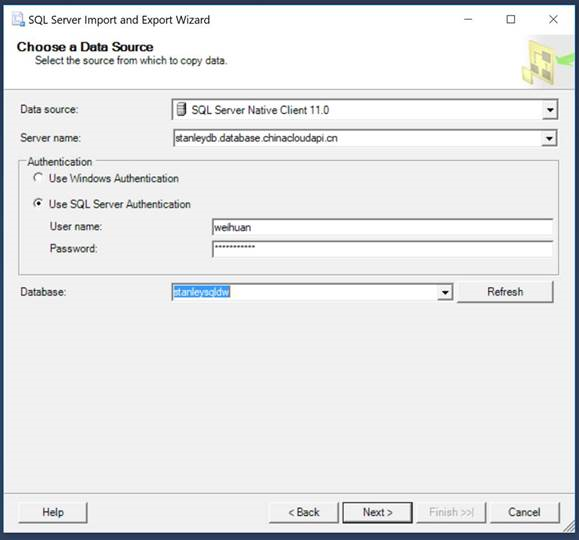
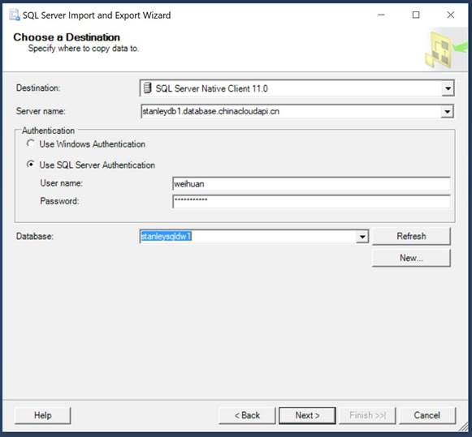
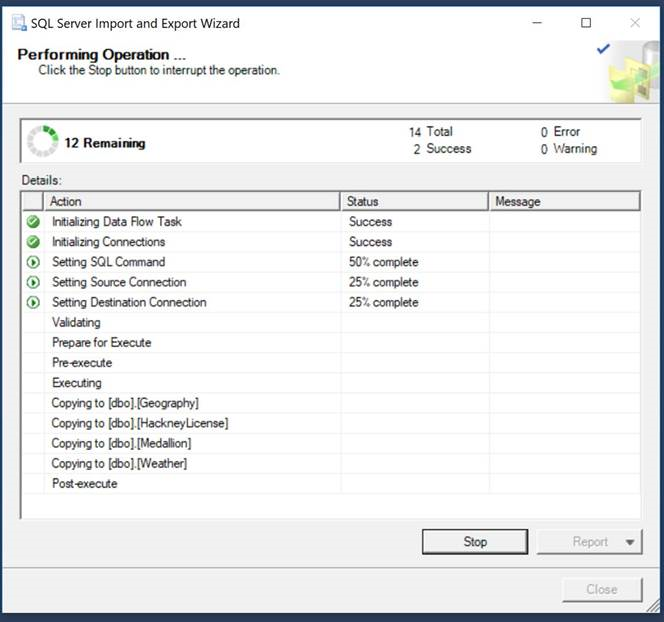
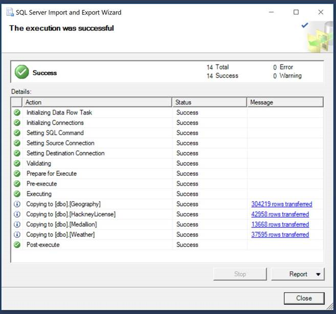
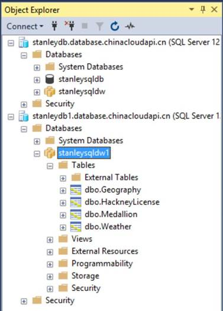

# 通过 SQL Server Management Studio 快速实现 Azure SQL 数据仓库间数据表迁移

SQL Server Management Studio(以下简称 SSMS)是微软官方出品的对 SQL Server 数据库具有完善管理功能的管理工具，同时它也支持对 Azure SQL 数据仓库的基本管理。然而由于产品设计的限制，目前 SSMS 尚不支持对 Azure SQL 数据库的导入导出操作，如下所示：

在上图的 SQL Server 数据库右键菜单中，Task 一项包括数据库将数据库导出为 bacpac 文件(包含 schema 和 data，通过 `Export Data-tier Application` 导出)或导出为 dacpac 文件(只包含 schema，通过 `Extract Data-tier Application` 导出)等。然而在下图中可发现，Azure SQL 数据仓库的右键菜单中并不包含 Task 这一项，因此如果希望实现之前所谈的 Task 功能，可以考虑借助 SQL Server 数据库来完成，以下是在 Azure SQL 数据仓库上实现 `Export Data-tier Application` 功能的一个示例，供读者参考：

1. 在 [Azure 门户](https://portal.azure.cn)中分别在服务器 stanleydb 和 stanleydb1 上创建名为 stanleysqldw 和 stanleysqldw1 的两个数据仓库：

    > [!NOTE]
    > 虽然本示例中两个 DW 在同一个订阅中，但该方案也适用于跨订阅的情况。

    

2. 在服务器 stanleydb 上创建一个空的 Basic 级别 SQL DB，名字为 stanleysqldb；

    

3. 用 SQL Server Management Studio 登陆服务器 stanleydb，在 stanleysqldw 上创建几个表；

    

4. 右键点击新创建的 SQL DB，选择 Task => Export Data；

    

5. 点击 Next，在之后分别设置好源 DW 和目的 DW 的信息，注意 Database 应选择数据仓库的名字；

    > [!NOTE]
    > 第一个下拉框须选择 SQL Server Native Client XX(版本号视 SSMS 的版本而定)，
    > 第二个框不要点下拉否则会卡住，只需直接填入 Server 名即可，
    > 最下面的 Database 选中相应的 SQL DW。

    
    

6. 之后继续点 Next，在 Select Source Tables and Views 页面时会出现提示说 SQL DW 不支持 Cursor，点击 OK 后选择需要迁移的表格名；

    
    

7. 然后再点 Next 直到数据迁移过程开始；

    

8. 当迁移过程完成后，便可在 stanleysqldw1 中看见迁移成功的表格了。

    
    

9. 最后，如果创建的 SQL DB 不再需要的话可以删除。