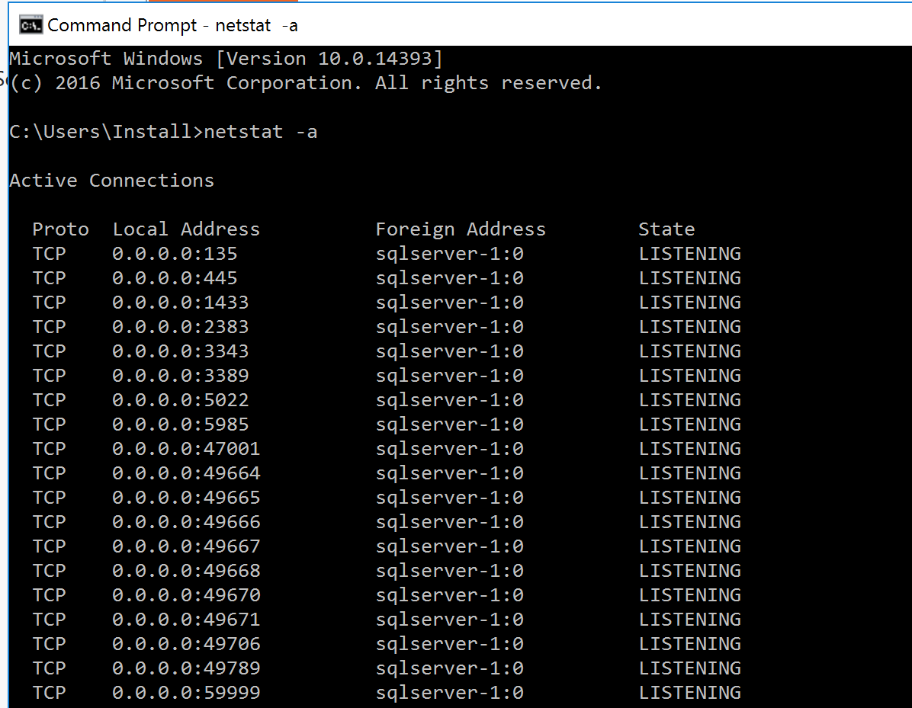
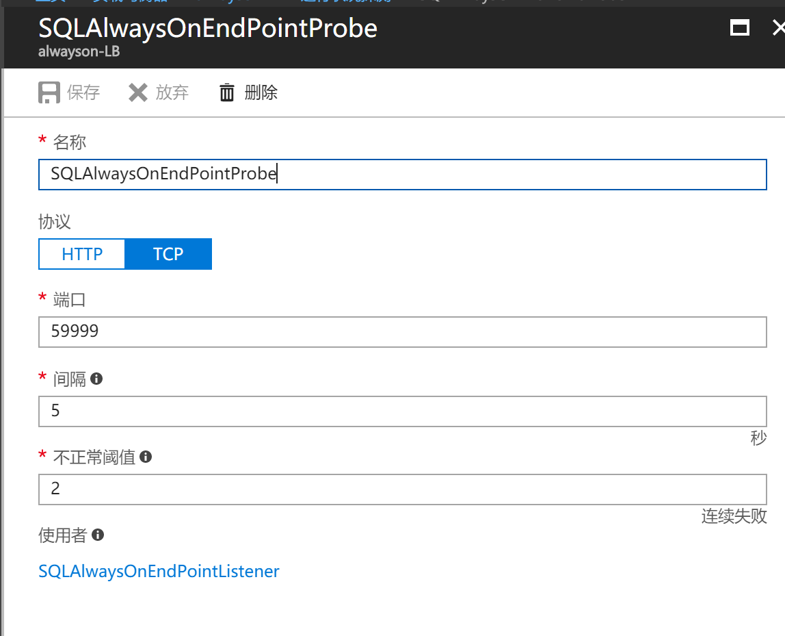
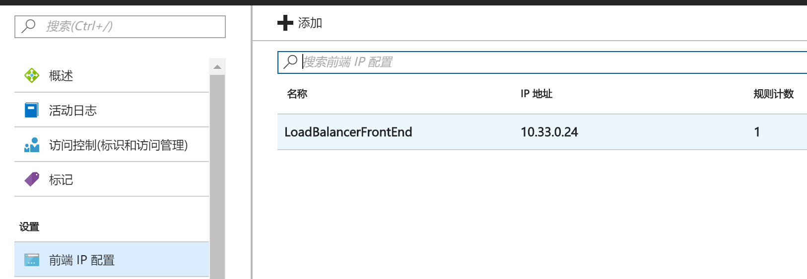
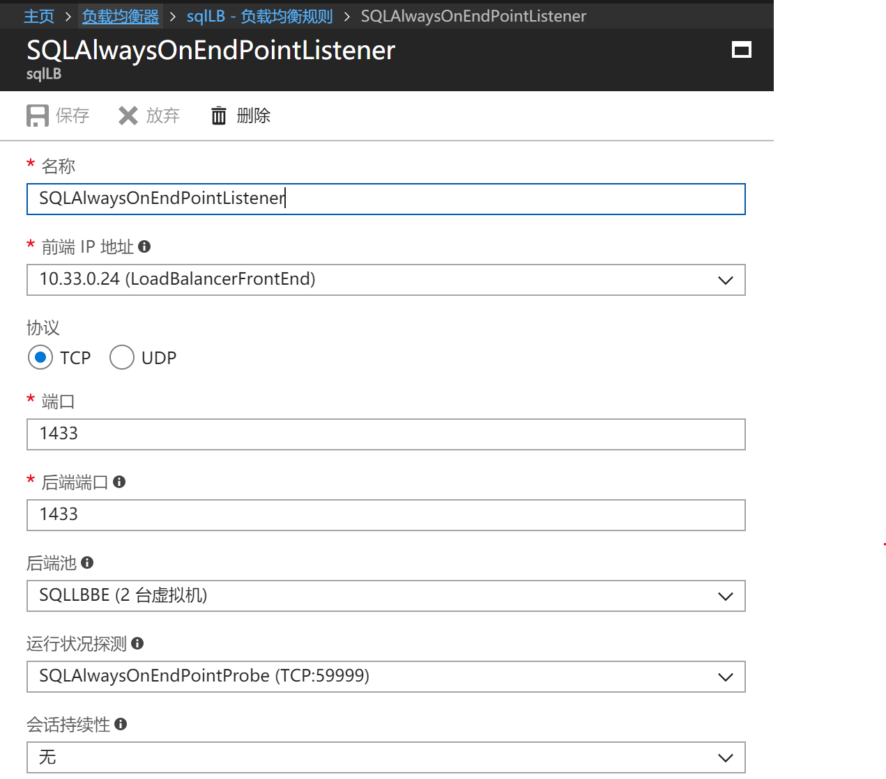

# 如何解决 Azure  Always On listener 无法访问的问题

本文旨在解决 Always On 无法从 secondary replica 通过 listener 连接集群，时而出现不能访问的常见问题。

## Always On 介绍

Always on 是 SQL Server on VM 的架构下最常见的高可用方案。<br>
其基本原理为创建一个至少为 2 台 VM 所组成的 Windows 集群，每台 VM 上安装一台 SQL Server Instance。由其中的一台 SQL instance 作为主节点（primary replica）提供对外读写访问，同时通过日志传输的形式提交到另外一台节点（secondary replica）进行数据同步。<br>
Secondary replica 可以提供只读功能，用于做读写分离或高可用(强烈建议依旧保持备份的习惯)。

> [!NOTE]
> 在 SQL server 2016 之前的版本，组成 Windows cluster 还需要一台 Domain controller(DC)。
搭建步骤：[在 Azure VM 中手动配置 Always On 可用性组](https://docs.azure.cn/zh-cn/virtual-machines/windows/sql/virtual-machines-windows-portal-sql-availability-group-tutorial)。


在 Azure 中搭建 Always On 的过程并不复杂，但是经常有客户会遇到搭建 Always On 之后无法使用 App 连接的自动故障转移功能。

Always on 的自动故障转移功能基于 Always on Listener。Listener 会被注册为一个 windows cluster 中的 resource，类似于 VIP 概念;在集群发生故障转移时 listener 会被漂移到新 primary 的 VM 中。对于客户端来说，只需要访问 Listner 的 IP 地址就可以保证永远连接到当前的 primary 数据库上。

在传统的 IDC 环境中，Always On 会自动将 Listener 所属的虚拟 IP 地址与网卡物理地址注册到路由表中，所以无论任何节点都可以通过 Listener 找到 primary 所在的服务器地址并建立链接。

在 Azure 环境下，该地址无法被注册，所以我们需要通过增加一个 Load Balancer 的方式来为 Listener 的访问请求进行转发。

参考示例脚本：[使用 PowerShell 将 IP 地址添加到现有负载均衡器](https://docs.azure.cn/zh-cn/virtual-machines/windows/sql/virtual-machines-windows-portal-sql-ps-alwayson-int-listener)

该脚本非常重要，会在 primary 节点上创建一个始终监听在 `<n.n.n.n>` 端口上的监听，并会随着 primary 切换而自动转移到新的 primary VM 上。本示例中使用 `59999`。

在配置好了 listener 之后可能会遇到以下几个常见问题：

1. 在 primary 节点上可以通过 listener IP 访问集群，但在 secondary 上无法访问 listener IP，只能通过提供 primary 服务器名或 IP 的方式来进行连接。
2. 在 secondary 上有时候可以访问 listener IP 有时候就不行，随机出现。

如果遇到上述问题，我们可以通过以下几个步骤进行排错：

1. **开始**=>**运行**=>**cmd** 输入 `netstat -a` 检查，是否 `59999` 监听端口已经在 primary 节点中存在。

    

2. 检查 [Azure 门户](https://portal.azure.cn)中 Load Balancer 上的 probe（探测器），探测的端口是否为 `59999` 或者是之前在 PowerShell 中创建的`<nnnnn>` 端口。

    ```
    [int]$ProbePort = "<nnnnn>"                     # Probe port 
    ```

    经常会有客户错误配置为 `1433` 端口，对于 LB 来说，`1433` 在 primary 和 secondary 都为存活状态，所以会随机的分配 request 给任何一台节点，可能是 primary，可能是 secondary。

    由于 Always On 必须要先访问 primary，所以如果该请求发给了 secondary 就会得不到响应。

    

3. [Azure 门户](https://portal.azure.cn)中 Load Balancer 的 front IP 是否与 Windows cluster resource 中的 listener 的 IP 完全一致。

    
    

4. 负载均衡规则中的 probe 是否配置。

    

如果以上步骤全部配置正确，通常就可以正常的使用 Always On 了。
