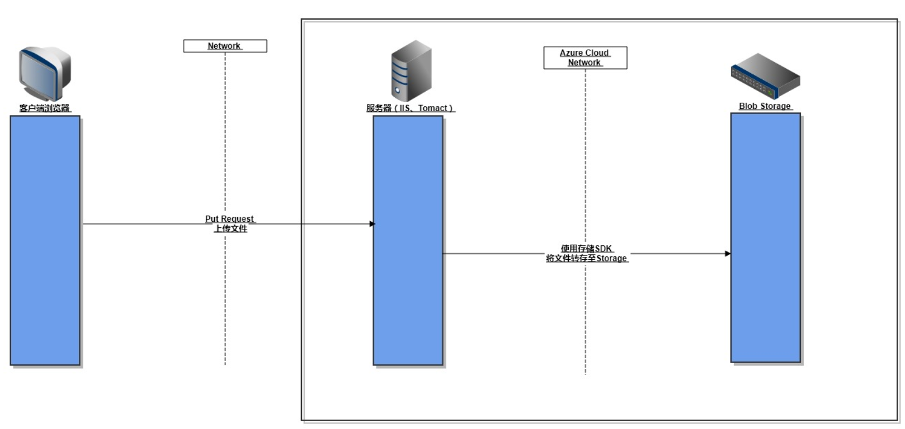
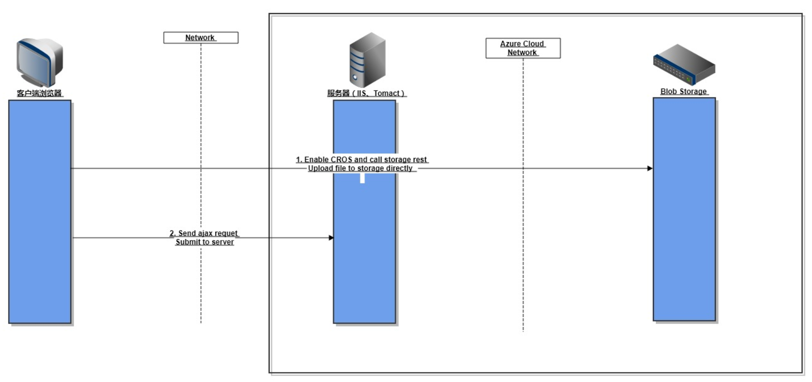
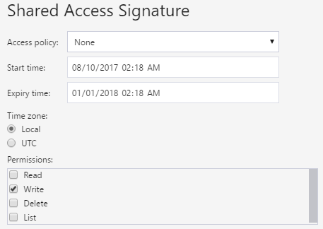
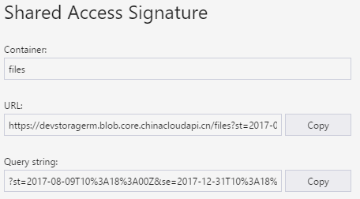
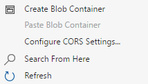
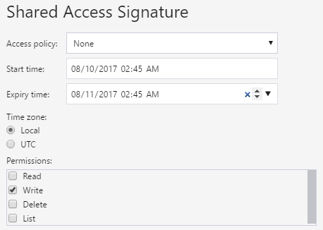
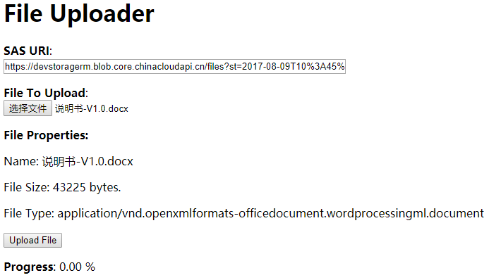

# 使用 Javascript 实现跨域上传文件到存储

用户在 Azure 上构建 B/S 程序时，有很多场景需要存储海量的文件，比如图片、文档及视频等，按照传统的方式，很多用户会将这些文件存储到宿主服务器上，比如基于 IIS 网站可能会考虑将这些文件存放在虚拟目录下某个文件夹中。不过目前大部分的 Azure 计算服务在一定程度都有容量限制，比如虚拟机可附加的磁盘数量和单块磁盘容量也只能支撑几十 TB 的总容量。PaaS 的计算服务，如 Web Apps、Cloud Service、Service Fabric 等因无法附加磁盘，所支撑的存储容量更是少之有少，往往支持到几十或几百 GB。

因此，对于云端 B/S 应用产生的文件存储，我们急需一种有效的存储方式。从现有的服务及适用场景来看，将应用文件托管到 Azure Blob Storage 服务，是最为有效的方式。存储单个账户规模可以支撑 500TB 容量，通过配置多个账户，可以支撑应用文件的海量存储，达到线性扩展的目的。

那么，B/S 应用如何将文件上传到存储服务呢？一般有两种方案：

- 方式 1：使用传统逻辑将文件从浏览器端（Client）上传到虚拟机（Server）,然后在调用存储接口，将文件从虚拟机（Server）上传到存储（Azure Storage）。

    

- 方式 2：将文件从浏览器端（Client）直接跨域上传到存储（Azure Storage）,同时在发起 Ajax 请求到虚拟机（Server）,在虚拟机（Server）接收上传的文件信息，进行后续逻辑处理，比如写入数据库等。

    

第一种方式略显笨拙，缺点比较明显，涉及中转过程，但不涉及跨域，不太适合互联网类型应用。第二种方式基于 Ajax 技术，不涉及中转，但需要了解存储 REST 接口、跨域访问等知识，实现难度略大一些，不过是最佳的方案选择。

下面我们将介绍第二种方案的实现，在此之前我们需要掌握一些基本的知识，参考如下：

## 存储共享访问签名（SAS）

1. 下载安装：[Azure Storage Explorer](http://storageexplorer.com/)
2. 连接目标存储账户，在目标“**存储容器**”上点击右键，在弹出的菜单项中选择“**Get Shared Access Signature…**”:

    

3. 上传文件需要写入权限，如果需要持续上传，可以调整过期时间，示例如下：

    

4. 点击“**Create**”，在弹出的界面上我们即可获取 SAS 签名 URL。Query String 即是签名字符串，这个签名字符串包含操作权限、有效时间等，如下：

    ```
    https://devstoragerm.blob.core.chinacloudapi.cn/files?st=2017-08-09T10%3A18%3A00Z&se=2017-12-31T10%3A18%3A00Z&sp=w&sv=2016-05-31&sr=c&sig=kupC7DiU0vaTMqY3DZ3sbl96MV21efmXwd8yDix%2BJ7E%3D
    ```

    

5. 更多参考资料，如下：

    - [使用共享访问签名委托访问权限](https://docs.microsoft.com/zh-cn/rest/api/storageservices/Delegating-Access-with-a-Shared-Access-Signature?redirectedfrom=MSDN)
    - [共享访问签名，第 1 部分：使用共享访问签名 (SAS)](https://docs.azure.cn/zh-cn/storage/storage-dotnet-shared-access-signature-part-1)
    - [共享访问签名，第 2 部分：创建 SAS 并将 SAS 用于 Blob 存储](https://docs.azure.cn/zh-cn/storage/storage-dotnet-shared-access-signature-part-2)
    - [Table SAS, Queue SAS 和 Blob SAS  介绍(共享访问签名)](https://blogs.msdn.microsoft.com/windowsazurestorage/2012/06/12/introducing-table-sas-shared-access-signature-queue-sas-and-update-to-blob-sas/)
    - [管理对容器和 Blob 的匿名读取访问](https://docs.azure.cn/zh-cn/storage/storage-manage-access-to-resources)
    - [面向 Java 开发人员的 Azure - 教程和 API 参考](https://docs.azure.cn/zh-cn/java/)

## 存储跨域设置(CORS)

1. 下载安装：[Azure Storage Explorer](http://storageexplorer.com/)
2. 连接目标存储账户，在 “**Blob Containers**” 上点击右键，在弹出的菜单项中选择 “**Configure CORS Settings…**”:

    

3. 在上一步操作弹出的界面，点击“**Add**”，配置 CORS 规则，示例如下：

    

4. 更多关于存储的 CORS 设置参考：[跨域资源共享(CORS)支持 Azure 存储服务](https://docs.microsoft.com/en-us/rest/api/storageservices/cross-origin-resource-sharing--cors--support-for-the-azure-storage-services)。


## 存储 REST 接口

1. [存储服务 REST API 参考](https://docs.microsoft.com/zh-cn/rest/api/storageservices/Azure-Storage-Services-REST-API-Reference?redirectedfrom=MSDN)
2. [PutBlob](https://docs.microsoft.com/en-us/rest/api/storageservices/Put-Blob?redirectedfrom=MSDN): 适合上传小文件的 REST API。
3. [PutBlock](https://docs.microsoft.com/en-us/rest/api/storageservices/operations-on-block-blobs): 分块上传，可以实现大文件上传、进度控制、断点续传的 REST API。

## 完整的示例：

1. 下载[代码示例](https://github.com/wacn/AOG-CodeSample/tree/master/Storage/json)。
2. 在要上传的容器上，创建一个“**写**”权限签名 URL:

    

    签名 URL 示例：`https://devstoragerm.blob.core.chinacloudapi.cn/files?st=2017-08-09T10%3A45%3A00Z&se=2017-08-10T10%3A45%3A00Z&sp=w&sv=2016-05-31&sr=c&sig=reFh8jikl%2B2hOVhJ5SORPkItoFN6Y8bbq%2FeYgKn6QsI%3D`

3. 配置 CORS，部署到生产环境，请限制为响应允许的 Origins、Methods、Headers，这里我们在本地测试，使用*提供了“宽范围”的 CORS 设置：

    

4. 使用支持 H5 的浏览器打开 test.html，将签名 URL 粘贴到“**SAS URI**”,选择目标文件后，点击“**Upload File**”,完成上传。过程显示如下:

    

    **上传完成：**

    

    **查看容器：**

    

## 其它相关参考资料：

    - [New Azure Storage JavaScript client library for browsers – Preview (MSDN)](https://blogs.msdn.microsoft.com/windowsazurestorage/2017/03/07/new-azure-storage-javascript-client-library-for-browsers-preview/)
    - [通过 HTML5 控件可靠地上传 Blob 存储(MSDN)](https://docs.microsoft.com/zh-cn/rest/api/storageservices/reliable-uploads-to-blob-storage-via-an-html5-control)
    - [使用共享访问签名，HTML 和 JavaScript 在 Windows Azure Blob 存储中上传大文件 (Stackoverflow)](https://stackoverflow.com/questions/19935404/upload-largefile-to-azure-blob-using-javascript)