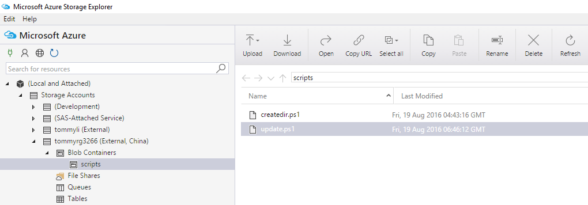
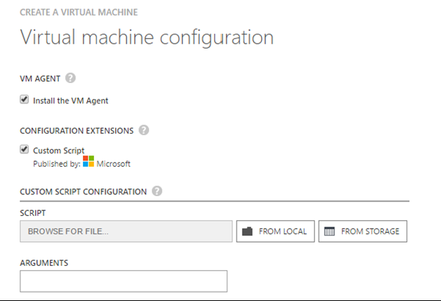
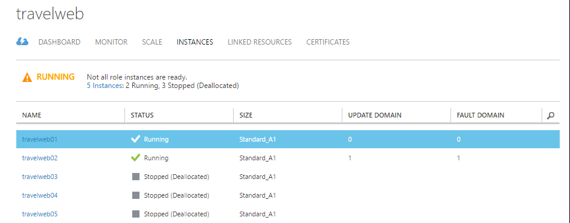

#自定义脚本使用示例

自定义脚本扩展程序可以从Azure存储自动下载脚本和文件，并在VM启动PowerShell脚本。 本例，我们将演示如何使用自定义脚本来完成Windows组件的安装及扩展集的自动扩展同步

## 示例一：  windows组件的安装

1.	创建安装组件的脚本(如update.ps1)：

		Install-WindowsFeature -Name Web-Server, Web-Mgmt-Tools

2.	将脚本上传到blob storage并设置其访问权限为public read access：
 
	

	
 
3.	创建虚拟机： 

	
        
4.	点击”FROM STORAGE“，选择所要使用的的powershell脚本

	

5.	虚拟机创建完成后，将会自动安装所需的组件

	

经过以上几步，我们可以确保每一台创建的VM都安装IIS组件

## 示例二：  扩展集的自动扩展同步

在自动扩展的环境中， 当CPU使用率不高时，部分VM实例会处于“Stopped(Deallocated)”的状态（不收费），但当CPU使用率上升时，根据规则设定，部分VM实例会重新回到“Running”的状态。  如何确保各实例间的数据是保持同步的？我们可以通过自定义脚本来实现。Blob Storage和VM之间的文件传输使用azcopy，关于安装和使用azcopy请阅读[这篇文章](https://azure.microsoft.com/en-us/documentation/articles/storage-use-azcopy/)。

 

创建自定义脚本的过程如示例一所述，需要更改的部分是脚本的内容：

例如： 

		AzCopy /Source:https://myaccount.blob.core.windows.net/mycontainer /Dest:C:\myfolder /SourceKey:key /S

这样我们可以把更新的文件上传到azure blob中，通过自定义脚本将更新文件同步到各个VM实例中， 从而实现扩展集的自动扩展同步

