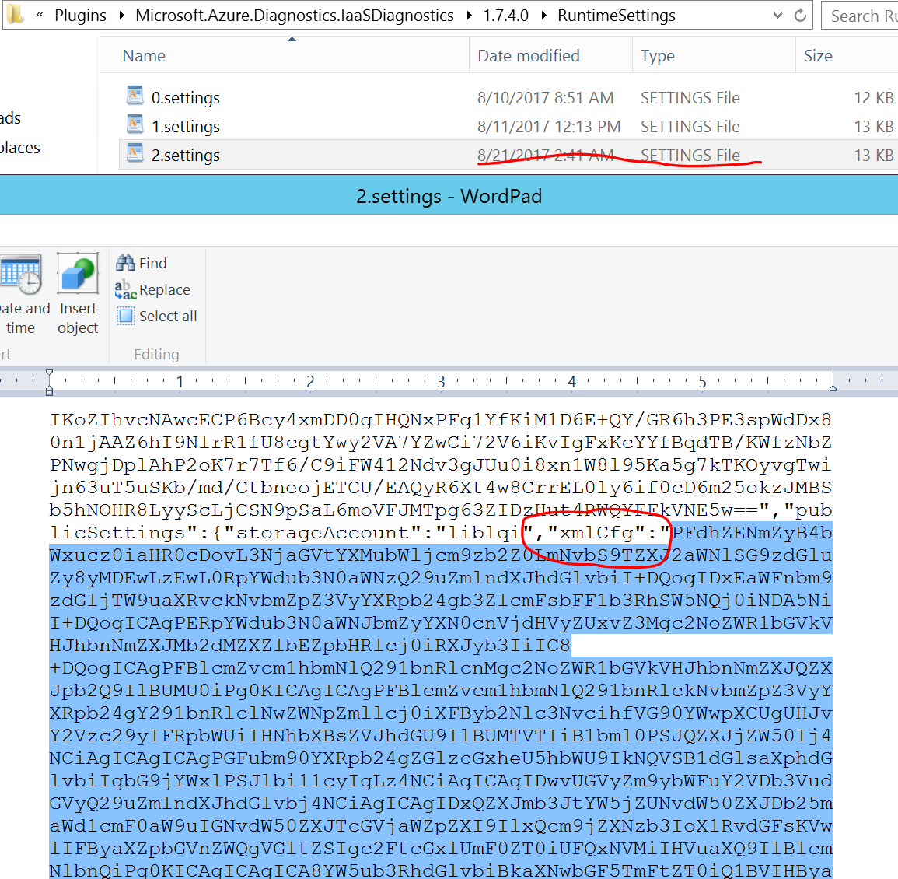
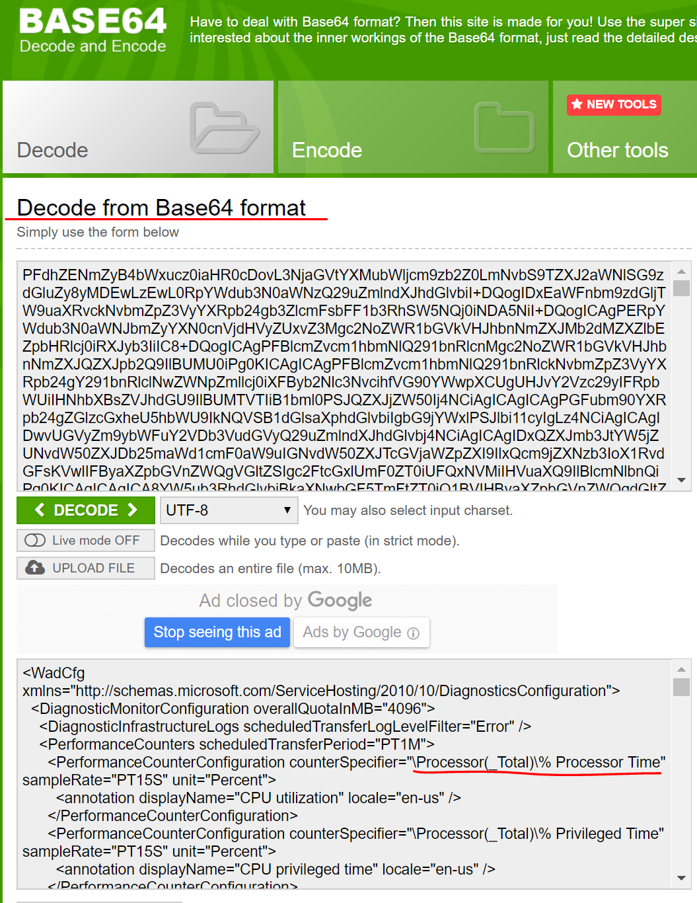

# 使用命令行如何调整 VMSS Autoscaling 的属性

对于没有配置 Autoscaling 的设置，可以参考[创建和管理自动缩放设置](https://docs.azure.cn/zh-cn/monitoring-and-diagnostics/insights-powershell-samples#create-and-manage-autoscale-settings) 进行配置。有几点注意如下：

1.	`New-AzureRmAutoscaleRule` 中的 `-MetricName` 必须是 Diagostics 中存在的指标。

    由于目前为止，[VirtualMachineScaleSets 支持的指标列表](https://docs.microsoft.com/zh-cn/azure/monitoring-and-diagnostics/monitoring-supported-metrics#microsoftcomputevirtualmachinescalesets) 中定义的指标在中国区 Azure 尚未上线，这些是 Azure 平台提供的指标。因此，用户必须要先为 VMSS 启用诊断扩展，再使用诊断扩展中定义的性能指标。

    这里列出 Windows 和 Linux 默认配置中常用的指标如下：

    - Windows:

        ```
        \Processor(_Total)\% Processor Time
        \Memory\% Committed Bytes In Use 
        ```

        更多信息，请从虚拟机中`C:\Packages\Plugins\Microsoft.Azure.Diagnostics.IaaSDiagnostics\1.7.4.0\RuntimeSettings`（版本可能有所不同）找到最新的 setting 文件。将其中 xmlcfg 的值通过 base64 解压，然后可以得到 xml 格式的配置文件。

        

        其中 PerformanceCounterConfiguration counterSpecifier 对应的值均可以作为 MetricName。

        

    - Linux: 

        ```
        \Processor\PercentProcessorTime
        \Memory\PercentUsedMemory
        ```

        更多信息，请从虚拟机中的`/var/lib/waagent/Microsoft.OSTCExtensions.LinuxDiagnostic-2.3.9021/xmlCfg.xml`（版本可能有所不同）中查询 mapname 字段中的指标名字，如图所示：

        

2.	若不需要使用邮件通知，可以忽略创建 webhook 属性和邮件通知这两步，并在最后一步去掉 `-Notifications` 参数。

以下介绍在已经为 VMSS 配置了 autoscalesetting 后，如何使用 Azure PowerShell 或者 Azure CLI 2.0 更新其属性。

首先介绍原理：

autoscalesetting 是 Azure Monitor (Microsoft.insights) 这个资源提供程序的提供的功能，不仅适用于 VMSS，也可以用于其他资源，如 Web 应用的自动缩放。对于不同资源，也提供了不同的缩放模式，如加减实例数量，升级实例的配置等。对 autoscalesetting 的管理，不是直接更改资源的属性，而是通过更改与这个资源关联的 autoscalesetting 的属性来完成。

- Azure PowerShell

    1. 获取资源管理的 `autoscalesetting` 值:

        ```PowerShell
        $RG = "lqi2ntestvmssrg"

        Get-AzureRmAutoscaleSetting -ResourceGroup $RG 
        ```

        若有多个输出，您可以根据 `TargetResourceID` 进行区分，记录下 `Name` 值。

        

    2. 运行命令得到具体的设置:

        ```PowerShell
        $oldsettingname = "NewScaleVMSSSetting01"
        $oldsetting = Get-AzureRmAutoscaleSetting -ResourceGroup $RG -Name $oldsettingname 
        ```

        

    3. 更改设置, 禁用 `autoscalesetting`:

        ```PowerShell
        Add-AzureRmAutoscaleSetting -SettingSpec $oldsetting -ResourceGroup $RG -DisableSetting 
        ```

        

    4. 更改 `autoscalesetting` 的 `Capacity` 属性:

        `Capacity` 属性、`rules` 属性等都包含在 `profiles` 中，`profiles` 是一个数组。因此要修改这些属性，首先要明确修改 `profiles` 数组中第几个元素的数组。一般需要多个元素的情况，是在不同时间段需要设置不同的缩放规则。具体参见[Add-AzureRmAutoscaleSetting/Examples](https://docs.microsoft.com/en-us/powershell/module/azurerm.insights/add-azurermautoscalesetting?view=azurermps-4.2.0) 中的示例。

        本示例中 `profiles` 数组只包含一个元素，因此这里引用 `[0]` 表示对第一个元素中的属性进行修改:

        ```PowerShell
        # 先查看要修改的属性值：
        $oldsetting.Profiles[0].Capacity
        # 赋予新的值:
        $oldsetting.Profiles[0].Capacity.Maximum = 11
        # 更新 autoscaling 设置:
        $vmssname = "lqi2ntest"
        $subscriptionid = "9ef8a15c-15a2-4ef1-a19b-e31876abxxx"
        $location = "china North"

        Add-AzureRmAutoscaleSetting -Location $location -Name $oldsettingname -ResourceGroup $RG -TargetResourceId /subscriptions/$subscriptionid/resourceGroups/$RG/providers/Microsoft.Compute/virtualMachineScaleSets/$vmssname -AutoscaleProfiles $oldsetting.Profiles
        ``` 

        更新后，您可以使用 `Get-AzureRmAutoscaleSetting` 重新获取并查看更新的值，也可以直接在门户中刷新后查看。

        

- Azure CLI 2.0

    流程和 Auzre PowerShell 类似。

    1. 获取资源管理的 `autoscalesetting` 值:

        ```
        # RG="lqi2ntestvmssrg"
        # vmssname="lqi2ntest"
        # az monitor autoscale-settings list --resource-group $RG --output table
        ```

        

    2. 运行命令得到具体的设置:

        ```
        # az monitor autoscale-settings show --resource-group $RG --name NewScaleVMSSSetting01
        ```

        

    3. 更改设置, 禁用 `autoscalesetting`:

        ```
        # az monitor autoscale-settings update --resource-group $RG --name NewScaleVMSSSetting01 --set Enabled=false
        ```
        
        

    4. 更改 `autoscalesetting` 的 `Capacity` 属性:

        ```
        # az monitor autoscale-settings update --resource-group $RG --name NewScaleVMSSSetting01 --set profiles[0].capacity.maximum=6
        ```

        