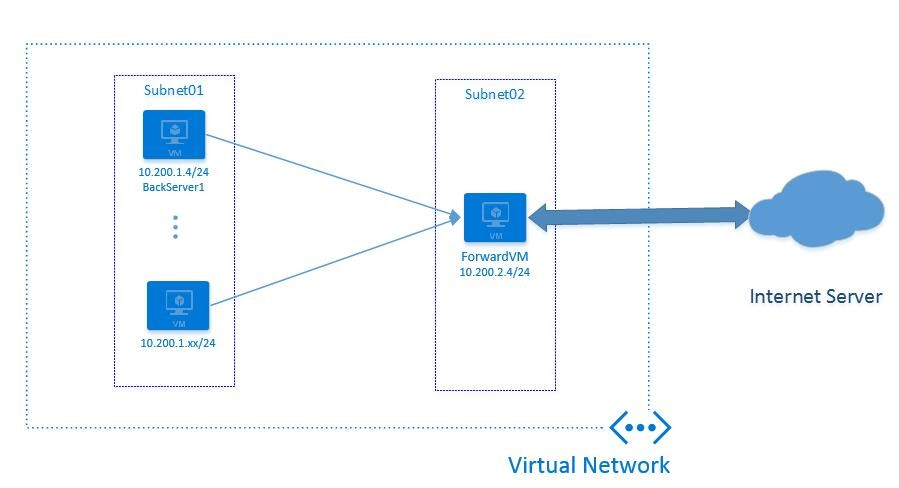
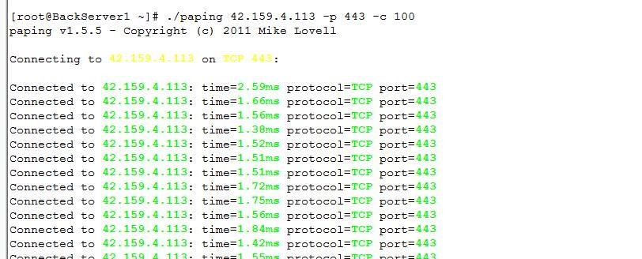

# ARM 虚拟机使用同一个公共 IP 访问公网的解决方案

Azure 目前有两种部署模型：资源管理器 ARM 和经典部署模型 ASM。ASM 的虚拟机默认公用云服务的 VIP 来访问 Internet，ARM 的虚拟机默认使用自己的公共 IP 访问 Internet。因为有的服务器有访问白名单的设置，因此有的客户可能想实现的一个需求就是 ARM 的多个虚拟机也公用一个公共 IP 来访问公网的某个服务器，这样就不需要在对方的白名单上添加多个虚拟机的公共 IP 地址。下面介绍如何实现这个方案。



虚拟网络的 Subnet01 子网中的多台虚拟机将公用 Subnet02 中的虚拟机 ForwardVM 访问 Internet 上的某台 Web 服务器。假设 Internet 上的这台 Web 服务器的地址是 `42.159.4.113`。

> [!NOTE]
> 此处 Web 服务器地址 `42.159.4.113` 为测试地址，无法保证该地址在 Internet 环境下一直可用。

下文介绍具体操作步骤 :

1. 首先借助 Azure 的自定义路由功能，创建一个路由表，将 Subnet01 这个子网访问 Internet 服务器的流量定向到虚拟机 ForwardVM。下面通过 Azure PowerShell 来操作。其实也可以在 Azure 门户上创建。

    ```powershell
    #创建一个路由条目
    $route = New-AzureRmRouteConfig -Name subnet01route -AddressPrefix 42.159.4.113/8 -NextHopType VirtualAppliance -NextHopIpAddress 10.200.2.4
    #创建一个路由表，关联上面创建的路由条目
    $routeTable = New-AzureRmRouteTable -ResourceGroupName TestVnetGroup –Location “China North” -Name tableforsubnet01 -Route $route
    #将上面创建的路由条目关联到子网Subnet01
    $vnet = Get-AzureRmVirtualNetwork -ResourceGroupName TestVnetGroup -Name TestVnet
    Set-AzureRmVirtualNetworkSubnetConfig -Name subnet01 -VirtualNetwork $vnet -AddressPrefix 10.200.1.0/24 –RouteTable $routeTable
    #保存虚拟网络的配置
    Set-AzureRmVirtualNetwork -VirtualNetwork $vnet
    ```

    保存成功后，我们看到 Subnet01 上已经关联了上面创建的路由表。

    

2. 在虚拟机 ForwardVM 上开启 IP 转发并对 Subnet01 子网中访问 Web 服务器的流量做 SNAT。

    1. 在平台层面，开启虚拟机的 IP 转发功能。

        在 Azure 门户上看到，虚拟机 ForwardVM 的网卡名称为 forwardvm350 : 

        

        ```powershell
        #获取网卡对象
        $nicfwvm=Get-AzureRMNetworkInterface -ResourceGroupName TestVnetGroup -Name forwardvm350
        #开启IP转发
        $nicfwvm.EnableIPForwarding = 1
        #保存配置
        Set-AzureRmNetworkInterface -NetworkInterface $nicfwvm
        ```

    2. 在虚拟机 ForwardVM 内部开启 IP 转发功能 :

        ```powershell
        echo 1 >/proc/sys/net/ipv4/ip_forward
        ```

        	

    3. 在虚拟机 ForwardVM 内做一个 SNAT，将 Subnet01 中虚拟机访问 Web 服务器的数据包的源地址改为虚拟机 ForwardVM 的地址 :

        ```
        iptables -t nat -A POSTROUTING -s 10.200.1.0/24 -j SNAT --to-source 10.200.2.4
        ```

        

3. 在 Subnet01 内的一台虚拟机 BackServer1 上进行测试。用 Paping 测试 Web 服务器地址 `42.159.4.113` 的 443 端口，一直可以访问 :

    

    同时在 ForwardVM 上进行抓包，发现 BackServer1 访问 `42.159.4.113` 的数据包确实发往了 ForwardVM。

    

    从上面的数据包可以看出，ForwardVM 对这个数据包确实做了地址转换。将访问数据包的源地址转换为了 ForwardVM 自己的 IP `10.200.2.4`.

因此上面的操作，实现了多个虚拟机公用一台虚拟机的公有 IP 访问 Internet 服务器的操作。