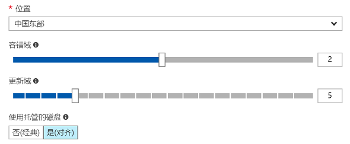
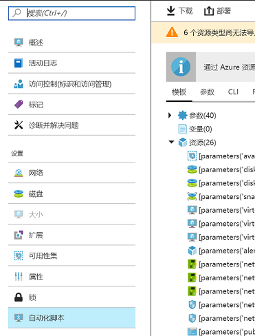
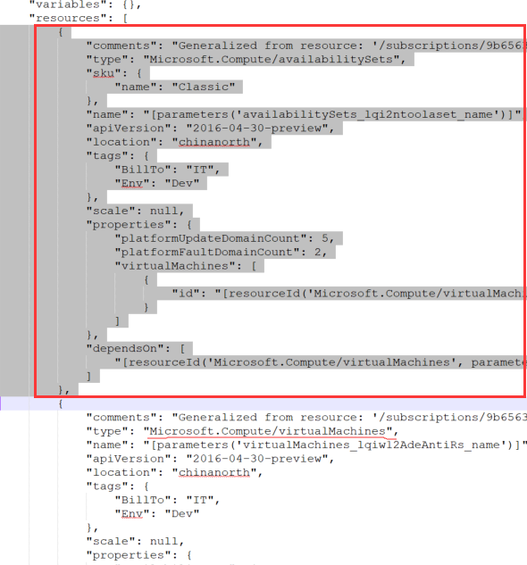
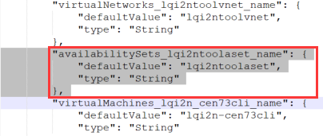
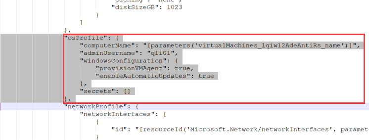
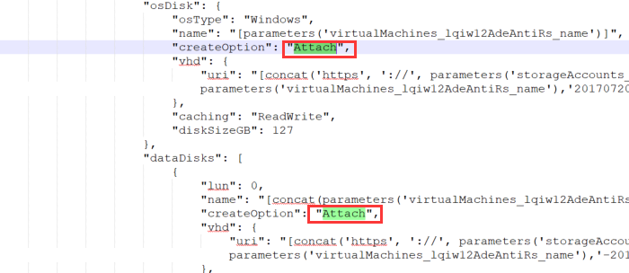
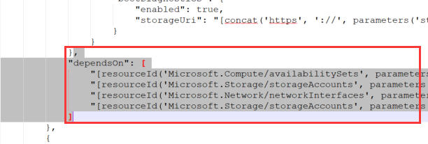
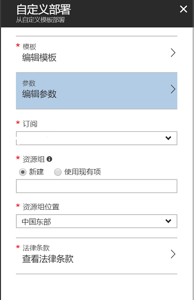
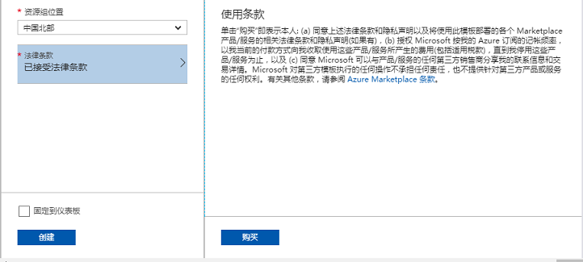

# 利用模板部署为现有 ARM 虚拟机添加可用性集

众所周知，Azure 平台通过将多台虚拟机加入同一个[可用性集](https://docs.azure.cn/zh-cn/virtual-machines/windows/manage-availability)来保证虚拟机中业务的高可用性。但是 Azure 资源管理器模式下的虚拟机在创建之后就无法更改可用性集。如果需要更改虚拟机的可用性集，则需要删除虚拟机进行重建。对于如何调用现有的资源以及如何保留各项配置则是重建过程中的常见问题。

本文提供了一个快捷有效的方法，就是利用 Azure 的模板部署功能，将现有的虚拟机快速重建，在此过程中可以为其添加或更改可用性集配置。

> [!IMPORTANT]
> 使用本文所描述的步骤会导致虚拟机中基于扩展的配置丢失，如诊断扩展配置或备份扩展配置，需要重新配置。对于有备份的虚拟机，建议暂时停止虚拟机的备份，在重建虚拟机后重新配置。

## 操作步骤

### 创建虚拟机所需的可用性集

通过 [Azure 门户](https://portal.azure.cn/)创建可用性集，建议与将要更改可用性集配置的虚拟机放在同一个资源组内，并选择与现有虚拟机相同的位置。<br>
如果虚拟机使用了托管磁盘，在最后一项 “**使用托管的磁盘**” 中选择 “**是(对齐)**”，如果虚拟机未使用托管磁盘，在最后一项中选择 “**否(经典)**”。



### 获得当前虚拟机的模板

根据文档：[从现有资源导出 Azure Resource Manager 模板](https://docs.azure.cn/zh-cn/azure-resource-manager/resource-manager-export-template#export-the-template-from-resource-group)，将模板下载到本地。



将下载的模板文件解压，使用 json 文本编辑器打开 template.json 文件。

template.json 文件主要分为三个部分：**parameter**、**variables** 和 **resources**。
    
- **parameters** : 部署时需要调用的参数，无需更改。
- **variables** : 部署时需要用到的变量，无需更改。
- **resources** : 部署时相关的资源配置，由于本次我们会调用现有的网卡、可用性集等资源，所以此处只需要保留虚拟机相关的资源和虚拟机扩展的相关配置，其他无关资源都需要删除。

### 修改模板

1. 删除 resources 中availabilitySets配置，保留其他与虚拟机本身相关的资源和扩展配置。

    > [!NOTE]
    > 在删除时请将无关资源的大括号中所有内容都删除，包括大括号本身。

    

2. 在 parameters 中找到先前创建的可用性集，记下其名称，在后续步骤中需要用到该值。

    

3. 在虚拟机的 `properties` 字段中添加 `availabilitySet` 属性配置: 
    
    > [!NOTE]
    > 此处 parameters 括号中为可用性集名称，请用第3步中记录的可用性集名称替代availabilitySets__name，注意结尾大括号后要有逗号。

    ```json
    "availabilitySet": {
    "id": "[resourceId('Microsoft.Compute/availabilitySets', parameters('availabilitySets__name'))]"
    },
    ```

    

4. 删除虚拟机 `properties` >> `storageProfile` >> `imageReference` 的属性配置，如下图所示内容：

    

5. 删除虚拟机 `properties` >> `osProfile` 的属性配置：

    

6. 修改虚拟机 `osDisk` 和 `dataDisks` 字段中的 `createOption` 属性为 `Attach`：

    

7. 删除虚拟机 `dependsOn` 字段，包括上一行最后的逗号：

    

8. 对修改完的模板进行检查，保证 resources 中只包含需要重创的虚拟机及其扩展配置。

> [!NOTE]
> 请确保以上所修改的模板没有多余的空行，结尾也没有多余的逗号。

### 删除当前虚拟机

在 [Azure 门户](https://portal.azure.cn/)中删除需要重建的虚拟机，保留其他资源如网卡、磁盘等。

### 进行模板部署

在 [Azure 门户](https://portal.azure.cn/)中点击左侧 “**新建**” 按钮，搜索 “**模板部署**”。



将之前修改完的模板贴到模板中，点击 “**保存**”。

点击 “**参数**”，在空白的参数中填入 **null**。


选择相关**订阅**和**资源组**。<br>
点击 “**法律条款**” >> “**购买**”，而后点击 “**创建**” 进行部署。



## 后续步骤

1. 在门户中查看虚拟机当前的可用性集。
2. 测试虚拟机连通性。
3. 重新配置诊断扩展或备份服务。

## 扩展阅读

- [创建和部署模板](https://docs.azure.cn/zh-cn/azure-resource-manager/resource-manager-create-first-template)
- [模板的最佳实践](https://docs.azure.cn/zh-cn/azure-resource-manager/resource-manager-template-best-practices)
- [使用 PowerShell 部署模板](https://docs.azure.cn/zh-cn/azure-resource-manager/resource-group-template-deploy)
- [使用 Azure CLI 部署模板](https://docs.azure.cn/zh-cn/azure-resource-manager/resource-group-template-deploy-cli)
