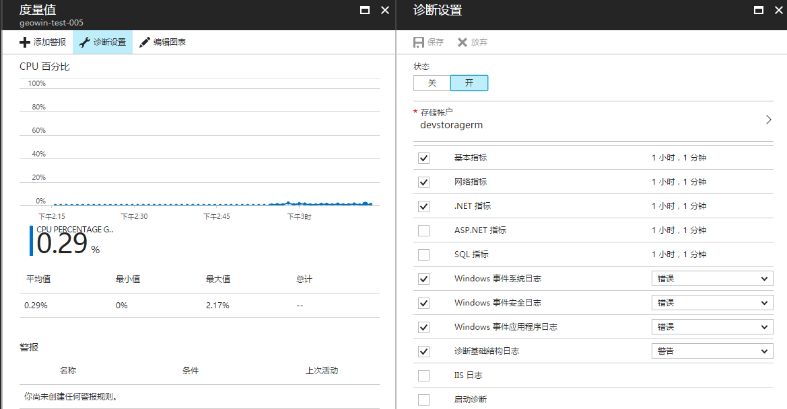

# Java 如何启用 ARM 虚拟机诊断

## 现象描述

如何通过 Java 语言实现在创建 ARM 虚拟机时开启诊断，并配置相关指标。



## 实现思路

调研最高版本的 JAVA SDK（1.1.0）源码发现，SDK 层面并未提供任启动诊断和配置诊断的相关接口。然而官方提供了相关的 REST 接口，参考：

 [如何增加及更新虚拟机扩展](https://docs.microsoft.com/zh-cn/rest/api/compute/extensions/extensions-add-or-update)

这个接口为我们提供了向现有的 ARM 虚拟机添加或更新虚拟机扩展（vm extension）的功能，而我们在 Portal 上配置的“**诊断功能**”其实是一个名为 “**IaaSDiagnostics**” 的一个扩展。结合上述的 REST 接口，该 REST 请求示例如下：

```
https://management.chinacloudapi.cn/subscriptions/<subId>/resourceGroups/<groupName>/providers/Microsoft.Compute/virtualMachines/<vmName>/extensions/IaaSDiagnostics?api-version=2016-03-30
````

这是一个 Put 请求，请求的参数主要包括 Header 和 Request Body 两部分，官方连接中提供的解释略有不足，以下是我们关于相关参数的说明：

- Header：主要包括 Authorization、Content-Type 及 Host 的设置:

    1. Authorization：提供认证的凭据，如何获取这个值请参考下面认证凭据描述。

    2. Content-Type：指定为 application/json，以 JSON 数据返回响应。

    3. Host：指定为“management.chinacloudapi.cn”，终结点地址。

- Request Body：关于扩展的配置信息，可以参考 [Azure Windows VM 扩展配置示例](./windows/extensions-configuration-samples)或以下模板:

    ```
    {	
        'type':'Microsoft.Compute/virtualMachines/extensions',
        'id':'/subscriptions/<subId>/resourceGroups/<groupName>/providers/Microsoft.Compute/virtualMachines/<vmName>/extensions/IaaSDiagnostics',
        'location':'<location>',
        'name':'IaaSDiagnostics',
        'properties':{
            'type':'IaaSDiagnostics',
            'publisher':'Microsoft.Azure.Diagnostics',
            'typeHandlerVersion':'1.5',
        'settings':{
            'StorageAccount':'<storageAccountName>',
            'xmlCfg':'<诊断 XML 配置的 Base64 编码值>'
        },
        'protectedSettings':{
            'storageAccountName':'<storageAccountName>',
            'storageAccountKey':'<storageAccountKey>',
            'storageAccountEndPoint':'https://core.chinacloudapi.cn'},
        'autoUpgradeMinorVersion':true,
        'instanceView':null
        }
    }
    ```

    1. subId：虚拟机所属的订阅 ID
    2. groupName:虚拟机所属的资源组名称
    3. vmName：虚拟机名称
    4. location：虚拟机地理位置(“China North” 或 “China East”)
    5. storageAccountName：虚拟诊断数据存储账号名称
    6. storageAccountKey：虚拟诊断数据存储账号秘钥
    7. 诊断 XML 配置的 Base64 编码值：这个值是指是将诊断指标配置做 Base64 编码计算得到的值。关于诊断指标配置参考[诊断 1.2 配置架构](https://docs.microsoft.com/zh-cn/azure/monitoring-and-diagnostics/azure-diagnostics-schema-1dot2)、[诊断 1.3 及更高版本的配置架构](https://docs.microsoft.com/zh-cn/azure/monitoring-and-diagnostics/azure-diagnostics-schema-1dot3-and-later)。同时，我们在 GitHub 中提供了相关测试用例：[WadCfg](https://github.com/wacn/AOG-CodeSample/blob/master/VirtualMachines/Java/azure-vmop-demo-master/src/main/java/geo/azure/test/WadCfg.xml) 

接下来我们可以通过 Java 来模拟提交该请求，实现为虚拟机开启诊断功能。

## 认证凭据

Authorization Header 的值是基于 AAD 方式验证返回的 Token 字符串，详细参考以下步骤：

1.	通过 PowerShell 获取认证凭据：

    ```PowerShell
    # 1.在 PowerShell 中，登录 Azure 账户
    Login-AzureRmAccount -EnvironmentName AzureChinaCloud

    # 2.选择当前订阅 ID
    Set-AzureRmContext -SubscriptionId "订阅 ID"

    # 3.创建 AD Application
    $azureAdApplication = New-AzureRmADApplication -DisplayName "georgeapp" -HomePage "https://www.georgeapp.org" -IdentifierUris "https://www.georgeapp.org/example" -Password "1QAZxsw2"
    $azureAdApplication

    # 4.为你的 AD 应用创建服务凭证
    New-AzureRmADServicePrincipal -ApplicationId $azureAdApplication.ApplicationId

    # 5.为服务凭证授权。如果想了解更多内容，请参考：https://azure.microsoft.com/en-us/documentation/articles/role-based-access-control-what-is/
    New-AzureRmRoleAssignment -RoleDefinitionName Contributor -ServicePrincipalName $azureAdApplication.ApplicationId 
    ```

    执行上述操作后，就可以获取可用的认证凭据信息：

    - tentantId：第二步执行完成后返回
    - subId：第二步指定的订阅 ID 
    - clientId：第三步执行完成后返回
    - clientSecret：第三步中设置的 Password

2.	获取 Token :

    ```Java
    private String getAccessToken() {

            AuthenticationContext context = null;
            AuthenticationResult result = null;
            ExecutorService service = null;
            service = Executors.newFixedThreadPool(1);

            try {
                context = new AuthenticationContext(
    String.format("%s/%s", 
    "https://login.chinacloudapi.cn", tentantId),
                    true, 
    service);
                ClientCredential cred = new ClientCredential(
    clientId, 
    clientSecret);
    Future<AuthenticationResult> future =   
    context.acquireToken(
    "https://management.chinacloudapi.cn/", cred,
                        null);

                result = future.get();

            } catch (MalformedURLException e) {
                e.printStackTrace();
            } catch (InterruptedException e) {
                e.printStackTrace();
            } catch (ExecutionException e) {
                e.printStackTrace();
            } finally {
                service.shutdown();
            }

            return result.getAccessToken();
    }
    ```

3.	Authorization: Bearer <Token>，以下是一个实际的示例:

    BearereyJ0eXAiOiJKV1QiLCJhbGciOiJSUzI1NiIsIng1dCI6Im0yZmFQUUZkQzFEVGRmWU1pb09kaHdSblFUMCIsImtpZCI6Im0yZmFQUUZkQzFEVGRmWU1pb09kaHdSblFUMCJ9.eyJhdWQiOiJodHRwczovL21hbmFnZW1lbnQuY29yZS5jaGluYWNsb3VkYXBpLmNuLyIsImlzcyI6Imh0dHBzOi8vc3RzLmNoaW5hY2xvdWRhcGkuY24vYjM4OGI4MDgtMGVjOS00YTA5LWE0MTQtYTdjYmJkOGI3ZTliLyIsImlhdC26MTQ5ODcyMzc1OSwibmJmIjoxNDk4NzIzNzU5LCJleHAiOjE0OTg3Mjc2NTksImFjciI6IjEiLCJhaW8iOiJZMkJnWU5pN2ZUS2Q0WDFxaHFOeGkvUDNsWTJUUXU5ZG1McmR5OEpucnJuTkhMV0RnYzhCIiwiYW1yIjpbInB3ZCJdLCJhcHBpZCI6ImM0NGI0MDgzLTNiYjAtNDljMS1iNDdkLTk3NGU1M2NiZGYzYyIsImFwcGlkYWNyIjoiMiIsImVfZXhwIjoyNjI4MDAsImZhbWlseV9uYW1lIjoiVGVzdDAzIiwiZ2l2ZW5fbmFtZSI6IkNJRSIsImlwYWRkciI6IjEwNi4xMjAuNzguMTkwIiwibmFtZSI6IkNJRSBUZXN0MDMiLCJvaWQiOiI3Njg2OTZiYi1hYjVlLTQ0YzYtOGUxYi03MTIyYjYxYjVlODEiLCJwbGF0ZiI6IjMiLCJwdWlkIjoiMjAwMzNGRkY3MDAxQjlEMCIsInNjcCI6InVzZXJfaW1wZXJzb25hdGlvbiIsInN1YiI6ImZZVkRjRHRKTzlqcTY0VUllU0todnc3LVh3U1JqOGw5cjJvZ3pSRVkwUlkiLCJ0aWQiOiJiMzg4YjgwOC0wZWM5LTRhMDktYTQxNC1hN2NiYmQ4YjdlOWIiLCJ1bmlxdWVfbmFtZSI6IkNJRVRlc3QwM0BNaWNyb3NvZnRJbnRlcm5hbC5wYXJ0bmVyLm9ubXNjaGluYS5jbiIsInVwbiI6IkNJRVRlc3QwM0BNaWNyb3NvZnRJbnRlcm5hbC5wYXJ0bmVyLm9ubXNjaGluYS5jbiIsInZlciI6IjEuMCJ9.C3n47Eoqvo65hYQa9UrZ6yRmedPA4HM96ZEoIQFkyeaql-ezNJVklkO0qUjA567REUJnFvQ_zSDPufLvbrO-VAqCto3w3MN4Pjlkk-4qGTNEAzeoS6k4LOC0-YHHnP_DJGv159IyUoukArNNnWrMs4ELTOw_SbhqB5usTNs7N1GPoZPJCwj5wYryFVlwYA5PN_o0ysIEj3XcdMvY18SEhsz663EJzxe-fwA0XRn7wejbbbTtXlTxvQfno5ZcB8t1IraL51CbZqyNyojc4Ya7n3ZsW6sX12Tt5e0DpMO4QpkIdyrSo1xZ3Mi7uJBAJIol-XIXnrO93_8xTfjn5Mu8_g

## 运行测试

    ```Java
    String resourceName ="geogroup";
    String vmName ="geowin-test-005";
    String vmLocation ="China North";
    String storageAccountName = "";
    String storageAccountKey= "";

    VmDiagnosticOperation diagnosticOperation = new VmDiagnosticOperation(
    "tenant id",
    "client id", 
    "client secret",
    "sub id");

    String result = diagnosticOperation.EnableVMDiagnostic(
    resourceName, 
    vmName, 
    vmLocation,
    storageAccountName, 
    storageAccountKey);

    System.out.println(result);
    ```
运行结果：


## 示例代码

示例代码已经托管在 GitHub 中，请点击 [azure-vmop-demo](https://github.com/wacn/AOG-CodeSample/tree/master/VirtualMachines/Java/azure-vmop-demo-master) 查看或下载完整代码示例。
