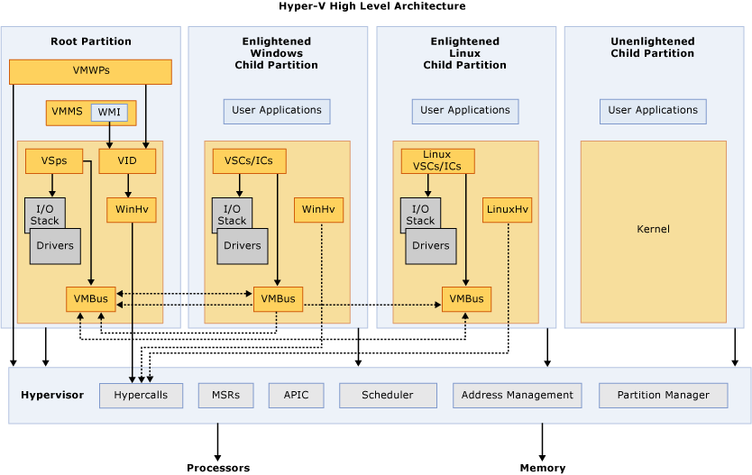

# 理解 Azure 平台中虚拟机的计算能力

虚拟化平台至今已经发展了十多年的时间。其中 Hyper-V 技术现在也已经是第三代版本。用户对于虚拟化计算也越来越接受，这也有了公有云发展的基础。然而在很多时候，用户在使用基于 Hyper-V 的 Azure 平台时，仍然有关于虚拟机计算能力的疑问，例如 :

- 虚拟化的功能的确很强大，但是会不会有性能问题，运行在 Hyper-V 平台的虚拟机是不是比 Hyper-V 服务器的性能要差？
- 在 Azure 平台上，由于 Azure 是多租户的系统，为了公平起见，是不是所有同一个大小，或是同一系列的虚拟机都会部署在同一种型号的物理服务器上？
- 我看到有的虚拟机使用的是 Intel 系列的 CPU，有的服务器使用的是 AMD 的 CPU，它们的主频，性能都不同，为什么收费是相同的，是不是当中存在欺诈和不平等的行为？

今天，我们来详细了解一下 Azure（Hyper-V）平台上的虚拟机计算能力。在具体了解虚拟机的计算能力之前，我们先来设定一个计算能力的衡量标准。目前业界有很多 CPU 的评测工具。为简单起见，我选择的是 wPrime，原因是：

- 容易使用，测试方法就是计算 10 亿内的所有自然数的平方根。
- 可以很方便选择多个工作线程，这样在多 CPU 的虚拟机上可以灵活配置。
- 测试不涉及内存和磁盘系统，结果也相对单纯。运算时间越长，运算能力越差。

需要指出的是 wPrime 只是为了便于本文描述性能而采用的工具，其仅仅测试了虚拟机 CPU 能力的某一个方面，并不代表微软官方对于虚拟机计算能力的测试方法。本文中实测的数据仅仅是来自于一个或几个特定实例，更多是用于表达不同虚拟机大小之间的比例关系，不作为官方衡量的依据。

针对于某些虚拟机计算能力的测试，实际上官方已经公布了一些数据。而这些数据是基于业界公认的测试方案，如 SPECint 2006 等。

- [Linux VM 的计算基准测试分数](https://docs.azure.cn/zh-cn/virtual-machines/linux/compute-benchmark-scores)
- [Windows VM 的计算基准测试分数](https://docs.azure.cn/zh-cn/virtual-machines/windows/compute-benchmark-scores)

众所周知， Azure 平台是基于 Hyper-V 架构的。为了理解 Azure 平台的虚拟机计算能力，我们需要初步了解下 Hyper-V 架构。

此处并不需要详细了解图中所有方格代表的组件的工作原理，只需知道 Hyper-V 平台存在两种分区(Partition)。其中最常用的一个分区，**Child Partition**，也就是我们通常意义上讲的虚拟机。值得注意的是另一个特殊分区，**Root Partition**，它是一个管理分区，用来管理物理主机的设备驱动、电源管理、设备热插拔等。同时，也是唯一可以直接访问物理主机硬件资源的分区。此时，大家可能已经明白，在一台 Hyper-V 服务器上，当我们连接上电源、键盘、鼠标、显示器，在本地登录时，我们实际上就是登陆了 Root Partition 这样一台虚拟机。而其他的 Child Partition 和 Root Partition 是并行的关系，Child Partition（虚拟机）并不是运行在 Root Partition 内部的。

问题一：通常运行在所谓的控制台（Console）中的应用程序，实际上是运行在 Root Partition 这样一台虚拟机里的。那 Root Partition 和 Child Partition 的运算能力有区别吗？通过 wPrime 进行第一个计算能力测试：在 Hyper-V 主机(Root Partition) 以及与其属于同一物理服务器中的同样核数的虚拟机上计算 10 亿内的所有自然数的平方根。为保证数据准确，每台机器计算两次。结果如下：

<table>
	<tr>
	    <th>分区</th>
	    <th>测试一</th>
	    <th>测试二</th>
        <th>CPU 性能</th>
	</tr>
	<tr>
	    <td>Child Partition</td>
	    <td>236 秒</td>
	    <td>236 秒</td>
        <td></img></td>
	</tr>
	<tr>
	    <td>Root Partition</td>
	    <td>227 秒</td>
	    <td>229 秒</td>
        <td></img></td>
	</tr>
</table>

考虑到虚拟机内部在测试时还有一定的 CPU 使用，以及 Root Partition 在 Hyper-V 的框架中的确有一些优势，但是从测试结过上看，差距微乎其微，在 3% 左右。因此，为个人认为从计算能力来看，Child Partition 和 Root Partition 是不存在差异的。

另外，我们注意到，Root Partition 和 Child Partition 显示的 CPU 的型号是一致的，都是 i7-4770 @3.4GHz。其实这在 Hyper-V 的架构上也可以理解。我们可以把物理主机的 CPU 资源看作是一个资源池，这个资源池原则上根据虚拟机的逻辑 CPU 的个数，来平均分配给各个虚拟机。当每个 CPU 使用自己的时间片时，他就可以使用物理 CPU 的主频来完成自己的计算任务。

这时，大家可能有一个疑问，在同一台 Hyper-V 主机上运行的虚拟机的 CPU 是否有同样的计算能力？换句话说，这些逻辑 CPU 是不是能够以同等机会拿到 CPU 的时间片，当它拿到 CPU 时间片后，是不是就能够以物理主机的主频来完成计算任务？我们来看一看 Hyper-V 上的虚拟机的 CPU 配置就清楚了：

在 Hyper-V 控制台程序中，对于虚拟机 CPU 配置有以下几部分：

| CPU 配置 | 缺省值 | 说明 |
| -------- | ----- | ---- |
| Virtual Machine Reserve | 缺省为 0   | 系统为该虚拟机保留的 CPU 资源 |
| Virtual Machine Limit   | 缺省为 100 | 该虚拟机可以达到的性能比例    |
| Relative Weight         | 缺省为 100 | 该虚拟机在系统分配资源时的比重 |

第一个选项为虚拟机保留更多的资源，第二个选项限定了虚拟机是否可以完全使用物理资源，第三个选项设定了该虚拟机同其他虚拟机相比取得 CPU 时间片的几率。其中第二第三个选项回答了我们之前的疑问：在同一台物理主机上运行的虚拟机，他们取得时间片的几率是可以调整的，当虚拟机获得时间片之后，我们也可以限定它是否可以完全利用 CPU 的最大性能。简单的进行测试，当我们把 Virtual Machine Limit 的值从 100 改成 50，即表明该虚拟机只可以使用 50 的最大性能，测试结果如下：

<table>
	<tr>
	    <th>Virtual Machine Limit</th>
	    <th>测试一</th>
	    <th>测试二</th>
        <th>CPU 性能</th>
	</tr>
	<tr>
	    <td>Limit = 100</td>
	    <td>330 秒</td>
	    <td>332 秒</td>
        <td></img></td>
	</tr>
	<tr>
	    <td>Limit = 50</td>
	    <td>680 秒</td>
	    <td>679 秒</td>
        <td></img></td>
	</tr>
</table>

从测试中可以看出，当虚拟机的上限被设定时，虚拟机的计算能力也相应被限定，尽管 Task Manager 中 CPU 的硬件型号及处理速度还和物理硬件保持一致。

**小结**：

- Root Partition 和 Child Partition 在计算能力上没有显著的差异。
- 虚拟机的 CPU 类型与其物理主机的类型一致。它仅仅是一个硬件信息，而不代表计算能力。
- 在同一台物理主机上运行的多个虚拟机，Hyper-V 完全有能力控制单个虚拟机的计算能力。

同时，这也回答了我们在文章开头提到的第二个问题，同一大小，同一类型的虚拟机并不是一定部署在同一种硬件设备上。Hyper-V 可以控制虚拟机的计算能力。

在 Azure 平台上，我们定义了很多虚拟机的大小标准，其中只有 Dv2 系列和 F 系列的虚拟机指定了其是基于最新一代 2.4 GHz Intel Xeon E5-2673 v3 (Haswell) 处理器。对于其他系列的虚拟机，Azure 并不保证其 CPU 的架构是 Intel 或是 AMD。另外，对于 A 系列的虚拟机，可以被放置在很多不同 CPU 类型的物理主机上。由于物理机房的服务器是在持续更新的过程中，其物理主机的运算能力存在差异。但是根据我们之前的对于 Hyper-V 主机的分析可以得知，通过限定虚拟机 CPU 资源（可以获得的时间片的几率，可以使用的物理资源的限定）的获取，尽管主机的类型不同，用户得到的是一致的 CPU 处理性能体验。

既然说到是一致的计算能力体验，就存在一个衡量的标准。这也就是在 Azure 中引入 Azure Compute Unit（ACU）的原因。ACU 并不是一个绝对数值，而是我们将 A1 系列的虚拟机的单个 CPU 计算能力定为 100，其他大小的虚拟机的单个 CPU 计算能力为 A1 的倍数。例如，Dv2 系列虚拟机的单个 CPU 的计算能力是 A1 系列的 2.1 到 2.5 倍，其 ACU 值为 210 到 250。我们在 A，Av2 和 D 系列上来重复 wPrime 测试 ：

- **A**: Intel Xeon E5-2660 0 @2.20GHz
- **Av2**：Intel Xeon E5-2660 0 @2.20GHz
- **Dv2**：Intel Xeon E5-2673 v3 @2.40GHz

| 大小  | CPU 数 | ACU/CPU | ACU 总计  | 测试一  | 测试二  | 实测计算能力 |
| :---: | :---: | :-----: | :-------: | :-----: | :----: | :--------: |
| A1    | 1     | 100     | 100       | 3830 秒 | 3822 秒 | 100       |
| A2    | 2     | 100     | 200       | 1926 秒 | 1896 秒 | 200       |
| A3    | 4     | 100     | 400       |  952 秒 |  940 秒 | 404       |
| A4    | 8     | 100     | 800       |  476 秒 |  471 秒 | 807       |
| A1_v2 | 1     | 100     | 100       | 3853 秒 | 3729 秒 | 101       |
| A2_v2 | 2     | 100     | 200       | 1883 秒 | 1845 秒 | 205       |
| A3_v2 | 4     | 100     | 400       |  923 秒 |  967 秒 | 405       |
| A4_v2 | 8     | 100     | 800       |  466 秒 |  466 秒 | 821       |
| D1_v2 | 1     | 210-250 | 210-250   | 1826 秒 | 1833 秒 | 209       |
| D2_v2 | 2     | 210-250 | 420-500   |  902 秒 |  902 秒 | 424       |
| D3_v2 | 4     | 210-250 | 840-1000  |  429 秒 |  428 秒 | 894       |
| D4_v2 | 8     | 210-250 | 1680-2000 |  221 秒 |  221 秒 | 1731      |

> [!NOTE]
> 实测计算能力以两次测试的平均值与 A1 的平均值 3826 相比，得到的计算能力。

在测试过程中，有 A 系列的虚拟机是使用 AMD Opteron Processor 4171 HE 的 CPU。根据 wPrime 的测试结果，A1 到 A4 之间虽然保证相应的比例关系，但不难发现同之前的 Intel 系列 CPU 的结果差距较大。其实这也是一个正常的结果，CPU 计算能力的测定往往同测试程序的编译代码，CPU 架构，服务器设计息息相关。在考虑 CPU 的计算能力时，往往需要综合考虑整型计算，浮点计算等等的测试结果。

| 大小  | CPU 数 | ACU/CPU | ACU 总计  | 测试一  | 测试二  |
| :---: | :---: | :-----: | :-------: | :-----: | :----: |
| A1    | 1     | 100     | 100       | 2867 秒 | 2832 秒 |
| A2    | 2     | 100     | 200       | 1462 秒 | 1389 秒 |
| A3    | 4     | 100     | 400       |  724 秒 |  719 秒 |
| A4    | 8     | 100     | 800       |  350 秒 |  345 秒 |

针对于使用不同 CPU 架构的虚拟机的计算能力，微软内部测试结果（结果暂未公开）表明，针对于 A 系列的虚拟机，AMD Opteron Processor 4171 HE 的单个 vCPU 的计算能力稍稍高于 Intel Xeon E5-2660 0 @2.20GHz，但误差也仅仅在 5% 附近。这个数据可能和大多数用户印象中的结论相反。使用 AMD 处理器的虚拟机在性能上并不弱于 Intel 处理器。

从以上的测试结果以及架构分析中，我们可以确认尽管在 Azure 平台存在不同的物理主机类型，但是这对于 Azure 标注的虚拟机计算能力，用户可以得到一致的计算能力。

1. 不同的主机型号，不同的 CPU 架构， ACU 数值可以得到控制以保证一致的计算体验。
2. 当虚拟机的大小改变时，实际的计算能力根据 ACU 的标称值线性增长。
3. 不同的虚拟机系列，都可以根据以 A1 系列换算的 ACU 数值，达到相应的计算能力。