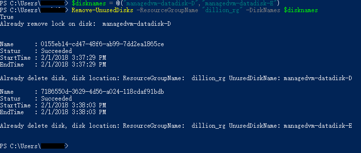
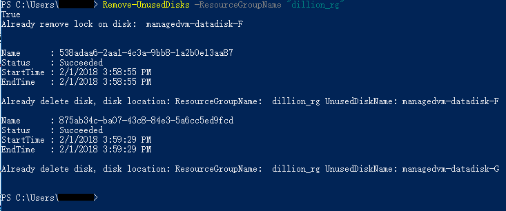

# 如何查找并删除未被使用的托管磁盘

在创建虚拟机时，可以选择该虚拟机是用托管磁盘还是非托管磁盘来存储虚拟机的系统磁盘和数据磁盘，有关托管磁盘和非托管磁盘的详细信息，请参考[磁盘存储](/virtual-machines/windows/about-disks-and-vhds)。

删除虚拟机时，与该虚拟机相关联的操作系统盘和数据磁盘不会被删除，最终会留在 Azure 存储账户中，从而导致用户继续承担这些磁盘的费用。

本文主要介绍了如何使用 PowerShell 查找并删除未被使用的托管磁盘。主要包括以下内容：

* [获取未被使用的托管磁盘](#getUnusedDisks)
* [删除指定的托管磁盘](#removeSpecifiedDisks)
* [保留指定的磁盘，删除指定资源组中其他未被使用的托管磁盘](#reservedisks)
* [删除当前订阅中指定资源组中未被使用的托管磁盘](#removeAllDisks)
* [详细 PowerShell 脚本](#detailsscript)

如果您使用的是非托管磁盘，可以参阅[如何查找并删除未被使用的非托管磁盘源 .vhd 文件](aog-virtual-machines-how-to-find-and-delete-unused-vhds.md)。

> [!IMPORTANT]
> 如果从资源组或存储账户中删除托管磁盘，Microsoft 则无法为用户恢复数据。为防止重要数据丢失，请将重要数据在本地备份。

## 实现思路:

通过检查托管磁盘的所有者来判断该磁盘是否正在被使用。

## <a id="getUnusedDisks"></a>获取未被使用的托管磁盘

> [!NOTE]
> 在本示例中，我将相关的 [PowerShell Function 脚本](#detailsscript)放在用户文件夹下的 "GetAndRemoveDisks.ps1" 文件中。在运行相关命令前，先执行脚本文件，定义 Function , 然后调用相关的 Function 执行查询和删除命令。

```powershell
# 执行脚本
. ".\GetAndRemoveDisks.ps1"//请不要忽略第一个点。
# 查看订阅下所有未被使用的托管磁盘。
Get-UnusedDisks
```

执行以上方法，获取当前订阅下所有未被使用的托管磁盘, 如下所示：


## <a id="removeSpecifiedDisks"></a>删除指定的托管磁盘

可以使用以下命令将 `<资源组名称>` 替换成磁盘所在的资源组，将 `<磁盘名称>` 替换为所要删除的磁盘名称，删除指定的托管磁盘：

```powershell
#数组类型，可以指定多个磁盘
$disknames = @("<磁盘名称>","<磁盘名称>")
Remove-UnusedDisks -ResourceGroupName "<资源组名称>" -DiskNames $disknames
```

> [!NOTE]
> 在指定磁盘名称时，请确保磁盘名称一致。



## <a id="reservedisks"></a>保留指定的磁盘，删除指定资源组中其他未被使用的托管磁盘

> [!WARNING]
> 使用该脚本删除磁盘时，会将被 Lock 的磁盘解锁并删除，所以在删除前再次检查是否需要删除，如果需要保留磁盘，请使用下列的代码指定保留磁盘。

```powershell
$reservedDiskName = @("磁盘名称","磁盘名称")
Remove-UnusedDisks -ResourceGroupName "<资源组名称>" -ReservedDiskNames $reservedDiskName 
```


## <a id="removeAllDisks"></a>删除当前订阅中指定资源组中未被使用的托管磁盘

```powershell
Remove-UnusedDisks -ResourceGroupName "<资源组名称>"
```



> [!NOTE]
> 如果不指定资源组，则删除当前订阅下所有未被使用的托管磁盘。

## <a id = "detailsscript"></a> 详细 PowerShell 脚本

```powershell
Function Get-UnusedDisks()
{
    $disks = Get-AzureRmDisk;
    foreach ($disk in $disks)
    {
        If($disk.OwnerId -eq $Null)
        {
            Write-Host "ResourceGroupName: " $disk.ResourceGroupName "UnusedDiskName:" $disk.Name;
        }
    }
}

Function Remove-UnusedDisks()
{
    #定义一个参数 $ResourceGroupName 用于指定需要删除磁盘的资源组
    #定义一个数组 $DiskNames，用于指定需要删除的磁盘名称
    #定义一个数组 $ReservedDisksName，用于指定不需要删除的磁盘名称
    Param($ResourceGroupName, [string[]]$DiskNames, [String[]]$ReservedDisksName);

    #用于存储查找出来的磁盘
    $disks = New-Object System.Collections.ArrayList;
    If($ResourceGroupName -eq $Null)
    {
        #如果未指定资源组，则查找当前订阅中的磁盘
        $disks = Get-AzureRmDisk;
    }
    Else
    {
        #查找特定资源组中的磁盘
        $disks = Get-AzureRmDisk -ResourceGroupName $ResourceGroupName;
    }

    Foreach($disk in $disks)
    {
        If($ReservedDisksName -ccontains($disk.Name))
        {
            #保留磁盘
        }
        else{
            if($DiskNames.Count -ne 0)
            {
                if($DiskNames -ccontains($disk.Name))
                {
                    #如果 OwnerId 为空，表明当前磁盘未被使用
                    If($disk.OwnerId -eq $Null)
                    {
                        #检查磁盘是否被锁定
                        $lockId = (Get-AzureRmResourceLock -ResourceGroupName $disk.ResourceGroupName -ResourceName $disk.Name -ResourceType Microsoft.Compute/disks).LockId;
                        if($lockId -ne $Null)
                        {
                            #解锁
                            Remove-AzureRmResourceLock -LockId $lockId -Force;
                            Write-Host "Already remove lock on disk: " $disk.Name;
                        }
                        Remove-AzureRmDisk -ResourceGroupName $disk.ResourceGroupName -DiskName $disk.Name -Force;
                        Write-Host "Already delete disk, disk location: ResourceGroupName: " $disk.ResourceGroupName "UnusedDiskName:" $disk.Name;
                    }
                }
            }
            else
            {
                #如果 DisksName 为空，删除除保留磁盘外其他未使用的磁盘。
                If($disk.OwnerId -eq $Null)
                {
                    #检查磁盘是否被锁定
                    $lockId = (Get-AzureRmResourceLock -ResourceGroupName $disk.ResourceGroupName -ResourceName $disk.Name -ResourceType Microsoft.Compute/disks).LockId;
                    if($lockId -ne $Null)
                    {
                        #解锁
                        Remove-AzureRmResourceLock -LockId $lockId -Force;
                        Write-Host "Already remove lock on disk: " $disk.Name;
                    }
                    Remove-AzureRmDisk -ResourceGroupName $disk.ResourceGroupName -DiskName $disk.Name -Force;
                    Write-Host "Already delete disk, disk location: ResourceGroupName: " $disk.ResourceGroupName "UnusedDiskName:" $disk.Name;
                }
            }
        }
    }    
}
```
