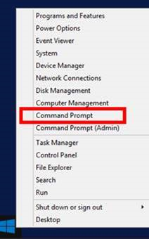

# 如何设置 Azure File 在系统重启后的自动挂载

## Linux 系统

### 场景描述

Linux 系统重启后，会根据 `/etc/fstab` 中的内容来进行文件系统的挂载，没有写入该文件的本地和远程文件系统，不会自动挂载。因此，为保证虚拟机重启后能自动挂载，建议您修改 `/etc/fstab` 写入 Azure File 的信息。

### 操作步骤

1. 在 Linux 命令行中以 root 身份执行下面语句，创建 Azure File Credentials 文件，相关参数请替换为您具体的环境信息：

    ```shell
    if [ ! -d "/etc/smbcredentials" ]; then
        mkdir /etc/smbcredentials
    fi

    if [ ! -f "/etc/smbcredentials/<storageaccountname>.cred" ]; then
        sudo bash -c 'echo "username=<storageaccountname>" >> /etc/smbcredentials/ <storageaccountname>.cred'
        sudo bash -c 'echo "password=<storageaccountkey>" >> /etc/smbcredentials/ <storageaccountname>.cred'
    fi

    chmod 600  /etc/smbcredentials/<storageaccountname>.cred
    ```

2. 编辑 `/etc/fstab`，添加 Azure File 的挂载点，挂载参数可以根据实际情况调整。

    `//<storageaccountname>.file.core.chinacloudapi.cn/share /moutpoint cifs credentials=/etc/smbcredentials/<storageaccountname>.cred,vers=3.0,dir_mode=0777,file_mode=0777,serverino`

### 参考文档

[使用 /etc/fstab 为 Azure 文件共享创建持久装入点](https://docs.azure.cn/zh-cn/storage/files/storage-how-to-use-files-linux#create-a-persistent-mount-point-for-the-azure-file-share-with-etcfstab)

## Windows 系统

### 场景描述

在 Windows 中，默认系统会尝试在重启后保持 SMB 连接，但是系统默认不会保存 Azure File 的认证信息，因此，重启后可能无法成功连接 Azure File。下面方式可以在系统中保存 Azure File 认证信息（测试在 Windows 2012R2 中可行）。

### 操作步骤

1. 以普通身份打开命令行窗口：

    

2. 添加凭据；如果已经添加过，可以忽略。

    ```bash
    cmdkey /add:<filestoragename>.file.core.chinacloudapi.cn\<yourshare> /user:AZURE\<filestoragename> /pass:xxxxxxxxxxxxxxxxxxxxMEeJPS8CBHBIhzLJFrf4XaIjbQN7dPHy0mC9ufs7g8xxxxxxxxxx==
    ```

3. 查看凭据是否添加成功：

    ```bash
    cmdkey /list
    ```

4. 连接 Azure File；这里无需指定特定的盘符，也无需再输入用户名密码，该命令会调用已经保存的凭据进行认证：

    ```bash
    net use * \\<filestoragename>.file.core.chinacloudapi.cn\<yourshare>
    ```

5. 查看连接情况:

    ```bash
    net use
    ```

6. 重启后再次查看连接情况:

    ```bash
    net use
    ```

### 参考文档

[保持 Azure 文件的持久连接](https://blogs.msdn.microsoft.com/windowsazurestorage/2014/05/26/persisting-connections-to-microsoft-azure-files/)