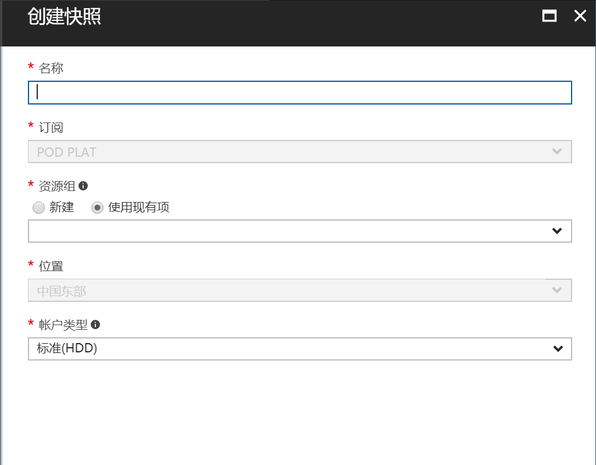
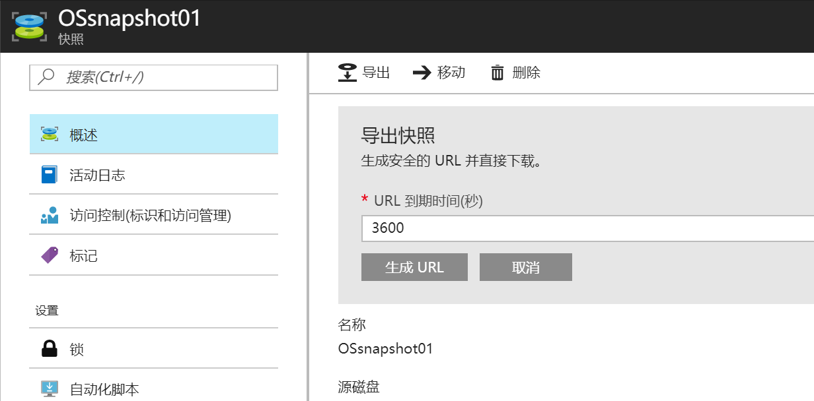

# 如何复制或导出托管磁盘

托管磁盘为用户在后台处理存储帐户的创建/管理，确保用户不需担心存储帐户的可伸缩性限制。 用户只需指定磁盘大小和性能层（标准/高级），然后 Azure 就会为用户创建和管理磁盘。 即使在添加磁盘或者对 VM 进行上下伸缩的时候，用户也不需担心所使用的存储。

如同非托管磁盘（VHD 文件）一般，Azure 提供了以下导出托管磁盘的方法。

> [!NOTE]
> 只有在虚机处于解除分配状态，或磁盘未被附加到虚机上时，才可以导出托管磁盘。

## 导出托管磁盘

当虚机处于解除分配状态，或磁盘未附加到虚机上时，可以使用 Azure 门户、PowerShell 或 Azure CLI 导出托管磁盘。如需在虚机开启时导出托管磁盘，需要先从磁盘创建托管快照，再对快照执行导出操作。托管快照是托管磁盘的只读副本。

### Azure 门户

在 Azure 门户中，在 **磁盘** 页面点击 **导出** 按钮，点击 **生成 URL** 按钮，即可生成安全的 URL 并直接用浏览器下载。


或点击 **创建快照** 按钮，从磁盘创建快照后，对快照执行 **导出** 操作。





### PowerShell

以下 PowerShell 脚本先对指定的托管磁盘创建快照，再将快照导出成 VHD 文件，保存在指定的存储账户中。

> [!NOTE]
> 请使用 6.5.0 以上版本的 AzureRM Module 以及 2.6.0 以上版本的 AzureRM.Compute Module。

```PowerShell
#提供订阅 ID
$SubscriptionId = "yourSubscriptionId"
#提供资源组名
$ResourceGroupName ="yourResourceGroupName"
#提供想要复制的托管磁盘名
$DiskName = "yourDiskName"
#提供想要创建的快照名
$SnapshotName = "yourSnapshotName"
#快照 SAS 的过期时间，3600 秒 = 1 小时
$sasExpiryDuration = "3600"
#提供目标存储账户名
$StorageAccountName = "yourstorageaccountName"
#提供目标存储账户容器名
$StorageContainerName = "yourstoragecontainername"
#提供目标存储账户密钥
$StorageAccountKey = 'yourStorageAccountKey'
#提供目标 VHD 文件名
$DestinationVHDFileName = "yourVHDfilename"
#提供地区信息，chinaeast 或 chinanorth
$Location = "resourcelocation"

#获取想要复制的托管磁盘
$Disk = Get-AzureRmDisk -ResourceGroupName $ResourceGroupName -DiskName $DiskName 

#创建快照配置
$Snapshot = New-AzureRmSnapshotConfig -SourceUri $Disk.Id -CreateOption Copy -Location $Location

#拍摄快照
New-AzureRmSnapshot -Snapshot $Snapshot -SnapshotName $SnapshotName -ResourceGroupName $ResourceGroupName 

#创建快照的 SAS Uri	
$sas = Grant-AzureRmSnapshotAccess -ResourceGroupName $ResourceGroupName -SnapshotName $SnapshotName -DurationInSecond $sasExpiryDuration -Access Read 
 
#创建目标存储账户上下文
$destinationContext = New-AzureStorageContext –StorageAccountName $StorageAccountName -StorageAccountKey $StorageAccountKey  

#将快照的基础 VHD 复制到存储账户
Start-AzureStorageBlobCopy -AbsoluteUri $sas.AccessSAS -DestContainer $StorageContainerName -DestContext $destinationContext -DestBlob $DestinationVHDFileName 
```

### Azure CLI

以下 Azure CLI 脚本仅对指定快照生成 SAS Uri，并将快照导出成 VHD 文件至指定存储账户。

此脚本可在 bash 会话中运行，关于更多信息，请参考[在 Linux 上使用 Azure CLI](https://docs.azure.cn/zh-cn/virtual-machines/linux/quick-create-cli) 。

```bash
#Provide the subscription Id where snapshot is created
subscriptionId=mySubscriptionId

#Provide the name of your resource group where snapshot is created
resourceGroupName=myResourceGroupName

#Provide the snapshot name 
snapshotName=mySnapshotName

#Provide Shared Access Signature (SAS) expiry duration in seconds e.g. 3600.
#Know more about SAS here: https://docs.microsoft.com/en-us/azure/storage/storage-dotnet-shared-access-signature-part-1
sasExpiryDuration=3600

#Provide storage account name where you want to copy the snapshot. 
storageAccountName=mystorageaccountname

#Name of the storage container where the downloaded snapshot will be stored
storageContainerName=mystoragecontainername

#Provide the key of the storage account where you want to copy snapshot. 
storageAccountKey=mystorageaccountkey

#Provide the name of the VHD file to which snapshot will be copied.
destinationVHDFileName=myvhdfilename

az account set --subscription $subscriptionId

sas=$(az snapshot grant-access --resource-group $resourceGroupName --name $snapshotName --duration-in-seconds $sasExpiryDuration --query [accessSas] -o tsv)

az storage blob copy start --destination-blob $destinationVHDFileName --destination-container $storageContainerName --account-name $storageAccountName --account-key $storageAccountKey --source-uri $sas
```
