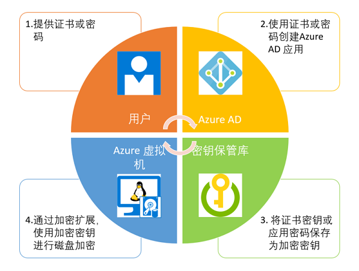
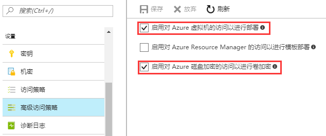

# Azure Linux 虚拟机磁盘加密问题排查指南

Azure Linux 虚拟机磁盘加密功能通过开源的 DM-Crypt 组件，使用 Azure 密钥保管库保管加密密钥，并利用 Azure Active Directory 中注册的服务实体来访问进行验证，达到对 Linux 虚拟机进行系统磁盘和数据磁盘加密的目的。
关于磁盘加密的使用方法请参考文档 [适用于 Windows 和 Linux IaaS VM 的 Azure 磁盘加密](https://docs.azure.cn/zh-cn/security/azure-security-disk-encryption)。
下图简要描绘了开启 Azure 磁盘加密时各个组件所发挥的作用。



在理解了 Azure 磁盘加密的基本原理后，进行加密问题排查的思路也就比较清晰了。

- 检查 Azure AD 密码或证书密钥是否过期
- 检查密钥保管库权限是否已设置
- 检查虚拟机操作系统是否支持磁盘加密及其前提条件
- 检查虚拟机加密扩展是否安装成功
- 检查虚拟机磁盘加密进度
- 如何重新对虚拟机进行加密

## 检查 Azure AD 密码或证书密钥是否过期

在创建 Azure AD 的应用程序时，可以直接创建，即不带密码，也可以通过密码或证书创建。通过密码创建的应用程序，其密码会被标注成类型为 Password 的密钥，通过证书创建的应用程序，其证书密钥会被标注成类型为 Cert 的密钥。

我们可以使用 `Get-AzureRmADApplication` 命令来查询 Azure AD 的应用，然后使用 Get-AzureRmADAppCredential 命令通过查询到的应用 ID 来查询应用的密钥有效期。


## 检查密钥保管库权限是否已设置

在使用密钥保管库进行磁盘加密时，需要对密钥保管库设定访问权限，使其允许磁盘加密扩展访问并解开 (Unwrap) 访问密钥。如果使用了证书密钥加密方式 (仅支持 Windows 虚拟机) ，还需要为虚拟机开启对密钥保管库中证书的访问权限。

一般可以通过以下两种方式进行访问权限的设定：

1. Azure 管理门户，在密钥保管库中点击高级访问策略，选中“启用对 Azure 虚拟机的访问以进行部署”和“启用对 Azure 磁盘加密的访问以进行卷加密”，并保存设置。

    

2. Azure PowerShell，使用 `Get-AzureRmKeyVault` 抓取密钥保管库信息，并使用 `Set-AzureRmKeyVaultAccessPolicy` 配置访问权限。

    
    

3. Azure CLI，使用 `azure keyvault set-policy --vault-name --enabled-for-disk-encryption true` 命令。

## 检查虚拟机操作系统是否支持磁盘加密

在执行磁盘加密时，Linux OS 磁盘加密序列会暂时卸载 OS 驱动器。 然后，它将对整个 OS 磁盘进行逐块加密，然后再将其重新安装为加密状态。与 Windows 上的 Azure 磁盘加密不同，Linux 磁盘加密不允许在加密的同时并发使用 VM。加密过程可能需要 3-16 小时才能完成存储库映像。如果添加了多 TB 大小的数据磁盘，此过程可能需要数天才能完成。VM 的性能特点会在完成加密所需的时间上产生显著差异。这些特点包括磁盘大小以及存储帐户为标准还是高级 (SSD) 存储。

在通过受支持的储备库映像修改或更改的目标 VM 环境上尝试加密 OS 磁盘更有可能发生此错误。与支持的映像存在偏差，从而可能会妨碍扩展卸载 OS 驱动器的示例如下所示：

- 自定义映像不再与受支持文件系统或分区方案匹配。
- 加密之前在 OS 中安装并运行了 SAP、MongoDB 或 Apache Cassandra 等大型应用程序。该扩展不能正确关闭这些应用程序。如果这些应用程序将打开的文件句柄保留到 OS 驱动器，则驱动器无法卸载，从而导致失败。
- 在启用加密的几乎同一时间内运行自定义脚本，或者在加密过程中在 VM 上进行其他任何更改。如果 Azure 资源管理器模板定义了多个同时执行的扩展，或者在执行磁盘加密的同时运行自定义脚本扩展或其他操作，则可能会发生此冲突。 序列化并隔离此类步骤可能会解决问题。
- 在启用加密之前未禁用安全性增强的 Linux (SELinux)，卸载步骤将会失败。完成加密后，可以重新启用 SELinux。
- OS 磁盘使用逻辑卷管理器 (LVM) 方案。尽管此时可以使用有限的 LVM 数据磁盘支持，但无法使用 LVM OS 磁盘支持。
- 不满足最低内存要求（建议为 OS 磁盘加密提供 7GB）。
- 数据驱动器以递归方式装载在 /mnt/ 目录下，或者相互装载（例如 /mnt/data1、/mnt/data2、/data3 + /data3/data4）。
- 不满足 Linux 的其他 Azure 磁盘加密[先决条件](https://docs.azure.cn/zh-cn/security/azure-security-disk-encryption#prerequisites)。

另外，并不是所有 Linux 发行版的所有磁盘都被 Azure 磁盘加密支持，有些操作系统目前只支持对数据磁盘进行加密。如果虚拟机操作系统只支持对数据磁盘进行加密，那需要在使用 `Set-AzureRmVMDiskEncryptionExtension` 命令时添加 `-VolumeType Data` 参数。

## 检查虚拟机加密扩展是否安装成功

虚拟机中的磁盘加密扩展无需用户手动安装，在第一次开启磁盘加密功能时即会自动安装。用户可以使用 `(Get-AzureRmVM -ResourceGroupName $RGName -Name $vmname).Extensions | where {$_.Name -eq "AzureDiskEncryptionForLinux"}` 命令查看虚拟机中加密扩展状态。


用户也可以在管理门户中查看虚拟机的扩展状态。


## 检查虚拟机磁盘加密进度

在执行 `Set-AzureRmVMDiskEncryptionExtension` 命令成功后，可以使用 `Get-AzureRmVMDiskEncryptionStatus` 命令查看加密进度，示例输出如下：


加密过程可能需要 **3-16** 小时才能完成存储库映像。如果添加了多 **TB** 大小的数据磁盘，此过程可能需要数天才能完成。如果有任何报错，会在 `ProgressMessage` 字段中显示。

## 如何重新对虚拟机进行加密

> [!NOTE]
> Azure 磁盘加密不支持对已加密的 Linux 虚拟机系统磁盘进行解密。

在已经加密的虚拟机中添加新数据磁盘时，磁盘加密扩展是不会自动对新数据磁盘进行加密的。这时候用户需要重新对虚拟机执行 `Set-AzureRmVMDiskEncryptionExtension -SequenceVersion` 命令，提供一个随机的 GUID 作为序列版本，对新的数据磁盘进行加密。


在需要对数据磁盘进行解密的时候，可以使用 `Disable-AzureRmVMDiskEncryption` 命令对已加密的虚拟机进行解密，已加密的 Linux 虚拟机系统磁盘不支持解密。


如果加密扩展配置出现问题，或者在执行 `Set-AzureRmVMDiskEncryptionExtension` 命令时反复出现如下报错，可以考虑执行 `Remove-AzureRmVMDiskEncryptionExtension` 命令删除当前的加密扩展，再重新对虚拟机的加密前提条件进行评估。

```PowerShell
Set-AzureRmVMDiskEncryptionExtension : Long running operation failed with status 'Failed'.
ErrorCode: VMExtensionProvisioningError
ErrorMessage: VM has reported a failure when processing extension 'AzureDiskEncryptionForLinux'. Error message: "Failed 
to update encryption settings with error: coercing to Unicode: need string or buffer, NoneType found, stack trace: 
Traceback (most recent call last):
  File "/var/lib/waagent/Microsoft.Azure.Security.AzureDiskEncryptionForLinux-0.1.0.999297/main/handle.py", line 280, 
in update_encryption_settings
    shutil.copy(existing_passphrase_file, encryption_environment.bek_backup_path)
  File "/usr/lib64/python2.7/shutil.py", line 119, in copy
    copyfile(src, dst)
  File "/usr/lib64/python2.7/shutil.py", line 68, in copyfile
    if _samefile(src, dst):
  File "/usr/lib64/python2.7/shutil.py", line 58, in _samefile
    return os.path.samefile(src, dst)
  File "/usr/lib64/python2.7/posixpath.py", line 155, in samefile
    s1 = os.stat(f1)
TypeError: coercing to Unicode: need string or buffer, NoneType found".
```


需要注意的是，在删除扩展之后，请登陆虚拟机，删除 `/var/lib/` 文件夹下的 `azure_disk_encryption_config` 文件夹，才能保证之后重新加密时不会报错。

## 其他注意事项

在磁盘加密开启之后，Linux 虚拟机内会出现一个大小为 50MB，标签为 “**BEK VOLUME**” 的 FAT32 分区，内含加密数据。如果重启虚拟机后出现磁盘设备名不一致的现象，请参考文档[如何解决 Linux 虚拟机磁盘设备名不一致的问题](https://docs.azure.cn/zh-cn/articles/virtual-machines/linux/aog-virtual-machines-linux-qa-disk-name-inconsistent)。