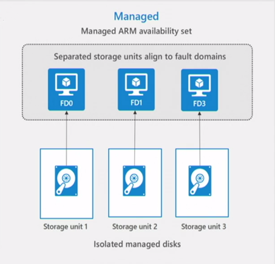
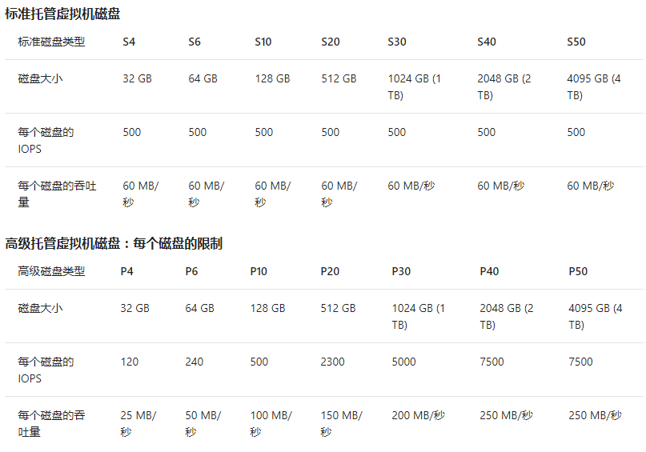
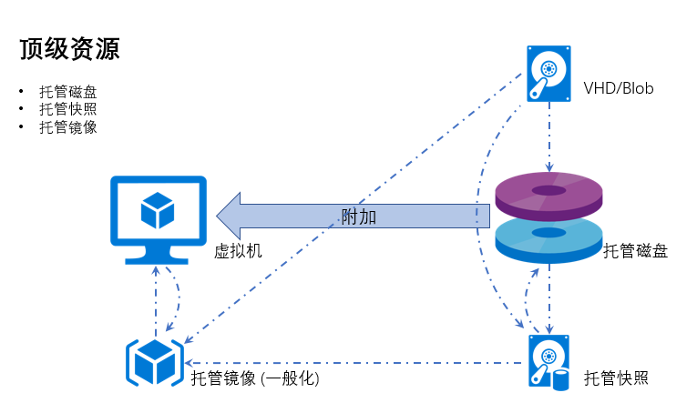

# 理解托管磁盘的原理与优势

## 简介

Azure 托管磁盘，是指将虚拟机使用的虚拟磁盘文件（VHD）和存储账号交由 Azure 来规划和控制的服务。

此功能的上线，意味着用户能更方便地管理 Azure 虚拟机的存储。Azure 托管磁盘将储存在标准或高级存储账户中的虚拟磁盘文件（VHD）抽象成 Azure 资源管理器中的顶级资源。用户只需给定磁盘类型（标准或高级）与磁盘大小，Azure 便会替用户创建并管理磁盘。

## 更高的虚拟机可用性

在使用搭建在非托管磁盘上的虚拟机时，通常我们会把多台虚拟机放到同一个可用性集中，以得到99.95% 的可用性。Azure 会把在同一个可用性集中的虚拟机放到不同的容错域（FD）内，以保证后台单个节点的故障不会影响可用性集中的所有虚拟机。

但是在这种情况下，Azure 无法保证对存放虚拟磁盘文件的存储账户也做到同样的容错。如果用户将虚拟磁盘文件都放到同一个存储账户中，一旦存储账户对应的存储单元发生故障导致磁盘无法访问，会对用户的应用造成毁灭性的影响。

现在，在可用性集中使用托管磁盘时，可用性集会负责将每台虚拟机使用的磁盘分配到不同的存储容错域中，以保证单个存储单元故障不会影响可用性集内的所有虚拟机。Azure 为可用性集添加了一个新的性能层，叫做 “**Aligned**”。这个性能层只支持使用托管磁盘的虚拟机，会自动分配虚拟机的托管磁盘到不同的存储容错域中，以达到容错的目的。

这一优势对托管数据磁盘也同样有效。

## 摆脱存储账户的诸多限制

众所周知，每个存储账户存在最大 20000 IOPS 的限制，当前的最佳实践是每个标准存储账户存放不超过 40 个 VHD 文件，使得虚拟磁盘的性能不会因超出存储账户的上限而收到影响。在使用高级存储账户时，更要考虑到高级存储账户最多只能存放 35TB 页面文件的限制。为使用高级存储账户的虚拟机规划备份时，还得考虑到备份时高级存储账户中生成的暂存位置。

在使用托管磁盘时，由于存储账户在后台都交由 Azure 来管理，用户无需考虑存储账户的规划，即可享受托管磁盘带来的高性能与简便性。当然，托管磁盘也有如下的限制：

- 单台虚拟机可附加的硬盘数、IOPS 和吞吐量保持不变，这仅与虚拟机的大小有关。
- 单块磁盘最高容量可达 4095GB，包括托管与非托管磁盘。
- 每个订阅和地区，默认最多可以部署 2000 个托管磁盘、托管镜像或托管快照。这个上限最高可以提升到 10000 个。

托管磁盘的性能与收费是根据磁盘的大小，向上一级靠拢。比如用户部署了一块 200GB 的高级托管磁盘，获得的性能为 P20 的 2300 IOPS 和 150MB/s 的吞吐量，而费用也会按照 P20 的标准来收取。与标准非托管磁盘的按用量收费不同，标准托管磁盘也同样按磁盘大小收费。

## 将磁盘作为顶级资源

在 Azure 资源管理器模式中使用非托管磁盘时，用户其实无法先创建一块磁盘，再将这块磁盘附加到虚拟机上。用户能做的只是在创建虚拟机或附加磁盘时，指定某个页面文件并将其作为系统磁盘或数据磁盘附加到虚拟机上。

现在，与托管磁盘相关的 PowerShell 命令已经被加到 `AzureRm.Compute` 模块中（v2.6.0以上），而非 `AzureRm.Storage` 模块中，因为托管磁盘本质上是对 Azure 存储中虚拟磁盘文件的抽象。在使用托管磁盘时，用户并不能找到任何 VHD 的 URL，资源模块 `Microsoft.Compute` 会为用户管理后台实际的 VHD 文件。

当用户对托管磁盘或托管快照使用导出功能时，会看到生成的 SAS Uri 中其实包含着后台存放 VHD 文件的实际存储账户名。

同时，Azure 为托管磁盘提供了全套管理命令，用户可以像管理虚拟机一样对托管磁盘进行创建、删除和更新等动作，更可以为其他账户设置基于角色的权限控制（Role-based Authorization Control）来控制对托管磁盘的管理权限。

下图罗列了托管磁盘功能引入的三个顶级资源之间的关系，其中托管镜像和托管快照我们会在后文详细讲述。

## 更简便的镜像管理

在部署使用非托管磁盘的虚拟机时，用户必须先将作为镜像的 VHD 文件拷贝至目标存储账户，才能在账户中创建虚拟机磁盘并搭建虚拟机。在创建大量虚拟机时，拷贝镜像文件时常会让人头疼。

现在，用户只需同一个区域/订阅中保留一个托管镜像，就能从这个镜像中部署出多台虚拟机，无需考虑存储账户的限制。而一个托管镜像中可以包含系统硬盘和多块数据硬盘，可以一键部署出带全套磁盘的虚拟机，更省去了管理数据磁盘的麻烦。

虽然托管镜像可以脱离原先的 VHD 文件，但是别急着把 VHD 文件删除。一个托管镜像只能在同一个订阅或区域内使用，如果需要跨订阅或区域，用户仍然需要将托管磁盘或快照导出成 VHD 文件，拷贝至其他订阅或区域，再重新创建一个托管镜像。

> [!NOTE]
> 托管镜像中的系统硬盘仍然像非托管磁盘时的镜像文件一般，需要进行一般化后才可以部署成多台虚拟机。

## 独立的托管快照

托管磁盘的快照是单个磁盘在当前时间点的只读拷贝。托管快照不依存于托管磁盘，即使将托管磁盘删除，托管快照仍然存在。针对单个托管磁盘，用户可以创建多个托管快照。以下是托管快照支持的操作：

- 从托管磁盘创建托管快照
- 从托管快照创建托管磁盘
- 从虚拟磁盘文件（VHD）创建托管快照
- 从托管快照创建托管镜像
- 将托管快照复制成另一个托管快照

用户可以做到将托管磁盘的级别（标准或高级磁盘）自由转换，只需为在用的托管磁盘创建快照，再通过快照创建不同级别的磁盘即可。用户还可以将托管磁盘的大小缩小——同样创建快照，再使用快照创建小一号的托管磁盘。

就像导出托管磁盘一样，托管快照也支持对快照内容的导出操作。

## 即刻拷贝

用户可能会注意到，不像之前的非托管磁盘，几乎所有针对托管磁盘和托管快照的拷贝操作都非常快。这得益于 Azure 团队最近开发的 “**读时拷贝**” 功能。此功能会即刻对拷贝操作返回 Success，然后在后台异步拷贝数据。目前此功能唯一的限制，是它只能应用于同一地区内的拷贝操作。

以下内容需要注意：

- 迁移

    虚拟机在从非托管磁盘迁移至托管磁盘时，会给在同一个可用性集内的所有虚拟机带来有短暂的停机时间。因为可用性集需要从普通性能层升级为 “**Aligned**” 性能层。

    PowerShell 提供了 `ConvertTo-AzureRmVMManagedDisk` 命令，使得 ARM 模式下的虚拟机可以直接从非托管磁盘迁移至托管磁盘。

    

   > [!NOTE]
   > 如果虚拟机的非托管磁盘处于开启了存储服务加密功能（SSE）的存储账号下，则无法通过此命令迁移到托管磁盘。用户需要将对应虚拟磁盘文件拷贝至未开启存储服务加密的存储账号下，再将其转换成托管磁盘。

- 安全性

    托管磁盘、托管快照与托管镜像的后台存储账号均默认开启存储服务加密功能。

    使用托管磁盘的虚拟机也可以开启Azure磁盘加密功能。

- 备份

    [Azure 门户](https://portal.azure.cn)中的 **Azure 备份服务** 支持使用托管磁盘的虚拟机。

- 管理

    请使用 2.6.0 以上版本的 `AzureRm.Compute` PowerShell 模块管理托管磁盘。