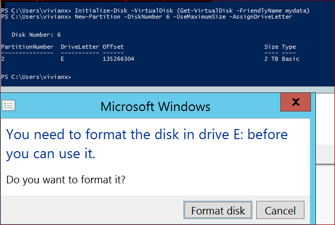

# 使用 PowerShell 创建 Storage Spaces 条带化虚拟机数据磁盘

在优化磁盘性能时，您可将多个高级磁盘一起条带化以便聚合其 IOPS，带宽和存储容量。由于使用服务器管理器 UI 可以将列的总数设置为每个条带化卷最多 8 个，当连接 8 个以上的磁盘时，您需要使用 PowerShell 来创建磁盘并设置相应数量的列数以得到理想的性能。

具体情况请参考：[磁盘条带化](https://docs.azure.cn/zh-cn/virtual-machines/windows/premium-storage-performance#disk-striping)

本文将介绍如何使用 PowerShell 来创建存储池以及虚拟磁盘。

1. 创建一台 Windows Server 2012R2 虚拟机。
2. 从 [Azure 门户](https://portal.azure.cn)上为虚拟机添加数据磁盘，本文以 4 块磁盘为例。
3. 登陆虚拟机。键入 `diskmgmt.msc` 来运行磁盘管理器。
4. 在跳出的对话框中点击 OK 来初始化磁盘。
5. 运行以下 PowerShell 来添加磁盘：

    ```powershell
    $subname = (Get-StorageSubSystem).FriendlyName
    $PhysicalDisks = (Get-PhysicalDisk -CanPool $True)
    New-StoragePool -FriendlyName <YourFriendlyName> -StorageSubsystemFriendlyName $subname -PhysicalDisks $PhysicalDisks
    ```

    

6. 打开 服务器管理器-> 文件和存储服务 -> 卷 -> 存储池,可以看到我们的存储池已经创建成功。

    

7. 创建新的虚拟磁盘。

    ```powershell
    New-VirtualDisk -FriendlyName <String> -StoragePoolFriendlyName <YourpoolName> -NumberOfColumns <number, allign with disk number> -UseMaximumSize -ResiliencySettingName Simple
    ```

    

    > [!NOTE]
    >- 只创建一个虚拟磁盘
    >- 使用 Simple 的弹性布局
    >- 列数和磁盘数量相等

    在虚拟磁盘可以看到我们创建好的磁盘，或者您可以使用Get-Disk查看：

    

8. 创建新的分区。
   首先初始化磁盘，并将磁盘上线。
   然后为磁盘创建分区。你可能需要使用Get-Disk命令获取磁盘的DiskNumber；或者直接在磁盘管理界面查看。参数AssignDriveLetter会为该分区分配一个盘符，并显示在命令输出中。
   最后格式化磁盘，DriveLetter为上面命令的输出。您可以用命令格式化，或者在跳出的对话框中点击格式化磁盘。

    ```powershell
    Initialize-Disk -VirtualDisk (Get-VirtualDisk -FriendlyName <Friendlyname>)
    New-Partition -DiskNumber <number> -UseMaximumSize -AssignDriveLetter
    Format-Volume -DriveLetter <driveLetter>
    ```

    

9. 之后在资源管理器中可以看到已经格式化后的磁盘。

    

## 注意事项

- 使用服务器管理器 UI 最多可以条带化 8 个磁盘，当连接 8 个以上的磁盘时，请使用 PowerShell 来创建卷。
- 使用 PowerShell，请将列数设置为与磁盘数相等。 否则将得不到理想的磁盘性能。例如，如果一个条带集中有 16 个磁盘，请在 `New-VirtualDisk PowerShell` 中使用 `NumberOfColumns` 参数设置 16 个列数。
- 每个存储池创建一个虚拟机磁盘。并选择 Simple 布局。
- 可以在 DS 系列的 VM 上将最多 32 个高级存储磁盘条带化，在 GS 系列的 VM 上将最多 64 个高级存储磁盘条带化。

## 参考链接

- [Azure 高级存储：高性能设计](https://docs.azure.cn/zh-cn/virtual-machines/windows/premium-storage-performance#disk-striping)
- [Interoperability with Azure VM](https://docs.microsoft.com/en-us/previous-versions/windows/it-pro/windows-server-2012-R2-and-2012/hh831739(v=ws.11)#interoperability-with-azure-virtual-machines)
- [Azure 高性能高级存储和托管磁盘](https://docs.azure.cn/zh-cn/virtual-machines/windows/premium-storage)
