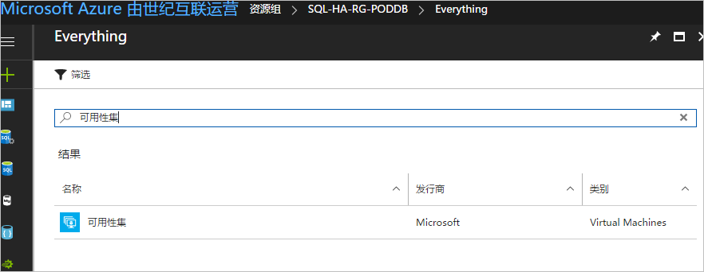
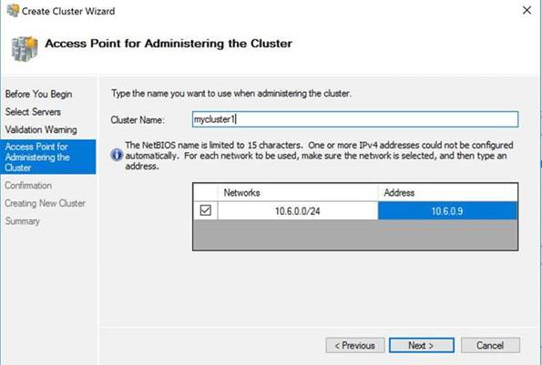
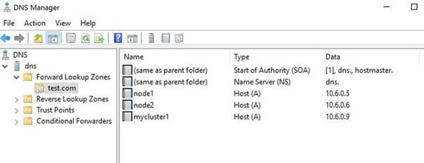
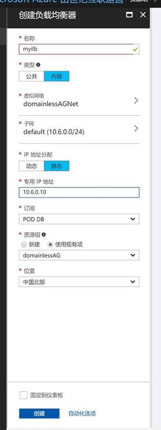
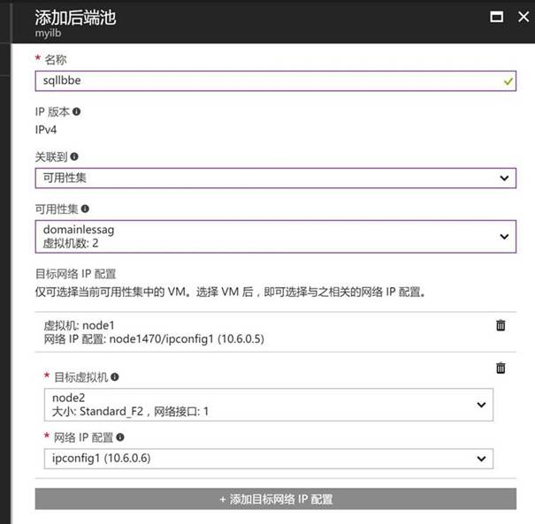
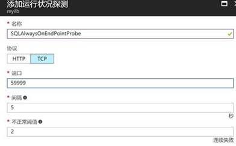
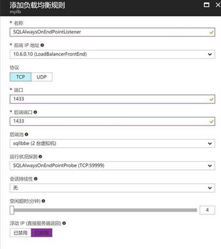
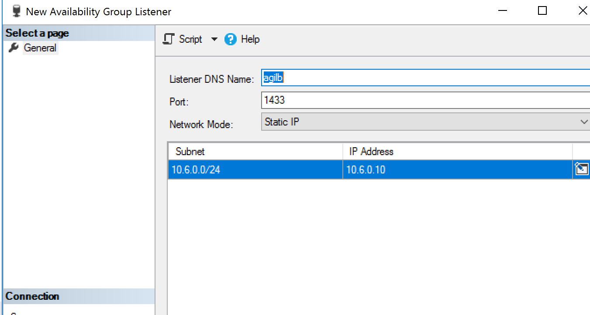
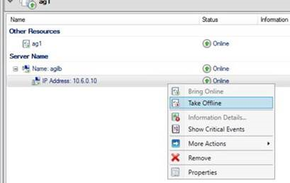
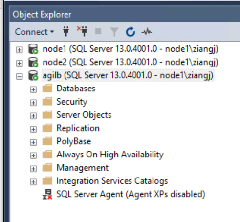

# 如何配置 SQL Server 无域 AlwaysOn 可用性组

## 环境准备

1. 创建可用性集：

    

    - 域控制器可用性集 **adavailabilitySetPoddb**
    - SQL Server 可用性集 **sqlAvailabilitySetPoddb**

2. 创建 3 台服务器，并配置为同一个 VNet：

    - DNS 服务器：**dns**
    - 服务器 1：**node1**
    - 服务器 2：**node2**

## 操错步骤

1. 在三个服务器上关闭防火墙。

2. node1 和 node2 在同一个可用性集。

3. 在 [Azure 门户](https://portal.azure.cn)上，配置 3 台服务器使用静态 IP。

    

4. 在 node1 和 node2 中设置静态 IP、默认网关、DNS 服务器 IP：

    

5. 在 node1 和 node2 中手动修改 DNS Suffix：

    

6. 把 hostname 和对应的 IP 地址写到 C:\Windows\System32\drivers\etc\hosts 文件中。

7. 在 node1 和 node2 上安装 Failover 服务并创建 cluster：

    

    

8. 在 DNS 中创建对应的 AName：

    

9. 成功创建 Cluster。

    

10. 在 node1 和 node2 上安装 SQL Server 服务，启动账号设为本地管理员。

11. 在 SQL Server 上启用 AG 功能。

12. 配置 AlwaysOn 可用性组，由于节点没有加入 AD 域，那么就不能用域认证，只能用证书认证，因此需要创建证书和端点，在配置可用性组之前各节点进行证书认证。

    各节点数据库创建的证书都备份并在其他节点还原：

    - 节点 A：创建主密钥/证书/端点，备份证书。使用 SSMS 连接节点 A，执行以下语句：

        ```sql
        USE master
        GO

        -- Create a database master key
        CREATE MASTER KEY ENCRYPTION BY PASSWORD = '1qaz@wsx3edc$rfv'
        GO

        -- Create a new certificate
        CREATE CERTIFICATE SQLBAG_Certificate_Node1_Private
        WITH SUBJECT = 'SQLBAG_Certificate_Private - Node 1',
        START_DATE = '20170801'
        GO

        -- Backup the public key of the certificate to the filesystem
        BACKUP CERTIFICATE SQLBAG_Certificate_Node1_Private
        TO FILE = 'c:\temp\SQLBAG_Certificate_Node1_Public.cert'
        GO

        -- Create an endpoint for the Availability Group
        CREATE ENDPOINT SQLBAG_Endpoint
        STATE = STARTED
        AS TCP
        (
            LISTENER_PORT = 5022
        )
        FOR DATABASE_MIRRORING
        (
            AUTHENTICATION = CERTIFICATE SQLBAG_Certificate_Node1_Private,
            ROLE = ALL,
            ENCRYPTION = REQUIRED ALGORITHM AES
        )
        GO
        ```

    - 节点 B：创建主密钥/证书，备份证书。使用 SSMS 连接节点 B，执行以下语句：

        ```sql
        USE master
        GO

        -- Create a database master key
        CREATE MASTER KEY ENCRYPTION BY PASSWORD = '1qaz@wsx3edc$rfv'
        GO

        -- Create a new certificate
        CREATE CERTIFICATE SQLBAG_Certificate_Node2_Private
        WITH SUBJECT = 'SQLBAG_Certificate_Private - Node 2',
        START_DATE = '20170801'
        GO

        -- Backup the public key of the certificate to the filesystem
        BACKUP CERTIFICATE SQLBAG_Certificate_Node2_Private
        TO FILE = 'c:\temp\SQLBAG_Certificate_Node2_Public.cert'
        GO

        -- Create an endpoint for the Availability Group
        CREATE ENDPOINT SQLBAG_Endpoint
        STATE = STARTED
        AS TCP
        (
            LISTENER_PORT = 5022
        )
        FOR DATABASE_MIRRORING
        (
            AUTHENTICATION = CERTIFICATE SQLBAG_Certificate_Node2_Private,
            ROLE = ALL,
            ENCRYPTION = REQUIRED ALGORITHM AES
        )
        GO
        ```

    - 将节点 B 上生成的 cer 文件拷贝到节点 A 上，然后在节点 A 上执行以下语句：

        ```sql
        CREATE LOGIN Node2Login WITH PASSWORD = '1qaz@wsx3edc$rfv'
        GO

        -- Create user for the login
        CREATE USER Node2User FOR LOGIN Node2Login
        GO

        -- Import the public key portion of the certificate from the other node
        CREATE CERTIFICATE SQLBAG_Certificate_Node2_Public
        AUTHORIZATION Node2User
        FROM FILE = 'c:\temp\SQLBAG_Certificate_Node2_Public.cert'
        GO

        -- Grant the CONNECT permission to the login
        GRANT CONNECT ON ENDPOINT::SQLBAG_Endpoint TO Node2Login
        GO
        ```

    - 将节点 A 上生成的 cer 文件拷贝到节点 B 上，然后在节点 B 上执行以下语句：

        ```sql
        CREATE LOGIN Node1Login WITH PASSWORD = '1qaz@wsx3edc$rfv'
        GO

        -- Create user for the login
        CREATE USER Node1User FOR LOGIN Node1Login
        GO

        -- Import the public key portion of the certificate from the other node
        CREATE CERTIFICATE SQLBAG_Certificate_Node1_Public
        AUTHORIZATION Node1User
        FROM FILE = 'c:\temp\SQLBAG_Certificate_Node1_Public.cert'
        GO

        -- Grant the CONNECT permission to the login
        GRANT CONNECT ON ENDPOINT::SQLBAG_Endpoint TO Node1Login
        GO
        ```

13. 创建 AG：

    

14. 在该资源组下面创建 ILB：

    

15. 配置后端池：

    

16. 配置检测：

    

17. 配置规则：

    

18. 在 DNS 中为 AG  Listener 加入需要的 AName：

    

19. 使用 SSMS 创建 Listener：

    

20. 在两个节点上分别运行的语句：

    ```powershell
    $ClusterNetworkName = "Cluster Network 1" # the cluster network name (Use Get-ClusterNetwork on Windows Server 2012 of higher to find the name)
    $IPResourceName = "ag1_10.6.0.10" # the IP Address resource name
    $ILBIP = "10.6.0.10" # the IP Address of the Internal Load Balancer (ILB). This is the static IP address for the load balancer you configured in the Azure Portal.
    [int]$ProbePort = 59999

    Import-Module FailoverClusters

    Get-ClusterResource $IPResourceName | Set-ClusterParameter -Multiple @{"Address"="$ILBIP";"ProbePort"=$ProbePort;"SubnetMask"="255.255.255.255";"Network"="$ClusterNetworkName";"EnableDhcp"=0}
    ```

21. 在 Failover Cluster Manager 中将 AG listener 资源下线再上线：

    

22. 使用 SSMS 进行验证：

    