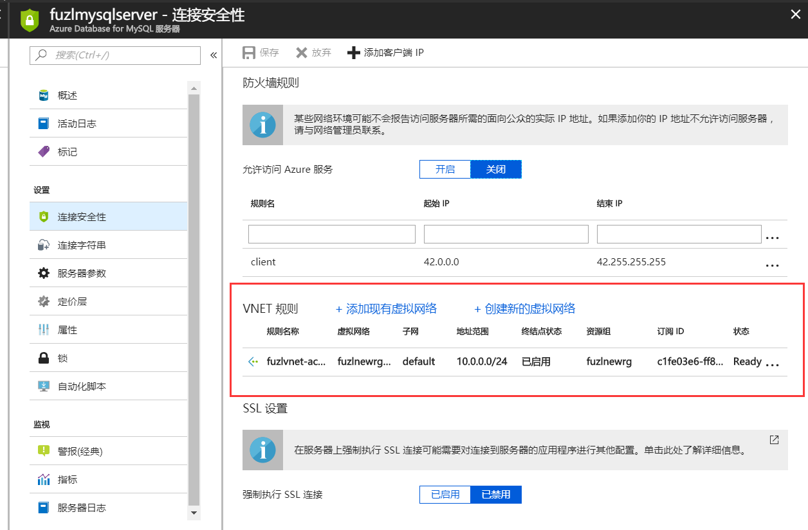

# 关于服务终结点的一些测试说明

在虚拟网络子网启用服务终结点后，子网内的虚拟机将使用自己的私有 IP 访问 Paas 的 SQL 服务和存储，同时平台会对该子网内的虚拟机添加一条特定的路由，也就是目标网段是 SQL 和存储服务的 IP 段，下一跳是 VirtualNetworkServiceEndpoint，SQL 和存储服务的 IP 网段，Azure 平台会进行维护更新，客户无需手动管理，可以参见 Service Point 的说明[网络服务终结点](https://docs.azure.cn/zh-cn/virtual-network/virtual-network-service-endpoints-overview)。同时可以通过查看虚拟机的有效路由得到验证，如下图：


此时虚拟机访问 SQL 和存储服务的流量不会走默认的 0.0.0.0 路由（PaaS SQL 服务的 IP 都是公网 IP），数据包也就不会发到 Internet，所以也就不会出现将虚拟机的内网 IP 转化为公网 IP 的情况。因为只有下一跳是 Internet 的流量会做地址转换，将虚拟机的内网 IP 转换为公网 IP。

同时我们也需要在 PaaS SQL 或者存储服务处配置允许访问的 Vnet 和 Subnet. 这是必不可少的。在 Subnet 处启用的服务终结点只起到了调整虚拟机路由的作用。允不允许访问 SQL 和存储，还需要在 SQL 和存储处添加允许规则。



完成上述配置后。可以在虚拟机上访问数据库。如果访问的是 SQL Server Paas，可以使用下面的命令查询连接的客户端 IP 地址：

```SQL
SELECT  CONNECTIONPROPERTY('PROTOCOL_TYPE') AS PROTOCOL_TYPE,CONNECTIONPROPERTY('CLIENT_NET_ADDRESS') AS CLIENT_NET_ADDRESS
```


如果访问的是 Mysql PaaS，可以使用如下的命令查看客户端的连接 IP：

```SQL
SELECT substring_index(host, ':',1) AS host_name,state,count(*) FROM information_schema.processlist GROUP BY state, host_name;
```


从测试可知客户端是使用内网 IP 来进行连接的。因此，启用服务终结点，可以实现使用内网访问 PaaS SQL 和存储，这样也相对更安全。