# Azure P2S VPN 如何配置自动重连

P2S VPN 为用户单机环境连接 Azure 服务提供了便利。根据用户反馈，配置时最容易在配置证书部分出错（目前 P2S VPN 仅支持证书认证，暂不支持 AD 认证），P2S 证书配置可以参考 Azure 视频中心【 Azure 点到站点 VPN 】的系列入门视频 （共 4 个），视频里详细介绍了配置 P2S 的每一步操作及各个证书的作用。

[视频中心](https://www.azure.cn/video-center/)

[详细的证书配置介绍](https://docs.azure.cn/zh-cn/vpn-gateway/vpn-gateway-certificates-point-to-site )

本文根据用户 P2S VPN 使用反馈，含括了以下三个部分，希望能帮助提升用户使用 P2S VPN 的体验。

- [Azure P2S VPN 如何配置自动重连](#section-1)
- [Azure P2S VPN 如何实现开机自动连接](#section-2)
- [常见 Azure P2S VPN 报错信息及解决方案](#section-3)

为了介绍如何配置自动重连，我们需要先了解什么是 P2S VPN？

Azure P2S VPN 日志提供了 VPN 连接的具体信息，打开方式如下：

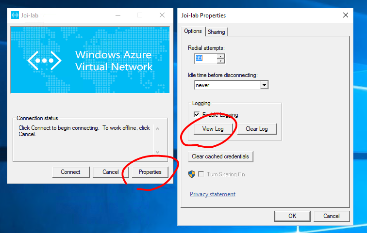


在这个文件中，可以看到 Custom Action Dll 中 ActionPath 这个路径，打开本地相应地址可以看到 VPN 客户端配置包（类似于传统的拨号），包含了具体的拨号内容（.pbk 文件 - 可以查看拨号的 Host name / IP address of destination，Security 相关选项）、路由表（ routes.txt ）等等。

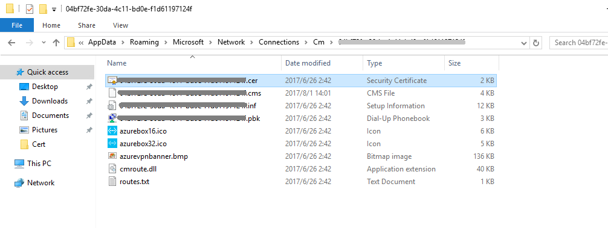

## <a id='section-1'>Azure P2S VPN 如何配置自动重连</a>

当 Azure P2S VPN 出现异常断开时，一般建议用户手动重连，并排查异常日志。如果用户有特殊需要 P2S VPN 断开时自动重连，可以考虑以下设置计划任务的方式。

通过添加计划任务，自动检测拨号是否中断（ Remote Disconnect 和 Client Disconnect ），如中断则重新建立 VPN 连接，这一过程会被记录在 [**任务状态**] 中。

### 具体步骤

1. 创建任务：

    任务计划程序（ Schedule Task ）界面创建任务。
        
    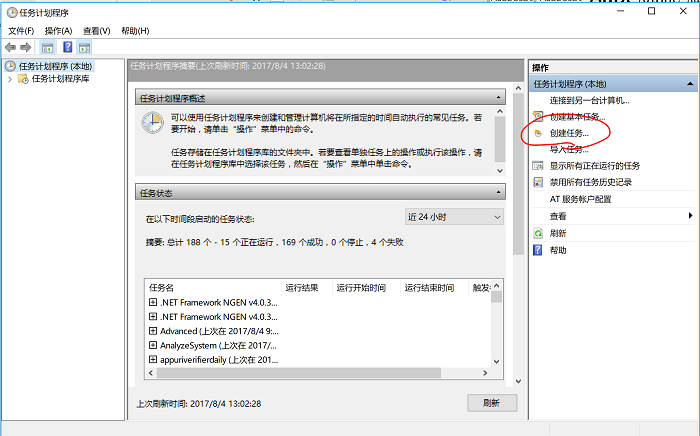

2. 参照用户需要，配置常规选卡、条件选卡和设置选卡，以下是模拟情况以供参考：

    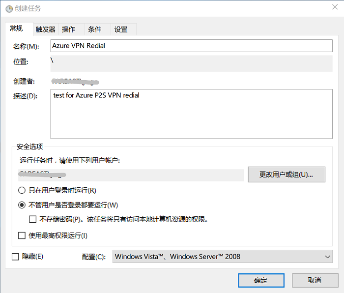
    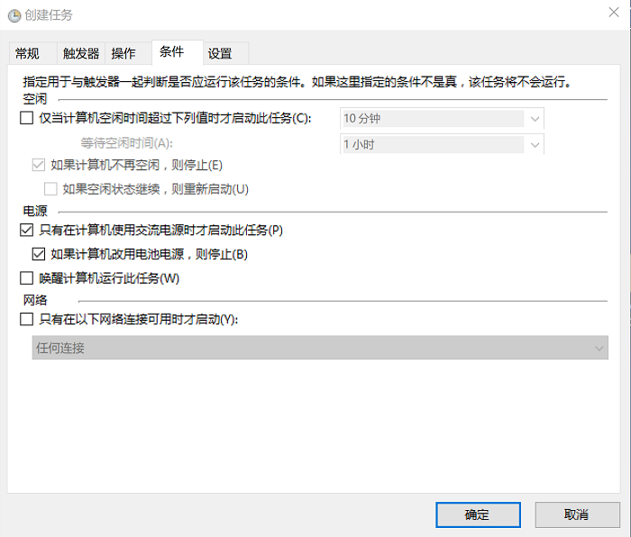
    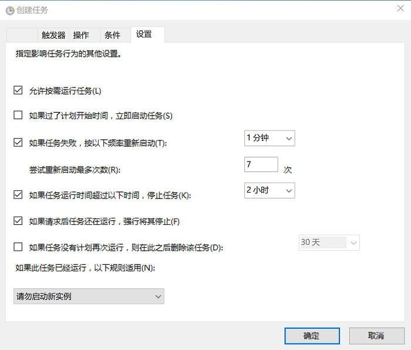

3. 创建触发器：

    当 Application Event for RasClient (EventID 20226) 出现 Error Code 829 Remote Disconnect, or 629 Client Disconnect 时，该事件被触发。

    一般来说 629 和 829 含括了常见的 VPN 中断情况，如果用户实际环境中出现别的中断需要调用重连，也可以在 EventData[Data[4] 之后写上对应的 Error Code。

    XML 代码如下：

    ```
    <QueryList>
    <Query Id="0" Path="Application">
    <Select Path="Application">*[System[Provider[@Name='RasClient'] and (EventID=20226)]] and *[EventData[Data[4]='829' or '629']]</Select>
    </Query>
    </QueryList>
    ``` 

    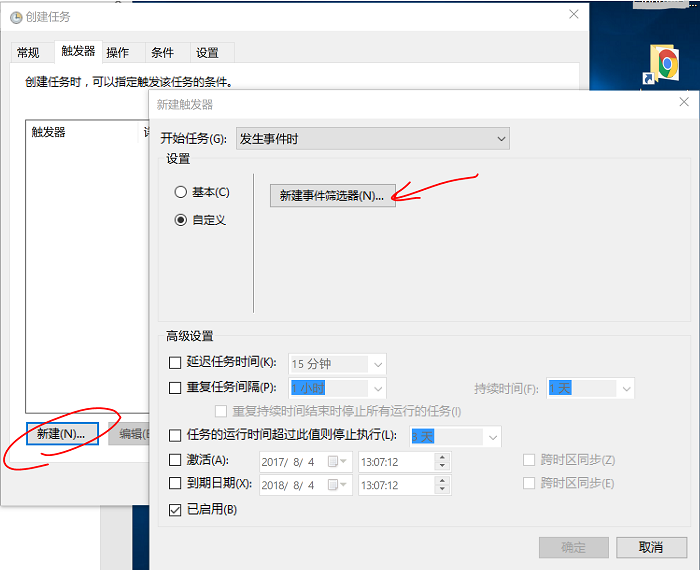

    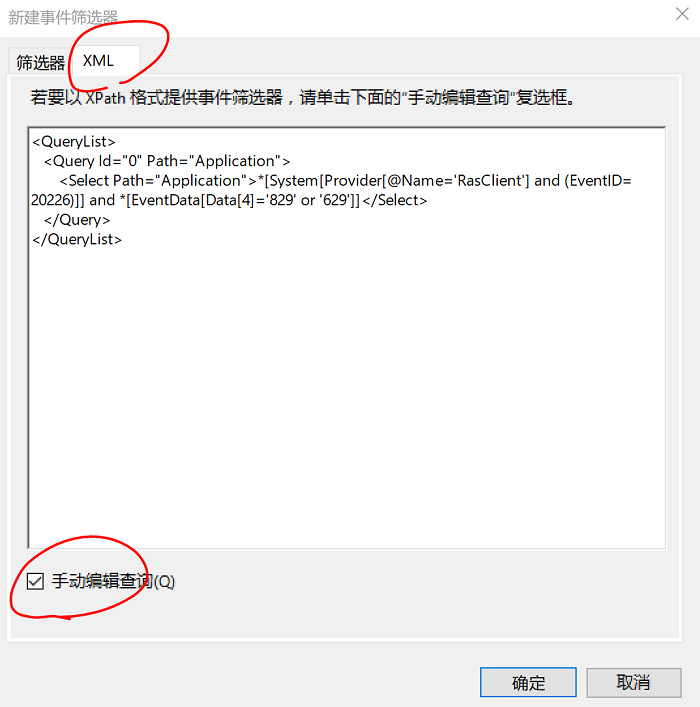

4. 创建操作：

    事件被触发时，执行 rasdial “用户自行创建的 VPN Name ” （这里根据用户需要也可写更复杂的脚本）。

    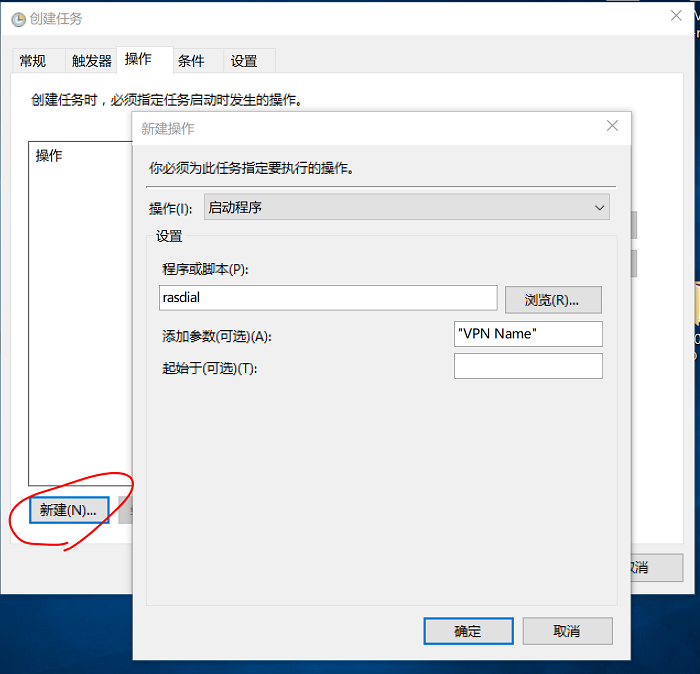

5. 至此 P2S VPN 自动重连配置完毕。


## <a id="section-2">Azure P2S VPN 如何实现开机自动连接</a>

一般自动连接 VPN 是通过 rasdial 拨号实现的，但 Azure P2S VPN 不支持 rasdial 功能。（[如何实现 Azure 虚拟网络中点到站 VPN 的自动重连](https://blogs.msdn.microsoft.com/cciccat/2014/06/03/azurevpn/)）

微软官方未提供 P2S VPN 开机自动连接的配置文档。常见的开机修改方式是将 VPN 连接/拨号复制到开机文件夹中（见下修改方法），但由于上述原因，对于 Azure P2S VPN 此方法只能实现开机自动检测，系统默认判断是否有网络连接，然后跳出 VPN 客户端界面等待链接。

### 修改方法

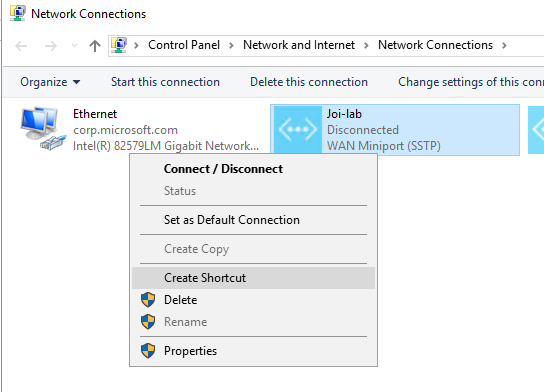
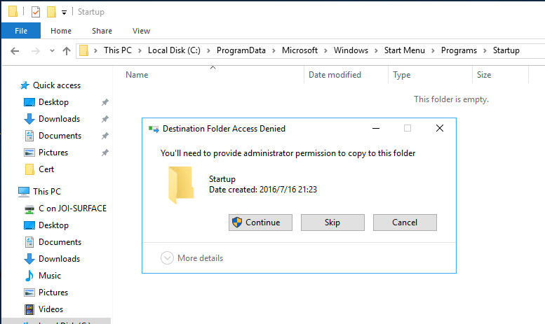
    
**开机/挂起后自动重启，跳出 VPN 等待连接界面：**

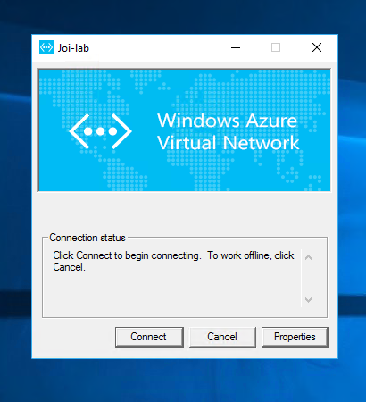

为了使 VPN 自动连接，在正常配置 Azure P2S VPN 的基础上，本文尝试了**创建拨号**的方式实现自动连接：

这种方法支持开机自动，但配置比较复杂，仅供参考。由于 Azure VPN 本身不支持 rasdial，我们需要额外创建一个新的 VPN 、配置它连接到 Azure VPN Gateway ，实现自动拨号。

1. 查看已配好的 P2S VPN，获取拨号配置文件目录 :

    双击 **P2S VPN** -> 点击**属性** -> 点击**查看日志** -> 找到自定义操作 DLL 这行的操作路径所在文件夹

    一般为：

    ```
    C:\Users\xxxx\AppData\Roaming\Microsoft\Network\Connections\Cm\xxxxx 
    ```
    
    

2. 在该目录文件夹中查看拨号目的地址，双击 pbk 文件，查看属性中目的地主机名:

    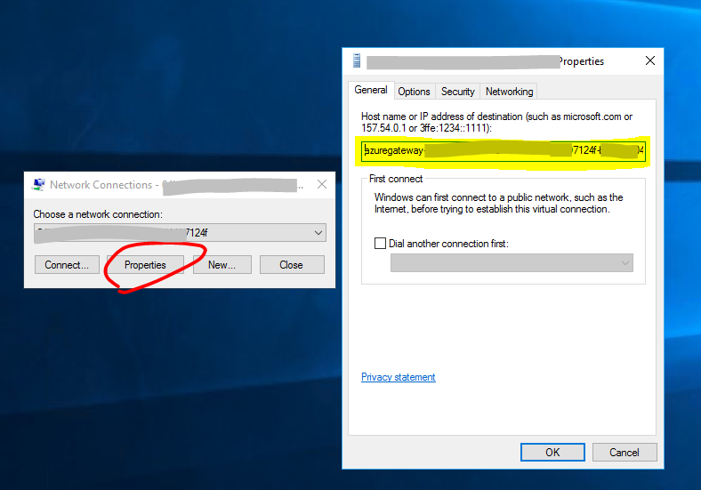

3. 创建一个新的 VPN 连接:

    打开网络和共享中心，设置新的网络连接到工作区，创建新的 Internet 连接，在地址栏键入刚才的目的地址。
    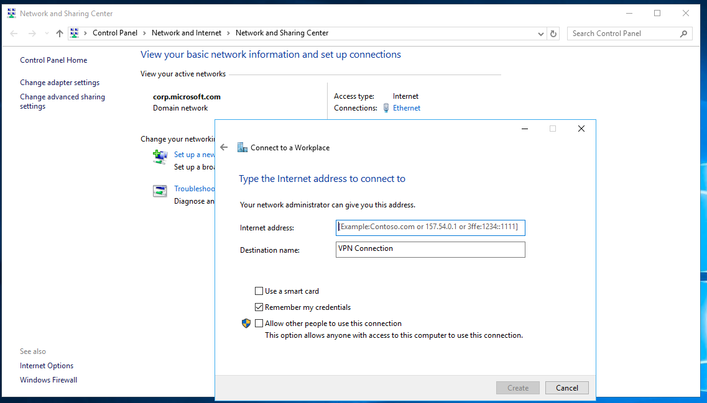

4. 在网络连接面板配置这个 VPN ，可参考步骤 2 中 pbk 文件的属性，请注意以下两点：

    选项选卡，PPP 设置中全都勾上：

    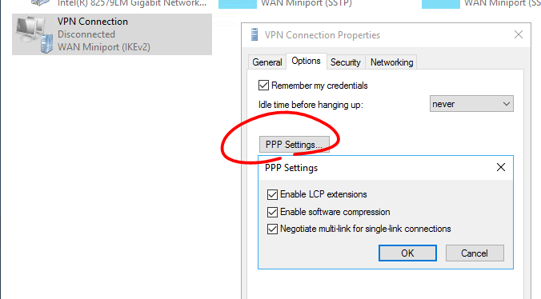

    安全选项页，使用 SSTP 协议，使用 Microsoft 证书加密，在属性中选取 **azuregateway** 开头的证书：

    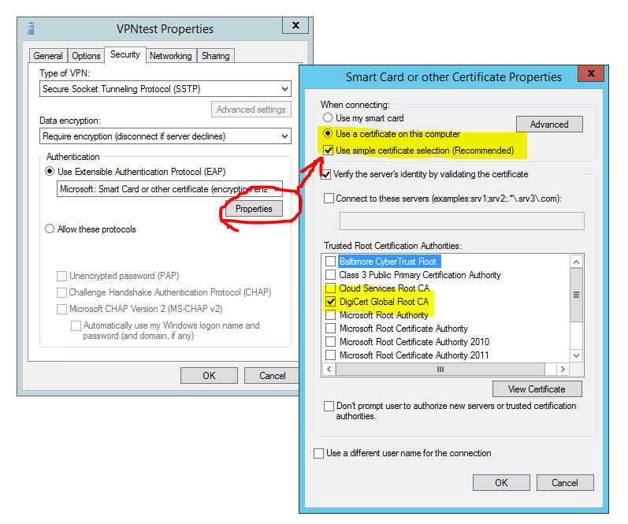

    至此，VPN 配置完毕，可用 cmd 键入< rasdial “ VPN 名称”> 测试 P2S 建立是否成功。

    由于系统权限问题，在 Win server 系统中，请使用 System（不要使用 Network Service ）用户连接 VPN ，否则可能会出现 `0x8010001d – SCARD_E_NO_SERVICE – “The Smart card resource manager is not running.”` 错误。

5. 配置开机启动：

    将上述 rasdial “ VPN 名称”这个命令另存为 bat 脚本，将它复制到 Windows 启动窗口。到这里就可以实现开机自动开启 VPN 了。

    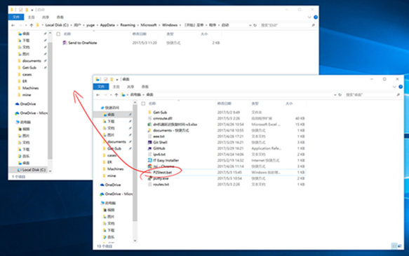

6. 还有一点需要请用户注意，由于这里的 VPN 是我们手动配置的，它无法更新 Azure VPN 的路由表。

    而 P2S VPN 自带的客户端程序能根据 Azure 的配置信息自动更新路由表，这个路由表也在 a) VPN 文件夹中，叫做 routes.txt。

    一般来说 P2S 的用户路由更新较少，如要经常检测路由表是否有更新，还需配置一个脚本手动刷新 route 并添加计划任务，比较复杂这里就不赘述了。
    
## <a id="section-3">常见 Azure P2S VPN 报错信息及解决方案</a>

### VPN 客户端错误：找不到证书 798。

#### 症状

尝试使用 VPN 客户端连接到 Microsoft Azure 虚拟网络时，看到以下错误消息：
找不到可用于此可扩展身份验证协议的证书。(错误 798)

#### 原因

如果 Certificates - Current User\Personal\Certificates 中缺少客户端证书，便会发生此问题。
根据经验这种情况很可能是用户配置的证书不正确，建议重新根据参考/联系 Support ，协助重新生成证书。

#### 解决方案

请确保已在证书存储 ( Certmgr.msc ) 的以下位置安装客户端证书：
Certificates - Current User\Personal\Certificates
若要详细了解如何安装客户端证书，请参阅[为点到站点连接生成并导出证书](https://docs.azure.cn/zh-cn/vpn-gateway/vpn-gateway-certificates-point-to-site)。

### VPN 客户端错误：接收到的消息异常，或格式不正确 (错误 0x80090326)。

#### 症状

尝试使用 VPN 客户端连接到虚拟网络时，VPN 客户端错误：接收到的消息异常，或格式不正确。(错误 0x80090326)

#### 原因

如果根证书公钥未上传到 Microsoft Azure VPN 网关或密钥已损坏/已过期，便会发生此问题。

#### 解决方案

若要解决此问题，请在 Azure 门户中检查根证书的状态，以确定是否已吊销。 如果未吊销，请尝试删除并重新上传根证书。 有关详细信息，请参阅 [创建证书](https://docs.azure.cn/zh-cn/vpn-gateway/vpn-gateway-howto-point-to-site-classic-azure-portal#generatecerts)。

### VPN 客户端错误：已处理证书链，但被终止。

#### 症状

尝试使用 VPN 客户端连接到 Azure 虚拟网络时，看到以下错误消息：
已处理证书链，但是在不受信任提供程序信任的根证书中终止

#### 解决方案

1. 请确保已正确的位置安装下列证书：

    | 证书                                          | 位置                                                  |
    | --------------------------------------------- | ----------------------------------------------------- |
    | AzureClient.pfx                               | Current User\Personal\Certificates                    |
    | Azuregateway-GUID.cloudapp.net                | Current User\Trusted Root Certification Authorities   |
    | AzureGateway-GUID.cloudapp.net、AzureRoot.cer | Local Computer\Trusted Root Certification Authorities |


2. 如果相应位置上已有证书，请尝试删除并重新安装证书。 azuregateway-GUID.cloudapp.net** 证书位于从 Azure 门户下载的 VPN 客户端配置包中，可以使用文件存档程序从配置包中提取文件。

### 错误：“文件下载错误，未指定目标 URI ”。

#### 症状

看到以下错误消息：

文件下载错误，未指定目标 URI

#### 原因

导致此问题发生的原因是网关类型不正确。

#### 解决方案

VPN 网关类型必须是 VPN，VPN 类型必须是 RouteBased。

### 一次性连接的 VPN 客户端过多。

对于每个 VPN 网关，最多可以连接 128 个客户端。 可以在 Azure 门户中查看连接的客户端总数。

### 重新安装 VPN 客户端后，在 Windows 中找不到点到站点 VPN 连接。

#### 症状

先删除了点到站点 VPN 连接，再重新安装 VPN 客户端。 在这种情况下，VPN 连接未成功配置。 在 Windows 的“网络连接”设置中看不到 VPN 连接。

#### 解决方案

若要解决此问题，请从 C:\Users\TheUserName\AppData\Roaming\Microsoft\Network\Connections 删除旧的 VPN 客户端配置文件，再重新运行 VPN 客户端安装程序。
